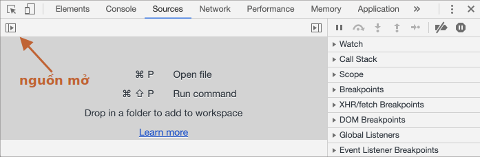
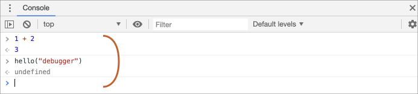
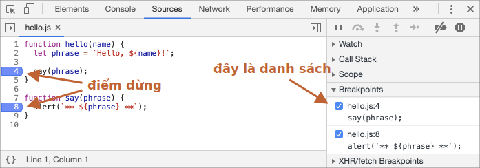
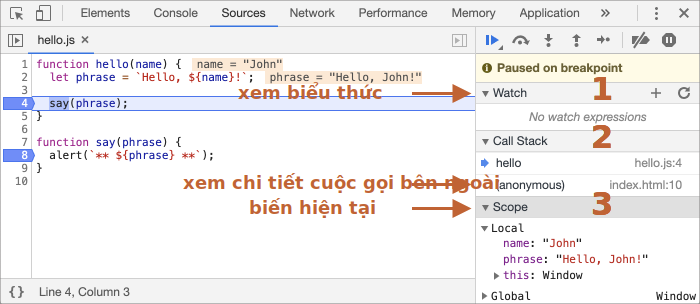
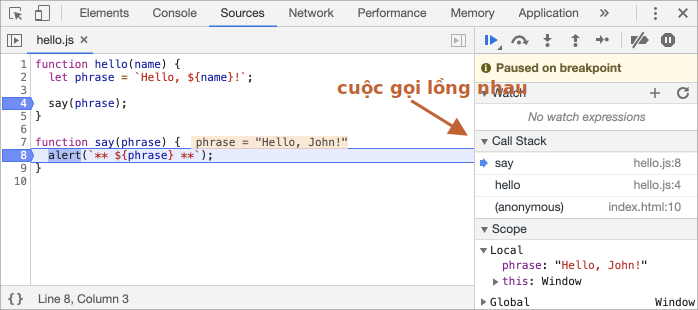

# Gỡ lỗi trong Chrome

Trước khi viết mã phức tạp hơn, hãy nói về gỡ lỗi.

[Gỡ lỗi](https://vi.wikipedia.org/wiki/G%E1%BB%A1_l%E1%BB%97i) là quá trình tìm và sửa lỗi trong một tập lệnh. Tất cả các trình duyệt hiện đại và hầu hết các môi trường khác đều hỗ trợ các công cụ gỡ lỗi -- một giao diện người dùng đặc biệt trong các công cụ dành cho nhà phát triển giúp việc gỡ lỗi dễ dàng hơn nhiều. Nó cũng cho phép theo dõi từng bước mã để xem chính xác điều gì đang diễn ra.

Chúng ta sẽ sử dụng Chrome ở đây, vì nó có đủ tính năng, hầu hết các trình duyệt khác đều có quy trình tương tự.

## Bảng "Sources"

Phiên bản Chrome của bạn có thể trông hơi khác một chút nhưng vẫn phải rõ ràng có gì ở đó.

- Mở [trang ví dụ](debugging/index.html) trong Chrome.
- Bật công cụ dành cho nhà phát triển bằng `key:F12` (Mac: `key:Cmd+Opt+I`).
- Chọn bảng `Sources`.

Đây là những gì bạn nên xem nếu bạn đang làm điều đó lần đầu tiên:


Nút chuyển đổi <span class="devtools" style="background-position:-172px -98px"></span> mở tab có tệp.

Hãy nhấp vào nó và chọn `hello.js` trong chế độ xem dạng cây. Đây là những gì sẽ hiển thị:


Bảng Sources có 3 phần:

1. Ngăn **File Navigator** liệt kê HTML, JavaScript, CSS và các tệp khác, bao gồm cả hình ảnh được đính kèm vào trang. Tiện ích mở rộng của Chrome cũng có thể xuất hiện ở đây.
2. Khung **Code Editor** hiển thị mã nguồn.
3. Khung **JavaScript Debugging** dùng để gỡ lỗi, chúng ta sẽ sớm khám phá nó.

Giờ đây, bạn có thể nhấp lại vào nút chuyển đổi <span class="devtools" style="background-position:-172px -122px"></span> để ẩn danh sách tài nguyên và tạo thêm không gian cho mã.

## Bảng điều khiển

Nếu chúng ta nhấn `key:Esc`, thì bảng điều khiển (console) sẽ mở ra bên dưới. Chúng ta có thể gõ lệnh ở đó và nhấn `key:Enter` để thực thi.

Sau khi một câu lệnh được thực thi, kết quả của nó được hiển thị bên dưới.

Ví dụ: ở đây `1+2` cho kết quả là `3` và `hello("debugger")` không trả về kết quả nào, vì vậy kết quả là `undefined`:



## Điểm dừng

Hãy kiểm tra những gì đang diễn ra trong mã của [trang ví dụ](debugging/index.html). Trong `hello.js`, nhấp vào dòng số `4`. Vâng, ngay trên chữ số `4`, không phải trên mã.

Chúc mừng! Bạn đã đặt một điểm dừng(breakpoint). Vui lòng nhấp vào số cho dòng `8`.

Nó sẽ trông như thế này (màu xanh là nơi bạn nên nhấp vào):



*breakpoint* là một điểm mã nơi trình gỡ lỗi sẽ tự động tạm dừng thực thi JavaScript.

Trong khi mã bị tạm dừng, chúng ta có thể kiểm tra các biến hiện tại, thực thi các lệnh trong bảng điều khiển, v.v. Nói cách khác, chúng ta có thể gỡ lỗi mã.

Chúng ta luôn có thể tìm thấy danh sách các điểm dừng trong bảng bên phải. Điều đó hữu ích khi chúng ta có nhiều điểm ngắt trong các tệp khác nhau. Nó cho phép chúng ta:
- Nhanh chóng chuyển đến điểm dừng trong mã (bằng cách nhấp vào nó trong bảng bên phải).
- Tạm thời vô hiệu hóa breakpoint bằng cách bỏ chọn nó.
- Loại bỏ breakpoint bằng cách click chuột phải chọn Remove.
- ...Vân vân.

```smart header="Điểm dừng có điều kiện"
*Nhấp chuột phải* vào số dòng cho phép tạo điểm ngắt *có điều kiện*. Nó chỉ kích hoạt khi biểu thức đã cho là đúng đắn.

Điều đó rất hữu ích khi chúng ta chỉ cần dừng đối với một giá trị biến nhất định hoặc đối với các tham số nhất định.
```

## Lệnh gỡ lỗi

Chúng ta cũng có thể tạm dừng mã bằng cách sử dụng lệnh `debugger` trong đó, như sau:

```js
function hello(name) {
  let phrase = `Hello, ${name}!`;

*!*
  debugger;  // <-- trình gỡ lỗi dừng ở đây
*/!*

  say(phrase);
}
```

Điều đó rất thuận tiện khi chúng ta đang ở trong trình chỉnh sửa mã và không muốn chuyển sang trình duyệt và tra cứu tập lệnh trong các công cụ dành cho nhà phát triển để đặt điểm dừng.

## Tạm dừng và nhìn xung quanh

Trong ví dụ của chúng ta, `hello()` được gọi trong khi tải trang, vì vậy cách dễ nhất để kích hoạt trình gỡ lỗi (sau khi chúng ta đã đặt các điểm ngắt) là tải lại trang. Vì vậy, hãy nhấn `key:F5` (Windows, Linux) hoặc `key:Cmd+R` (Mac).

Khi điểm ngắt được đặt, quá trình thực thi tạm dừng ở dòng thứ 4:



Vui lòng mở menu thả xuống thông tin ở bên phải (được đánh dấu bằng các mũi tên). Chúng cho phép bạn kiểm tra trạng thái mã hiện tại:

1. **`Watch` -- hiển thị các giá trị hiện tại cho bất kỳ biểu thức nào.**

     Bạn có thể nhấp vào dấu cộng `+` và nhập một biểu thức. Trình gỡ lỗi sẽ hiển thị giá trị của nó bất kỳ lúc nào, tự động tính toán lại giá trị đó trong quá trình thực thi.

2. **`Ngăn xếp cuộc gọi (Call Stack)` -- hiển thị chuỗi cuộc gọi lồng nhau.**

    Tại thời điểm hiện tại, trình gỡ lỗi nằm trong lệnh gọi `hello()`, được gọi bởi một tập lệnh trong `index.html` (không có hàm nào ở đó, vì vậy nó được gọi là "ẩn danh").

    Nếu bạn nhấp vào một mục trong ngăn xếp (ví dụ: "ẩn danh"), trình gỡ lỗi sẽ chuyển đến mã tương ứng và tất cả các biến của nó cũng có thể được kiểm tra.
3. **`Scope` -- biến hiện tại.**

    `Local` hiển thị các biến hàm cục bộ. Bạn cũng có thể thấy các giá trị của chúng được đánh dấu ngay trên nguồn.

    `Global` có các biến toàn cục (ngoài bất kỳ hàm nào).

    Ngoài ra còn có từ khóa `this` mà chúng ta chưa nghiên cứu, nhưng chúng ta sẽ làm điều đó sớm thôi.

## Theo dõi việc thực hiện

Bây giờ là lúc *theo dõi* tập lệnh.

Có các nút cho nó ở trên cùng của bảng điều khiển bên phải. Hãy bấm vào nó.
<!-- https://github.com/ChromeDevTools/devtools-frontend/blob/master/front_end/Images/src/largeIcons.svg -->
<span class="devtools" style="background-position:-146px -168px"></span> -- "Resume": tiếp tục thực hiện, phím nóng `key:F8`.
: Tiếp tục thực thi. Nếu không có điểm dừng bổ sung, thì quá trình thực thi sẽ tiếp tục và trình gỡ lỗi sẽ mất quyền kiểm soát.

    Đây là những gì chúng ta có thể thấy sau khi nhấp vào nó:

    

    Quá trình thực thi đã tiếp tục, đạt đến một điểm dừng khác bên trong `say()` và tạm dừng ở đó. Hãy xem "Call Stack" ở bên phải. Nó đã tăng thêm một cuộc gọi nữa. Bây giờ chúng ta đang ở trong `say()`.

<span class="devtools" style="background-position:-200px -190px"></span> -- "Step": chạy lệnh tiếp theo, phím nóng `key:F9`.
: Chạy câu lệnh tiếp theo. Nếu chúng ta nhấp vào nó ngay bây giờ, `alert` sẽ được hiển thị.

    Nhấp đi bấm lại vào đây sẽ lần lượt duyệt qua tất cả các câu lệnh trong tập lệnh.

<span class="devtools" style="background-position:-62px -192px"></span> -- "Step over": chạy lệnh tiếp theo, nhưng *không đi vào hàm*, phím nóng `key :F10`.
: Tương tự như lệnh "Step" trước đó, nhưng hoạt động khác nếu câu lệnh tiếp theo là lệnh gọi hàm. Đó là: không phải là hàm tích hợp sẵn, như `alert`, mà là một hàm của riêng chúng ta.

    Lệnh "Step" đi vào nó và tạm dừng thực thi ở dòng đầu tiên, trong khi "Step over" thực hiện lời gọi hàm lồng nhau một cách vô hình, bỏ qua các phần bên trong hàm.

    Việc thực thi sau đó bị tạm dừng ngay sau hàm đó.

    Điều đó tốt nếu chúng ta không quan tâm đến việc xem điều gì xảy ra bên trong lời gọi hàm.

<span class="devtools" style="background-position:-4px -194px"></span> -- "Step into", phím nóng `key:F11`.
: Điều đó tương tự như "Step", nhưng hoạt động khác trong trường hợp gọi hàm không đồng bộ. Nếu bạn chỉ mới bắt đầu học JavaScript, thì bạn có thể bỏ qua sự khác biệt, vì chúng ta chưa có cuộc gọi không đồng bộ.

    Trong tương lai, chỉ cần lưu ý rằng lệnh "Step" bỏ qua các hành động không đồng bộ, chẳng hạn như `setTimeout` (gọi hàm theo lịch trình), thực thi sau. "Bước vào" đi vào mã của hàm, đợi hàm nếu cần. Xem [Hướng dẫn sử dụng DevTools](https://developers.google.com/web/updates/2018/01/devtools#async) để biết thêm chi tiết.

<span class="devtools" style="background-position:-32px -194px"></span> -- "Step out": tiếp tục thực thi cho đến khi kết thúc hàm hiện tại, phím nóng `key:Shift+F11`.
: Tiếp tục thực thi và dừng nó ở dòng cuối cùng của hàm hiện tại. Điều đó rất hữu ích khi chúng ta vô tình tham gia một cuộc gọi lồng nhau bằng cách sử dụng <span class="devtools" style="background-position:-200px -190px"></span>, nhưng nó không khiến chúng ta quan tâm và chúng ta muốn tiếp tục đến cuối cuộc gọi đó sớm nhất có thể.

<span class="devtools" style="background-position:-61px -74px"></span> -- bật/tắt tất cả các điểm dừng.
: Nút đó không di chuyển việc thực hiện. Chỉ cần bật/tắt hàng loạt cho các điểm dừng.

<span class="devtools" style="background-position:-90px -146px"></span> -- bật/tắt tự động tạm dừng trong trường hợp có lỗi.
: Khi được bật và các công cụ dành cho nhà phát triển đang mở, lỗi tập lệnh sẽ tự động tạm dừng quá trình thực thi. Sau đó, chúng ta có thể phân tích các biến để xem điều gì đã xảy ra. Vì vậy, nếu tập lệnh của chúng ta chết do lỗi, chúng ta có thể mở trình gỡ lỗi, bật tùy chọn này và tải lại trang để xem tập lệnh chết ở đâu và bối cảnh tại thời điểm đó là gì.

```smart header="Continue to here"
Nhấp chuột phải vào một dòng mã sẽ mở menu ngữ cảnh với một tùy chọn tuyệt vời có tên "Continue to here".

Điều đó rất hữu ích khi chúng ta muốn di chuyển nhiều bước về phía trước dòng, nhưng chúng ta quá lười để đặt điểm dừng.
```

## Ghi nhật ký

Để xuất nội dung nào đó ra bảng điều khiển từ mã của chúng ta, có một hàm là `console.log`.

Chẳng hạn, mã sau đây xuất các giá trị từ `0` đến `4` sang bảng điều khiển:

```js run
// mở console để thấy
for (let i = 0; i < 5; i++) {
  console.log("value,", i);
}
```

Người dùng thông thường không nhìn thấy đầu ra đó, nó nằm trong bảng điều khiển. Để xem nó, hãy mở bảng điều khiển của công cụ dành cho nhà phát triển hoặc nhấn `key:Esc` khi đang ở bảng điều khiển khác: mở bảng điều khiển ở dưới cùng.

Nếu chúng ta có đủ thông tin nhật ký bên trong mã của mình thì chúng ta có thể xem điều gì đang diễn ra từ các bản ghi mà không cần trình gỡ lỗi.

## Tóm tắt

Như chúng ta có thể thấy, có ba cách chính để tạm dừng tập lệnh:
1. Một điểm dừng.
2. Các câu lệnh `debugger`.
3. Lỗi (nếu công cụ dành cho nhà phát triển đang mở và nút <span class="devtools" style="background-position:-90px -146px"></span> đang "bật").

Khi tạm dừng, chúng ta có thể gỡ lỗi - kiểm tra các biến và theo dõi mã để xem nơi thực thi sai.

Có nhiều tùy chọn hơn trong các công cụ dành cho nhà phát triển ngoài những gì được đề cập ở đây. Hướng dẫn đầy đủ có tại <https://developers.google.com/web/tools/chrome-devtools>.

Thông tin từ chương này là đủ để bắt đầu gỡ lỗi, nhưng sau này, đặc biệt nếu bạn làm nhiều công việc trên trình duyệt, vui lòng vào đó và xem qua các khả năng nâng cao hơn của các công cụ dành cho nhà phát triển.

Ồ, và bạn cũng có thể nhấp vào các vị trí khác nhau của công cụ dành cho nhà phát triển và chỉ cần xem những gì đang hiển thị. Đó có lẽ là con đường nhanh nhất để tìm hiểu các công cụ dành cho nhà phát triển. Đừng quên nhấp chuột phải và menu ngữ cảnh!
