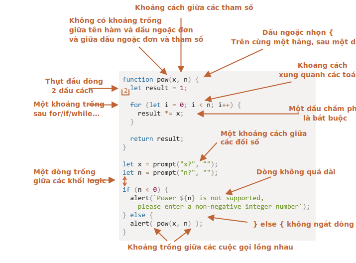

# Phong cách viết code

Mã của chúng ta phải rõ ràng và dễ đọc nhất có thể.

Đó thực sự là nghệ thuật lập trình -- nhận một nhiệm vụ phức tạp và code nó theo cách vừa chính xác vừa có thể đọc được. Một cách viết code tốt hỗ trợ rất nhiều trong việc đó.

## Cú pháp

Đây là một bảng hỗ trợ với một số quy tắc được đề xuất (xem bên dưới để biết thêm chi tiết):


<!--
```js
function pow(x, n) {
  let result = 1;

  for (let i = 0; i < n; i++) {
    result *= x;
  }

  return result;
}

let x = prompt("x?", "");
let n = prompt("n?", "");

if (n < 0) {
  alert(`Luỹ thừa ${n} không được hỗ trợ,
    vui lòng nhập số nguyên không âm`);
} else {
  alert( pow(x, n) );
}
```

-->

Bây giờ hãy thảo luận chi tiết về các quy tắc và lý do cho chúng.

```warn header="Không có quy tắc \"bạn phải\""
Không có gì là cố định ở đây. Đây là những sở thích phong cách, không phải giáo điều tôn giáo.
```

### Dấu ngoặc nhọn

Trong hầu hết các dự án JavaScript, dấu ngoặc nhọn được viết theo kiểu "Ai Cập" với dấu ngoặc nhọn mở trên cùng một dòng với từ khóa tương ứng -- không phải trên một dòng mới. Cũng nên có một khoảng trắng trước dấu ngoặc mở, như thế này:

```js
if (condition) {
  // làm cái này
  // ...và cái kia
  // ...và cái kia
}
```

Cấu trúc một dòng, chẳng hạn như `if (điều kiện) doSomething()`, là một trường hợp rìa quan trọng. Có nên sử dụng dấu ngoặc nhọn không?

Dưới đây là các biến thể được chú thích để bạn có thể tự đánh giá khả năng đọc được của chúng:    
1. 😠 Người mới bắt đầu đôi khi làm điều đó. Tệ! Không cần dấu ngoặc nhọn: 
   ```js
    if (n < 0) *!*{*/!*alert(`Nguồn ${n} không được hỗ trợ`);*!*}*/!*
    ```
2. 😠 Tách sang dòng riêng không dấu ngoặc. Đừng bao giờ làm vậy, dễ bị lỗi khi thêm dòng mới:
    ```js
    if (n < 0)
      alert(`Nguồn ${n} không được hỗ trợ`);
    ```
3. 😏 Một dòng không có dấu ngoặc nhọn - chấp nhận được, nếu ngắn:
    ```js
    if (n < 0) alert(`Nguồn ${n} không được hỗ trợ`);
    ```
4. 😃 Biến thể tốt nhất:
    ```js
    if (n < 0) {
      alert(`Nguồn ${n} không được hỗ trợ`);
    }
    ```

Đối với một code rất ngắn gọn, một dòng được cho phép, ví dụ: `if (cond) return null`. Nhưng một code block (biến thể cuối cùng) thường dễ đọc hơn.

### Độ dài của dòng

Không ai thích đọc một dòng mã dài. Cách tốt nhất là tách chúng ra.

Ví dụ:
```js
// backtick quotes ` cho phép chia chuỗi thành nhiều dòng
let str = `
  TC39 của ECMA International là một nhóm các nhà phát triển JavaScript,
  người thực hiện, học giả, v.v., hợp tác với cộng đồng
  để duy trì và phát triển định nghĩa của JavaScript.
`;
```

Và, đối với câu lệnh `if`:

```js
if (
  id === 123 &&
  moonPhase === 'Waning Gibbous' &&
  zodiacSign === 'Libra'
) {
  letTheSorceryBegin();
}
```

Độ dài tối đa của dòng phải được thống nhất ở cấp độ nhóm. Nó thường là 80 hoặc 120 ký tự.

### Thụt lề

Có hai loại thụt lề:

- **Thụt lề ngang: 2 hoặc 4 dấu cách.**

    Thụt lề ngang được thực hiện bằng cách sử dụng 2 hoặc 4 dấu cách hoặc ký hiệu tab ngang (phím `key:Tab`). Lựa chọn việc nên dùng cách nào đã gây nên một cuộc xung đột từ xưa đến nay. Ngày nay thì sử dụng dấu cách dường như đã phổ biến hơn.

    Một lợi thế của dấu cách so với tab là nó cho phép cấu hình thụt lề linh hoạt hơn so với tab.

    Chẳng hạn, chúng ta có thể căn chỉnh các tham số với dấu ngoặc mở, như thế này:

    ```js no-beautify
    show(parameters,
         aligned, // 5 dấu cách đệm ở bên trái
         one,
         after,
         another
      ) {
      // ...
    }
    ```

- **Thụt lề dọc: các dòng trống để tách mã thành các khối logic.**

    Ngay cả một chức năng đơn lẻ thường có thể được chia thành các khối hợp lý. Trong ví dụ bên dưới, việc khởi tạo các biến, vòng lặp chính và trả về kết quả được chia theo chiều dọc:

    ```js
    function pow(x, n) {
      let result = 1;
      //              <--
      for (let i = 0; i < n; i++) {
        result *= x;
      }
      //              <--
      return result;
    }
    ```

    Chèn thêm một dòng mới để giúp mã dễ đọc hơn. Không được có nhiều hơn chín dòng mã mà không có thụt đầu dòng theo chiều dọc.

### Dấu chấm phẩy

Dấu chấm phẩy phải có sau mỗi câu lệnh, ngay cả khi nó có thể bị bỏ qua.

Có những ngôn ngữ mà dấu chấm phẩy thực sự là tùy chọn và hiếm khi được sử dụng. Tuy nhiên, trong JavaScript, có những trường hợp ngắt dòng không được hiểu là dấu chấm phẩy, khiến mã dễ bị lỗi. Xem thêm về điều đó trong chương <info:structure#semicolon>.

Nếu là một lập trình viên JavaScript có kinh nghiệm, bạn có thể chọn kiểu mã không có dấu chấm phẩy như [StandardJS](https://standardjs.com/). Nếu không, tốt nhất là sử dụng dấu chấm phẩy để tránh những cạm bẫy có thể xảy ra. Phần lớn các nhà phát triển đặt dấu chấm phẩy.

### Cấp độ lồng

Cố gắng tránh lồng mã quá nhiều cấp độ.

Ví dụ: trong vòng lặp, đôi khi nên sử dụng chỉ thị [`continue`](info:while-for#continue) để tránh lồng thêm.

Ví dụ: thay vì thêm điều kiện `if` lồng nhau như sau:

```js
for (let i = 0; i < 10; i++) {
  if (cond) {
    ... // <- thêm một cấp độ lồng nhau
  }
}
```

Ta có thể viết

```js
for (let i = 0; i < 10; i++) {
  if (!cond) *!*continue*/!*;
  ...  // <- không có cấp độ lồng thêm
}
```

Điều tương tự có thể được thực hiện với `if/else` và `return`.

Ví dụ, hai cấu trúc bên dưới giống hệt nhau.

Trường hợp 1:

```js
function pow(x, n) {
  if (n < 0) {
    alert("Số âm `n` không được hỗ trợ");
  } else {
    let result = 1;

    for (let i = 0; i < n; i++) {
      result *= x;
    }

    return result;
  }  
}
```

Trường hợp 2:

```js
function pow(x, n) {
  if (n < 0) {
    alert("Số âm `n` không được hỗ trợ");
    return;
  }

  let result = 1;

  for (let i = 0; i < n; i++) {
    result *= x;
  }

  return result;
}
```

Cái thứ hai dễ đọc hơn vì "trường hợp đặc biệt" của `n < 0` được xử lý sớm. Sau khi kiểm tra xong, chúng ta có thể chuyển sang luồng mã "chính" mà không cần lồng bổ sung.

## Vị trí chức năng

Nếu bạn đang viết một số hàm "helper" và mã sử dụng chúng, có ba cách để tổ chức các hàm.

1. Khai báo các hàm *ở trên* mã sử dụng chúng:

    ```js
    // *!*khai báo hàm*/!*
    function createElement() {
      ...
    }

    function setHandler(elem) {
      ...
    }

    function walkAround() {
      ...
    }

    // *!*mã sử dụng chúng*/!*
    let elem = createElement();
    setHandler(elem);
    walkAround();
    ```
2. Code trước, sau đó viết hàm

    ```js
    // *!*mã sử dụng các chức năng*/!*
    let elem = createElement();
    setHandler(elem);
    walkAround();

    // --- *!*hàm trợ giúp*/!* ---
    function createElement() {
      ...
    }

    function setHandler(elem) {
      ...
    }

    function walkAround() {
      ...
    }
    ```
3. Hỗn hợp: một chức năng được khai báo ở nơi nó được sử dụng lần đầu tiên.

Hầu hết thời gian, biến thể thứ hai được ưa thích hơn.

Đó là bởi vì khi đọc mã, trước tiên chúng tôi muốn biết *nó làm gì*. Nếu mã đi trước, thì nó sẽ rõ ràng ngay từ đầu. Sau đó, có lẽ chúng ta sẽ không cần phải đọc các chức năng, đặc biệt nếu tên của chúng mô tả những gì chúng thực sự làm.

## Hướng dẫn phong cách

Hướng dẫn phong cách chứa các quy tắc chung về "cách viết" mã, ví dụ: nên sử dụng trích dẫn nào, thụt lề bao nhiêu khoảng trắng, độ dài dòng tối đa, v.v. Rất nhiều điều nhỏ nhặt.

Khi tất cả các thành viên của một nhóm sử dụng cùng một hướng dẫn về phong cách, mã sẽ trông thống nhất, bất kể thành viên nào trong nhóm đã viết nó.

Tất nhiên, một nhóm luôn có thể viết hướng dẫn phong cách của riêng họ, nhưng thường thì không cần thiết. Có rất nhiều hướng dẫn hiện có để lựa chọn.

Một số lựa chọn phổ biến:

- [Hướng dẫn về phong cách JavaScript của Google](https://google.github.io/styleguide/jsguide.html)
- [Hướng dẫn về phong cách JavaScript của Airbnb](https://github.com/airbnb/javascript)
- [Idiomatic.JS](https://github.com/rwaldron/idiomatic.js)
- [StandardJS](https://standardjs.com/)
- (còn nhiều hơn nữa)

Nếu bạn là một nhà phát triển mới làm quen, hãy bắt đầu với bảng hỗ trợ ở đầu chương này. Sau đó, bạn có thể duyệt qua các hướng dẫn về phong cách khác để chọn thêm ý tưởng và quyết định xem bạn thích ý tưởng nào nhất.

## Linters tự động

Linters là công cụ có thể tự động kiểm tra kiểu mã của bạn và đưa ra các đề xuất cải tiến.

Điều tuyệt vời về chúng là kiểm tra kiểu cũng có thể tìm thấy một số lỗi, như lỗi chính tả trong tên biến hoặc hàm. Do tính năng này, nên sử dụng linter ngay cả khi bạn không muốn dính vào một "kiểu mã" cụ thể.

Dưới đây là một số công cụ linting nổi tiếng:

- [JSLint](http://www.jslint.com/) -- một trong những công cụ đầu tiên.
- [JSHint](http://www.jshint.com/) -- nhiều cài đặt hơn JSLint.
- [ESLint](http://eslint.org/) -- có lẽ là cái mới nhất.

Tất cả chúng đều có thể sử dụng. Ở đây, tác giả sử dụng [ESLint](http://eslint.org/).

Hầu hết các linters đều được tích hợp với nhiều editor phổ biến: chỉ cần bật plugin trong trình chỉnh sửa và tùy chỉnh kiểu.

Chẳng hạn, đối với ESLint, bạn nên làm như sau:

1. Cài đặt [Node.js](https://nodejs.org/).
2. Cài đặt ESLint bằng lệnh `npm install -g eslint` (npm là trình cài đặt gói JavaScript).
3. Tạo một tệp cấu hình có tên `.eslintrc` trong thư mục gốc của dự án JavaScript của bạn (trong thư mục chứa tất cả các tệp của bạn).
4. Cài đặt/bật plugin cho trình chỉnh sửa tích hợp với ESLint của bạn. Đa số các editor đều có.

Đây là một ví dụ về tệp `.eslintrc`:

```js
{
  "extends": "eslint:recommended",
  "env": {
    "browser": true,
    "node": true,
    "es6": true
  },
  "rules": {
    "no-console": 0,
    "indent": 2
  }
}
```

Ở đây, lệnh `"extends"` có nghĩa là cấu hình này dựa trên bộ cài đặt "eslint:recommended". Sau đó, chúng ta có thể thay đổi theo cách của mình.

Cũng có thể tải xuống các bộ quy tắc kiểu từ web và và thay đổi chúng. Xem <http://eslint.org/docs/user-guide/getting-started> để biết thêm chi tiết về cài đặt.

Ngoài ra, một số IDE nhất định có linting tích hợp, thuận tiện nhưng không thể tùy chỉnh như ESLint.

## Tóm tắt

Tất cả các quy tắc cú pháp được mô tả trong chương này (và trong các hướng dẫn về phong cách được tham chiếu) nhằm mục đích tăng khả năng đọc mã của bạn. Tất cả chúng đều gây tranh cãi.

Khi chúng ta nghĩ về việc viết mã "tốt hơn", các câu hỏi chúng ta nên tự hỏi mình là: "Điều gì làm cho mã dễ đọc hơn và dễ hiểu hơn?" và "Điều gì có thể giúp chúng ta tránh sai sót?" Đây là những điều chính cần lưu ý khi lựa chọn và tranh luận về kiểu mã.

Đọc các hướng dẫn về phong cách phổ biến sẽ cho phép bạn cập nhật những ý tưởng mới nhất về xu hướng phong cách mã và các phương pháp hay nhất.
