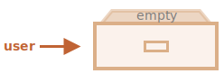
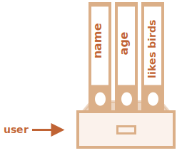

# Đối tượng

Như chúng ta đã biết ở chương <info:types>, có tám loại dữ liệu trong JavaScript. Bảy trong số chúng được gọi là "nguyên thủy", bởi vì giá trị của chúng chỉ chứa một thứ duy nhất (đó có thể là một chuỗi hoặc một số hoặc cái gì đó khác).

Ngược lại, các đối tượng được sử dụng để lưu trữ các bộ sưu tập có khóa của các dữ liệu khác nhau và các thực thể phức tạp hơn. Trong JavaScript, các đối tượng thâm nhập vào hầu hết mọi khía cạnh của ngôn ngữ. Vì vậy, chúng ta phải hiểu chúng trước khi đi sâu vào bất cứ nơi nào khác.

Một đối tượng có thể được tạo bằng dấu ngoặc hình `{…}` với một danh sách *thuộc tính* tùy chọn. Một thuộc tính là một cặp "khóa: giá trị", trong đó `khóa` là một chuỗi (còn được gọi là "tên thuộc tính"), và `giá trị` có thể là bất cứ thứ gì.

Chúng ta có thể tưởng tượng một đối tượng như một cái tủ với các tập tin đã ký. Mỗi phần dữ liệu được lưu trữ trong tệp của nó bằng từ khóa. Thật dễ dàng để tìm một tệp theo tên của nó hoặc thêm/xóa một tệp.


Một đối tượng rỗng ("tủ rỗng") có thể được tạo bằng một hoặc hai cú pháp:

```js
let user = new Object(); // cú pháp "đối tượng constructor"
let user = {};  // cú pháp "đối tượng theo nghĩa đen"
```



Thông thường, dấu ngoặc `{...}` được sử dụng. Loại khai báo đó được gọi là *đối tượng theo nghĩa đen*.

## Đối tượng theo nghĩa đen và thuộc tính

Chúng ta có thể ngay lập tức đặt một số thuộc tính vào `{...}` dưới dạng các cặp "khóa: giá trị":

```js
let user = {     // một đối tượng
  name: "John",  // khóa "name" lưu giá trị "John"
  age: 30        // khóa "age" lưu giá trị 30
};
```

Một thuộc tính có một khóa (còn được gọi là "tên" hoặc "định danh") trước dấu hai chấm `":"` và một giá trị ở bên phải của nó.

Trong đối tượng `user`, có hai thuộc tính:

1. Thuộc tính thứ nhất có tên là `"name"` và giá trị là `"John"`.
2. Thuộc tính thứ hai có tên là `"age"` và giá trị là `30`.

The resulting `user` object can be imagined as a cabinet with two signed files labeled "name" and "age".

Kết quả là đối tượng `user` có thể được tưởng tượng như một cái tủ với hai tệp được ký có nhãn "name" và "age".


Chúng ta có thể thêm, xóa và đọc tệp từ chúng mọi lúc.

Các giá trị của thuộc tính có thể truy cập bằng cách sử dụng dấu chấm:

```js
// lấy giá trị của thuộc tính trong đối tượng:
alert( user.name ); // John
alert( user.age ); // 30
```

Giá trị có thể là bất kỳ kiểu dữ liệu nào. Hãy thêm một giá trị boolean:

```js
user.isAdmin = true;
```


Để xóa thuộc tính, ta có thể dùng `delete`:

```js
delete user.age;
```


Chúng ta cũng có thể sử dụng tên thuộc tính có nhiều từ, nhưng sau đó chúng phải được bọc lại:

```js
let user = {
  name: "John",
  age: 30,
  "likes birds": true  // tên thuộc tính nhiều từ phải được bọc lại bằng dấu ngoặc kép
};
```




Thuộc tính cuối cùng trong danh sách có thể kết thúc bằng dấu phẩy:
```js
let user = {
  name: "John",
  age: 30*!*,*/!*
}
```
Đó được gọi là dấu phẩy "trailing" hay "hanging". Nó khiến dễ dàng thêm/xóa/di chuyển xung quanh các thuộc tính, bởi vì tất cả các dòng trở nên giống nhau.

## Dấu ngoặc vuông

Với thuộc tính nhiều từ, truy cập bằng dấu chấm không hoạt động:

```js run
// sẽ có lỗi cú pháp
user.likes birds = true
```

JavaScript không hiểu điều đó. Nó nghĩ rằng chúng ta cần `user.likes`, do đó nó trả ra lỗi cú pháp khi đi qua `birds` không mong muốn.

Dấu chấm yêu cầu khóa phải là một biến định danh hợp lệ. Đó là: không chứa khoảng trắng, không bắt đầu bằng một số và không bao gồm các kí tự đặc biệt (`$` và `_` thì được).

Có một thay thế là "dấu ngoặc vuông" sẽ hoạt động với bất cứ chuỗi nào:

```js run
let user = {};

// set
user["likes birds"] = true;

// get
alert(user["likes birds"]); // true

// delete
delete user["likes birds"];
```

Bây giờ mọi thứ đã tốt. Hãy lưu ý rằng chuỗi bên trong ngoặc được bao bọc chính xác (bất kỳ loại bao bọc nào cũng được).

Dấu ngoặc vuông cũng cung cấp một cách để có được tên thuộc tính là kết quả của bất kỳ biểu thức nào -- trái ngược với chuỗi ký tự -- giống như từ một biến như sau:

```js
let key = "likes birds";

// giống như user["likes birds"] = true;
user[key] = true;
```

Ở đây, biến `key` có thể được tính vào thời gian chạy hoặc phụ thuộc vào đầu vào của người dùng. Và sau đó chúng ta sử dụng nó để truy cập vào thuộc tính. Điều đó giúp chúng ta linh hoạt hơn.

Ví dụ:

```js run
let user = {
  name: "John",
  age: 30
};

let key = prompt("Bạn muốn biết điều gì về người dùng?", "name");

// truy cập vào biến
alert( user[key] ); // John (nếu nhập "name")
```

Dấu chấm không thể dùng theo cách như vậy:

```js run
let user = {
  name: "John",
  age: 30
};

let key = "name";
alert( user.key ) // undefined
```

### Thuộc tính computed

Chúng ta có thể sử dụng dấu ngoặc vuông trong một object literal, khi tạo một object. Đó gọi là * những thuộc tính computed*.

Ví dụ:

```js run
let fruit = prompt("Mua loại trái cây nào?", "apple");

let bag = {
*!*
  [fruit]: 5, // tên của thuộc tính được lấy từ biến fruit
*/!*
};

alert( bag.apple ); // 5 nếu fruit="apple"
```

Ý nghĩa của thuộc tính computed rất đơn giản: `[fruit]` có nghĩa là tên thuộc tính nên được lấy từ` fruit`.

Do vậy, nếu người dùng nhập `"apple"`, `bag` sẽ thành `{apple: 5}`.

Về cơ bản, nó hoạt động giống như:
```js run
let fruit = prompt("Mua loại trái cây nào?", "apple");
let bag = {};

// lấy tên thuộc tính từ biến fruit
bag[fruit] = 5;
```

...Nhưng nhìn tốt hơn.

Chúng ta có thể sử dụng các biểu thức phức tạp hơn trong dấu ngoặc vuông:

```js
let fruit = 'apple';
let bag = {
  [fruit + 'Computers']: 5 // bag.appleComputers = 5
};
```

Dấu ngoặc vuông có mạnh hơn dấu chấm. Chúng chấp nhận bất cứ tên của thuộc tính và biến nào. Nhưng ngoài ra chúng cũng cồng kềnh khi viết.

Vì vậy hầu hết thời gian, khi tên thuộc tính được biết và đơn giản, dấu chấm được sử dụng. Và nếu chúng ta cần một cái gì đó phức tạp hơn, thì chúng ta chuyển sang dấu ngoặc vuông.

## Property value shorthand

Trong code chúng ta thường sử dụng các biến sẵn có làm giá trị cho tên của các thuộc tính.

Ví dụ:

```js run
function makeUser(name, age) {
  return {
    name: name,
    age: age,
    // ...các thuộc tính khác
  };
}

let user = makeUser("John", 30);
alert(user.name); // John
```

Trong ví dụ trên, các thuộc tính có cùng tên với các biến. Trường hợp sử dụng để tạo một thuộc tính từ một biến là rất phổ biến, do đó có một loại *tốc ký giá trị của thuộc tính* làm cho nó ngắn hơn.

Thay vì `name:name` chúng ta có thể viết `name`, như thế này:

```js
function makeUser(name, age) {
*!*
  return {
    name, // giống như name: name
    age,  // giống như age: age
    // ...
  };
*/!*
}
```

Chúng ta có thể sử dụng cả thuộc tính bình thường và tốc ký trong cùng một đối tượng:

```js
let user = {
  name,  // giống như name:name
  age: 30
};
```

## Giới hạn của tên thuộc tính

Như ta đã biết, một biến không thể có tên trùng với những từ dành riêng cho ngôn ngữ lập trình như "for", "let", "return" vâng vâng.

Nhưng thuộc tính của object thì không giới hạn:

```js run
// những thuộc tính này đều đúng
let obj = {
  for: 1,
  let: 2,
  return: 3
};

alert( obj.for + obj.let + obj.return );  // 6
```

Nói tóm lại, không có giới hạn về tên thuộc tính. Chúng có thể là bất kỳ chuỗi hoặc ký hiệu nào (có một loại đặc biệt dành cho nhận dạng, sẽ được đề cập sau).

Các loại khác được tự động chuyển thành chuỗi.

Chẳng hạn, số `0` trở thành một chuỗi `"0"` khi được sử dụng làm khóa thuộc tính:

```js run
let obj = {
  0: "test" // giống như "0": "test"
};

// cả hai alert đều truy cập vào cùng một thuộc tính (số 0 được chuyển đổi thành chuỗi "0")
alert( obj["0"] ); // test
alert( obj[0] ); // test (có cùng thuộc tính)
```

Có một vấn đề nhỏ với thuộc tính đặc biệt có tên `__proto__`. Chúng ta không thể đặt nó thành non-object value:

```js run
let obj = {};
obj.__proto__ = 5; // assign a number
alert(obj.__proto__); // [object Object] - the value is an object, didn't work as intended
```

Như chúng ta thấy từ code, việc gán cho số `5` bị bỏ qua.

Chúng ta sẽ đề cập đến bản chất đặc biệt của `__proto__` trong [các chương tiếp theo](info:prototype-inheritance) và đề xuất [các cách khắc phục](info:prototype-methods) hành vi như vậy.

## Kiểm tra sự tồn tại của thuộc tính, toán tử "in"

Một tính năng đáng chú ý của các đối tượng trong JavaScript, so với nhiều ngôn ngữ khác, là có thể truy cập bất kỳ thuộc tính nào. Sẽ không có lỗi nếu thuộc tính không tồn tại!

Việc truy cập thuộc tính không tồn tại chỉ trả về `undefined`. Vì vậy, chúng ta có thể dễ dàng kiểm tra xem thuộc tính có tồn tại hay không:

```js run
let user = {};

alert( user.noSuchProperty === undefined ); // true có nghĩa là "no such property"
```

Ngoài ra còn tồn tại một toán tử đặc biệt `"in"` cho điều đó.

Cú pháp:
```js
"key" in object
```

Ví dụ:

```js run
let user = { name: "John", age: 30 };

alert( "age" in user ); // true, user.age tồn tại
alert( "blabla" in user ); // false, user.blabla không tồn tại
```

Hãy lưu ý rằng ở phía bên trái của `in` phải có *tên thuộc tính*. Đó thường là một chuỗi được bao bọc trong dấu ngoặc kép.

Nếu chúng ta bỏ qua dấu ngoặc kép, điều đó có nghĩa là một biến chứa tên thực tế sẽ được kiểm tra. Ví dụ:

```js run
let user = { age: 30 };

let key = "age";

alert( *!*key*/!* in user ); // true, thuộc tính "age" tồn tại
```

Tại sao `in` tồn tại? Không phải nó quá đủ để so sánh `undefined` sao?

Vâng, thường thì so sánh với `undefined` là đủ. Nhưng có một trường hợp đặc biệt khi nó lỗi, nhưng `"in"` hoạt động đúng.

Đó là khi một thuộc tính trong đối tượng tồn tại, nhưng lưu trữ là `undefined`:

```js run
let obj = {
  test: undefined
};

alert( obj.test ); // thuộc tính không tồn tại, do đó - nó không phải là thuộc tính?

alert( "test" in obj ); // true, thuộc tính tồn tại!
```

Trong đoạn code trên, về mặt kỹ thuật thuộc tính `obj.test` tồn tại. Vì vậy, toán tử `in` hoạt động đúng.

Các tình huống như thế này rất hiếm khi xảy ra, vì `undefined` thường không được chỉ định. Chúng ta chủ yếu sử dụng `null` cho các giá trị "không xác định" hoặc "rỗng". Vì vậy, toán tử `in` là một vị khách kỳ lạ trong code.

## Vòng lặp "for..in"

Để đi qua tất cả các khóa của một đối tượng, ta có một dạng vòng lặp đặc biệt: `for..in`. Đây là một điều hoàn toàn khác với cấu trúc `for (;;)` mà chúng ta đã học trước đây.

Cú pháp:

```js
for (key in object) {
  // thực thi phần thân cho mỗi key của thuộc tính trong đối tượng
}
```

Ví dụ, in ra tất cả các thuộc tính của `user`:

```js run
let user = {
  name: "John",
  age: 30,
  isAdmin: true
};

for (let key in user) {
  // các khóa
  alert( key );  // name, age, isAdmin
  // giá trị của các khóa
  alert( user[key] ); // John, 30, true
}
```

Lưu ý rằng tất cả các cấu trúc "for" cho phép chúng ta khai báo biến vòng lặp bên trong vòng lặp, như `let key` ở đây.

Ngoài ra, chúng ta có thể sử dụng một tên biến khác ở đây thay vì `key`. Chẳng hạn, `"for (let prop in obj)"` cũng được sử dụng rộng rãi.


### Sắp xếp như một đối tượng

Đối tượng có được sắp xếp không? Nói cách khác, nếu chúng ta lặp qua một đối tượng, chúng ta có nhận được tất cả các thuộc tính theo cùng thứ tự chúng đã được thêm không? Chúng ta có thể tin vào điều này không?

Câu trả lời là: "sắp xếp theo kiểu đặc biệt": thuộc tính số nguyên được sắp xếp, những cái khác xuất hiện theo thứ tự tạo. Các chi tiết theo sau.

Ví dụ: hãy xem xét một đối tượng có chứa mã điện thoại:

```js run
let codes = {
  "49": "Đức",
  "41": "Thụy Sĩ",
  "44": "Anh",
  // ..,
  "1": "Mỹ"
};

*!*
for (let code in codes) {
  alert(code); // 1, 41, 44, 49
}
*/!*
```

Đối tượng có thể được sử dụng để đề xuất một danh sách các tùy chọn cho người dùng. Nếu chúng ta tạo một trang chủ yếu cho người Đức thì có lẽ chúng ta muốn `49` đứng đầu tiên.

Nhưng nếu chúng ta chạy code, chúng ta sẽ thấy một bức tranh hoàn toàn khác:

- Mỹ (1) đứng đầu
- sau đó Thụy Sỹ (41) và cứ thế.

Các mã điện thoại đi theo thứ tự tăng dần, bởi vì chúng là số nguyên. Vì vậy, chúng ta thấy `1, 41, 44, 49`.

````smart header="Integer properties? What's that?"
Thuật ngữ "thuộc tính số nguyên" ở đây có nghĩa là một chuỗi có thể được chuyển đổi thành và từ một số nguyên mà không thay đổi.

Do đó, "49" là thuộc thuộc tính số nguyên, vì khi nó được chuyển đổi sang số nguyên và ngược lại, nó vẫn giống nhau. Nhưng "+49" và "1.2" thì không:

```js run
// Math.trunc là một hàm dựng sẵn để xóa một phần của số thập phân
alert( String(Math.trunc(Number("49"))) ); // "49", giống nhau, thuộc tính số nguyên
alert( String(Math.trunc(Number("+49"))) ); // "49", không giống "+49" ⇒ không phải thuộc tính số nguyên
alert( String(Math.trunc(Number("1.2"))) ); // "1", không giống "1.2" ⇒ không phải thuộc tính số nguyên
```
````

...Mặt khác, nếu các khóa không phải là số nguyên, thì chúng được liệt kê theo thứ tự tạo, Ví dụ:

```js run
let user = {
  name: "John",
  surname: "Smith"
};
user.age = 25; // thêm một thuộc tính nữa

*!*
// thuộc tính không nguyên được liệt kê theo thứ tự tạo
*/!*
for (let prop in user) {
  alert( prop ); // name, surname, age
}
```

Vì vậy, để khắc phục sự cố với mã điện thoại, chúng ta có thể "gian lận" bằng cách làm cho mã không nguyên. Thêm dấu cộng `"+"` trước mỗi mã là đủ.

Như sau:

```js run
let codes = {
  "+49": "Đức",
  "+41": "Thụy Sỹ",
  "+44": "Anh",
  // ..,
  "+1": "Mỹ"
};

for (let code in codes) {
  alert( +code ); // 49, 41, 44, 1
}
```

Bây giờ nó hoạt động như ý muốn.

## Tổng kết

Đối tượng là mảng kết hợp với một số tính năng đặc biệt.

Họ lưu trữ các thuộc tính (các cặp khóa-giá trị), trong đó:
- Thuộc tính khóa phải là chuỗi hoặc ký hiệu (thường là chuỗi).
- Giá trị có thể là bất kỳ loại nào.

Để truy cập một thuộc tính, chúng ta có thể sử dụng:
- Ký hiệu dấu chấm: `obj.property`.
- Ký hiệu ngoặc vuông `obj["property"]`. Dấu ngoặc vuông cho phép lấy khóa từ một biến, như `obj[varWithKey]`.

Toán tử bổ sung:
- Để xóa một thuộc tính: `delete obj.prop`.
- Để kiểm tra xem một thuộc tính có khóa đã cho có tồn tại không: `"key" in obj`.
- Để lặp qua một đối tượng: `for (let key in obj)`

Những gì chúng ta đã nghiên cứu trong chương này được gọi là "đối tượng đơn giản", hoặc `Object`.

Có nhiều loại đối tượng khác trong JavaScript:

- `Array` để lưu trữ các bộ sưu tập dữ liệu theo thứ tự,
- `Ngày` để lưu trữ thông tin về ngày và giờ,
- `Error` để lưu trữ thông tin về lỗi.
- ...Và nhiều hơn.

Chúng có những tính năng đặc biệt mà chúng ta sẽ nghiên cứu sau. Đôi khi mọi người nói một cái gì đó như "Kiểu mảng" hoặc "Kiểu ngày", nhưng chính thức chúng không có kiểu của riêng chúng, mà thuộc về một loại dữ liệu "đối tượng" duy nhất. Và chúng mở rộng nó theo nhiều cách khác nhau.

Các đối tượng trong JavaScript rất mạnh mẽ. Chúng ta chỉ vừa vạch ra bề mặt của một chủ đề thực sự rất lớn. Ta sẽ làm việc chặt chẽ với các đối tượng và tìm hiểu thêm về chúng trong các phần tiếp theo.
