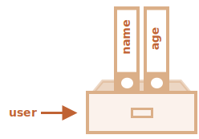

# Đối tượng

Như chúng ta đã biết ở chương <info:types>, có 6 loại dữ liệu trong JavaScript. Chúng được gọi là "nguyên thủy", bởi vì giá trị của chúng chỉ chứa một thứ duy nhất (đó có thể là một chuỗi hoặc một số hoặc cái gì đó khác).

Ngược lại, các đối tượng được sử dụng để lưu trữ các bộ sưu tập có khóa của các dữ liệu khác nhau và các thực thể phức tạp hơn. Trong JavaScript, các đối tượng thâm nhập vào hầu hết mọi khía cạnh của ngôn ngữ. Vì vậy, chúng ta phải hiểu chúng trước khi đi sâu vào bất cứ nơi nào khác.

Một đối tượng có thể được tạo bằng dấu ngoặc hình `{…}` với một danh sách *thuộc tính* tùy chọn. Một thuộc tính là một cặp "khóa: giá trị", trong đó `khóa` là một chuỗi (còn được gọi là "tên thuộc tính"), và `giá trị` có thể là bất cứ thứ gì.

Chúng ta có thể tưởng tượng một đối tượng như một cái tủ với các tập tin đã ký. Mỗi phần dữ liệu được lưu trữ trong tệp của nó bằng từ khóa. Thật dễ dàng để tìm một tệp theo tên của nó hoặc thêm/xóa một tệp.


Một đối tượng rỗng ("tủ rỗng") có thể được tạo bằng một hoặc hai cú pháp:

```js
let user = new Object(); // cú pháp "đối tượng constructor"
let user = {};  // cú pháp "đối tượng theo nghĩa đen"
```


Thông thường, dấu ngoặc `{...}` được sử dụng. Loại khai báo đó được gọi là *đối tượng theo nghĩa đen*.

## Đối tượng theo nghĩa đen và thuộc tính

Chúng ta có thể ngay lập tức đặt một số thuộc tính vào `{...}` dưới dạng các cặp "khóa: giá trị":

```js
let user = {     // một đối tượng
  name: "John",  // khóa "name" lưu giá trị "John"
  age: 30        // khóa "age" lưu giá trị 30
};
```

Một thuộc tính có một khóa (còn được gọi là "tên" hoặc "định danh") trước dấu hai chấm `":"` và một giá trị ở bên phải của nó.

Trong đối tượng `user`, có hai thuộc tính:

1. Thuộc tính thứ nhất có tên là `"name"` và giá trị là `"John"`.
2. Thuộc tính thứ hai có tên là `"age"` và giá trị là `30`.

The resulting `user` object can be imagined as a cabinet with two signed files labeled "name" and "age".

Kết quả là đối tượng `user` có thể được tưởng tượng như một cái tủ với hai tệp được ký có nhãn "name" và "age".



Chúng ta có thể thêm, xóa và đọc tệp từ chúng mọi lúc.

Các giá trị của thuộc tính có thể truy cập bằng cách sử dụng dấu chấm:

```js
// lấy giá trị của thuộc tính trong đối tượng:
alert( user.name ); // John
alert( user.age ); // 30
```

Giá trị có thể là bất kỳ kiểu dữ liệu nào. Hãy thêm một giá trị boolean:

```js
user.isAdmin = true;
```


Để xóa thuộc tính, ta có thể dùng `delete`:

```js
delete user.age;
```


Chúng ta cũng có thể sử dụng tên thuộc tính có nhiều từ, nhưng sau đó chúng phải được bọc lại:

```js
let user = {
  name: "John",
  age: 30,
  "likes birds": true  // tên thuộc tính nhiều từ phải được bọc lại bằng dấu ngoặc kép
};
```


Thuộc tính cuối cùng trong danh sách có thể kết thúc bằng dấu phẩy:
```js
let user = {
  name: "John",
  age: 30*!*,*/!*
}
```
Đó được gọi là dấu phẩy "trailing" hay "hanging". Nó khiến dễ dàng thêm/xóa/di chuyển xung quanh các thuộc tính, bởi vì tất cả các dòng trở nên giống nhau.

## Dấu ngoặc vuông

Với thuộc tính nhiều từ, truy cập bằng dấu chấm không hoạt động:

```js run
// sẽ có lỗi cú pháp
user.likes birds = true
```

Đó là vì dấu chấm yêu cầu khóa phải là một biến định danh hợp lệ. Đó là: không chứa khoảng trắng và các giới hạn khác.

Có một thay thế là "dấu ngoặc vuông" sẽ hoạt động với bất cứ chuỗi nào:

```js run
let user = {};

// set
user["likes birds"] = true;

// get
alert(user["likes birds"]); // true

// delete
delete user["likes birds"];
```

Bây giờ mọi thứ đã tốt. Hãy lưu ý rằng chuỗi bên trong ngoặc được bao bọc chính xác (bất kỳ loại bao bọc nào cũng được).

Dấu ngoặc vuông cũng cung cấp một cách để có được tên thuộc tính là kết quả của bất kỳ biểu thức nào -- trái ngược với chuỗi ký tự -- giống như từ một biến như sau:

```js
let key = "likes birds";

// giống như user["likes birds"] = true;
user[key] = true;
```

Ở đây, biến `key` có thể được tính vào thời gian chạy hoặc phụ thuộc vào đầu vào của người dùng. Và sau đó chúng ta sử dụng nó để truy cập vào thuộc tính. Điều đó giúp chúng ta linh hoạt hơn.

Ví dụ:

```js run
let user = {
  name: "John",
  age: 30
};

let key = prompt("Bạn muốn biết điều gì về người dùng?", "name");

// truy cập vào biến
alert( user[key] ); // John (nếu nhập "name")
```

Dấu chấm không thể dùng theo cách như vậy:

```js run
let user = {
  name: "John",
  age: 30
};

let key = "name";
alert( user.key ) // undefined
```

### Thuộc tính computed

Chúng ta có thể sử dụng dấu ngoặc vuông trong một đối tượng theo nghĩa đen. Đó gọi là *thuộc tính computed*.

Ví dụ:

```js run
let fruit = prompt("Mua loại trái cây nào?", "apple");

let bag = {
*!*
  [fruit]: 5, // tên của thuộc tính được lấy từ biến fruit
*/!*
};

alert( bag.apple ); // 5 nếu fruit="apple"
```

Ý nghĩa của thuộc tính computed rất đơn giản: `[fruit]` có nghĩa là tên thuộc tính nên được lấy từ` fruit`.

Do vậy, nếu người dùng nhập `"apple"`, `bag` sẽ thành `{apple: 5}`.

Về cơ bản, nó hoạt động giống như:
```js run
let fruit = prompt("Mua loại trái cây nào?", "apple");
let bag = {};

// lấy tên thuộc tính từ biến fruit
bag[fruit] = 5;
```

...Nhưng nhìn tốt hơn.

Chúng ta có thể sử dụng các biểu thức phức tạp hơn trong dấu ngoặc vuông:

```js
let fruit = 'apple';
let bag = {
  [fruit + 'Computers']: 5 // bag.appleComputers = 5
};
```

Dấu ngoặc vuông có mạnh hơn dấu chấm. Chúng chấp nhận bất cứ tên của thuộc tính và biến nào. Nhưng ngoài ra chúng cũng cồng kềnh khi viết.

Vì vậy hầu hết thời gian, khi tên thuộc tính được biết và đơn giản, dấu chấm được sử dụng. Và nếu chúng ta cần một cái gì đó phức tạp hơn, thì chúng ta chuyển sang dấu ngoặc vuông.


````smart header="Reserved words are allowed as property names"
Một biến không thể có tên bằng một trong những từ dành riêng cho ngôn ngữ như "for", "let", "return", vâng vâng.

Nhưng đối với một thuộc tính đối tượng, không có hạn chế đó. Tên nào cũng được:

```js run
let obj = {
  for: 1,
  let: 2,
  return: 3
};

alert( obj.for + obj.let + obj.return );  // 6
```

Về cơ bản, bất kỳ tên nào cũng được cho phép, nhưng có một tên đặc biệt: `" __proto __ "` được đối xử đặc biệt vì lý do lịch sử. Chẳng hạn, chúng ta không thể đặt nó vào một giá trị phi đối tượng:

```js run
let obj = {};
obj.__proto__ = 5;
alert(obj.__proto__); // [object Object], didn't work as intended
```

Như chúng ta thấy từ code, việc gán cho một biến nguyên thủy `5` bị bỏ qua.

Điều đó có thể trở thành nguyên nhân gây ra lỗi và thậm chí là lỗ hổng nếu ta dự định lưu trữ các cặp khóa-giá trị tùy ý trong một đối tượng và cho phép người dùng truy cập các khóa cụ thể.

Trong trường hợp đó, người dùng có thể chọn `__proto__` làm khóa và logic gán sẽ bị hủy (như được hiển thị ở trên).

Có một cách để làm cho các đối tượng coi `__proto__` như một thuộc tính thông thường, chúng ta sẽ đề cập sau, nhưng trước tiên chúng ta cần biết thêm về các đối tượng.

Ngoài ra còn có một cấu trúc dữ liệu khác [Map](info:map-set), mà chúng ta sẽ tìm hiểu trong chương <info:map-set>, nó hỗ trợ các khóa tùy ý.
````


## Tốc ký giá trị của thuộc tính

Trong code chúng ta thường sử dụng các biến sẵn có làm giá trị cho tên của các thuộc tính.

Ví dụ:

```js run
function makeUser(name, age) {
  return {
    name: name,
    age: age
    // ...các thuộc tính khác
  };
}

let user = makeUser("John", 30);
alert(user.name); // John
```

Trong ví dụ trên, các thuộc tính có cùng tên với các biến. Trường hợp sử dụng để tạo một thuộc tính từ một biến là rất phổ biến, do đó có một loại *tốc ký giá trị của thuộc tính* làm cho nó ngắn hơn.

Thay vì `name:name` chúng ta có thể viết `name`, như thế này:

```js
function makeUser(name, age) {
*!*
  return {
    name, // giống như name: name
    age   // giống như age: age
    // ...
  };
*/!*
}
```

Chúng ta có thể sử dụng cả thuộc tính bình thường và tốc ký trong cùng một đối tượng:

```js
let user = {
  name,  // giống như name:name
  age: 30
};
```

## Kiểm tra tồn tại

Một tính năng đáng chú ý của đối tượng là có thể truy cập bất kỳ thuộc tính nào. Sẽ không có lỗi nếu thuộc tính không tồn tại! Truy cập một thuộc tính không tồn tại chỉ trả về `undefined`. Nó cung cấp một cách rất phổ biến để kiểm tra xem thuộc tính có tồn tại hay không - lấy nó và so sánh với undefined:

```js run
let user = {};

alert( user.noSuchProperty === undefined ); // true có nghĩa là "no such property"
```

Ngoài ra còn tồn tại một toán tử đặc biệt `"in"` để kiểm tra sự tồn tại của một thuộc tính.

Cú pháp:
```js
"key" in object
```

Ví dụ:

```js run
let user = { name: "John", age: 30 };

alert( "age" in user ); // true, user.age tồn tại
alert( "blabla" in user ); // false, user.blabla không tồn tại
```

Hãy lưu ý rằng ở phía bên trái của `in` phải có *tên thuộc tính*. Đó thường là một chuỗi được bao bọc trong dấu ngoặc kép.

Nếu chúng ta bỏ qua dấu ngoặc kép, điều đó có nghĩa là một biến chứa tên thực tế sẽ được kiểm tra. Ví dụ:

```js run
let user = { age: 30 };

let key = "age";
alert( *!*key*/!* in user ); // true, lấy tên từ key và kiểm tra thuộc tính đó
```

````smart header="Using \"in\" for properties that store `undefined`"
Thông thường, sự so sánh chặt `"=== undefined"` kiểm tra sự tồn tại của thuộc tính. Có một trường hợp đặc biệt nó sẽ sai, nhưng với `"in"` thì chạy chính xác.

Đó là khi một thuộc tính trong đối tượng tồn tại, nhưng lưu trữ là `undefined`:

```js run
let obj = {
  test: undefined
};

alert( obj.test ); // thuộc tính không tồn tại, do đó - nó không phải là thuộc tính?

alert( "test" in obj ); // true, thuộc tính tồn tại!
```


Trong đoạn code trên, thuộc tính `obj.test` về mặt kỹ thuật tồn tại. Vì vậy, toán tử `in` hoạt động đúng.

Các tình huống như thế này rất hiếm khi xảy ra, vì `undefined` thường không được chỉ định. Chúng ta chủ yếu sử dụng `null` cho các giá trị "không xác định" hoặc "rỗng". Vì vậy, toán tử `in` là một vị khách kỳ lạ trong code.

## Vòng lặp "for..in"

Để đi qua tất cả các khóa của một đối tượng, ta có một dạng vòng lặp đặc biệt: `for..in`. Đây là một điều hoàn toàn khác với cấu trúc `for (;;)` mà chúng ta đã học trước đây.

Cú pháp:

```js
for (key in object) {
  // thực thi phần thân cho mỗi key của thuộc tính trong đối tượng
}
```

Ví dụ, in ra tất cả các thuộc tính của `user`:

```js run
let user = {
  name: "John",
  age: 30,
  isAdmin: true
};

for (let key in user) {
  // các khóa
  alert( key );  // name, age, isAdmin
  // giá trị của các khóa
  alert( user[key] ); // John, 30, true
}
```

Lưu ý rằng tất cả các cấu trúc "for" cho phép chúng ta khai báo biến vòng lặp bên trong vòng lặp, như `let key` ở đây.

Ngoài ra, chúng ta có thể sử dụng một tên biến khác ở đây thay vì `key`. Chẳng hạn, `"for (let prop in obj)"` cũng được sử dụng rộng rãi.


### Sắp xếp một đối tượng

Đối tượng có được sắp xếp không? Nói cách khác, nếu chúng ta lặp qua một đối tượng, chúng ta có nhận được tất cả các thuộc tính theo cùng thứ tự chúng đã được thêm không? Chúng ta có thể tin vào điều này không?

Câu trả lời là: "sắp xếp theo kiểu đặc biệt": thuộc tính số nguyên được sắp xếp, những cái khác xuất hiện theo thứ tự tạo. Các chi tiết theo sau.

Ví dụ: hãy xem xét một đối tượng có chứa mã điện thoại:

```js run
let codes = {
  "49": "Đức",
  "41": "Thụy Sĩ",
  "44": "Anh",
  // ..,
  "1": "Mỹ"
};

*!*
for (let code in codes) {
  alert(code); // 1, 41, 44, 49
}
*/!*
```

Đối tượng có thể được sử dụng để đề xuất một danh sách các tùy chọn cho người dùng. Nếu chúng ta tạo một trang chủ yếu cho người Đức thì có lẽ chúng ta muốn `49` đứng đầu tiên.

Nhưng nếu chúng ta chạy code, chúng ta sẽ thấy một bức tranh hoàn toàn khác:

- Mỹ (1) đứng đầu
- sau đó Thụy Sỹ (41) và cứ thế.

Các mã điện thoại đi theo thứ tự tăng dần, bởi vì chúng là số nguyên. Vì vậy, chúng ta thấy `1, 41, 44, 49`.

````smart header="Integer properties? What's that?"
Thuật ngữ "thuộc tính số nguyên" ở đây có nghĩa là một chuỗi có thể được chuyển đổi thành và từ một số nguyên mà không thay đổi.

Do đó, "49" là thuộc thuộc tính số nguyên, vì khi nó được chuyển đổi sang số nguyên và ngược lại, nó vẫn giống nhau. Nhưng "+49" và "1.2" thì không:

```js run
// Math.trunc là một hàm dựng sẵn để xóa một phần của số thập phân
alert( String(Math.trunc(Number("49"))) ); // "49", giống nhau, thuộc tính số nguyên
alert( String(Math.trunc(Number("+49"))) ); // "49", không giống "+49" ⇒ không phải thuộc tính số nguyên
alert( String(Math.trunc(Number("1.2"))) ); // "1", không giống "1.2" ⇒ không phải thuộc tính số nguyên
```
````

...Mặt khác, nếu các khóa không phải là số nguyên, thì chúng được liệt kê theo thứ tự tạo, Ví dụ:

```js run
let user = {
  name: "John",
  surname: "Smith"
};
user.age = 25; // thêm một thuộc tính nữa

*!*
// thuộc tính không nguyên được liệt kê theo thứ tự tạo
*/!*
for (let prop in user) {
  alert( prop ); // name, surname, age
}
```

Vì vậy, để khắc phục sự cố với mã điện thoại, chúng ta có thể "gian lận" bằng cách làm cho mã không nguyên. Thêm dấu cộng `"+"` trước mỗi mã là đủ.

Như sau:

```js run
let codes = {
  "+49": "Đức",
  "+41": "Thụy Sỹ",
  "+44": "Anh",
  // ..,
  "+1": "Mỹ"
};

for (let code in codes) {
  alert( +code ); // 49, 41, 44, 1
}
```

Bây giờ nó hoạt động như ý muốn.

## Sao chép bằng tham chiếu

Một trong những khác biệt cơ bản của các đối tượng so với nguyên thủy là chúng được lưu trữ và sao chép "bằng tham chiếu".

Các giá trị nguyên thủy: chuỗi, số, booleans - được gán/sao chép "dưới dạng toàn bộ giá trị".

Ví dụ:

```js
let message = "Hello!";
let phrase = message;
```

Kết quả là chúng ta có hai biến độc lập, mỗi biến được lưu trữ chuỗi `"Hello!"`.


Đối tượng không như thế.

**Một biến lưu trữ không phải chính là đối tượng, mà là "địa chỉ trong bộ nhớ", nói cách khác là "một tham chiếu" đến nó.**

Đây là hình ảnh cho đối tượng:

```js
let user = {
  name: "John"
};
```


Ở đây, đối tượng được lưu trữ ở đâu đó trong bộ nhớ. Và biến `user` có "tham chiếu" đến nó.

**Khi một biến đối tượng được sao chép -- tham chiếu được sao chép, đối tượng không được sao chép.**

Nếu chúng ta tưởng tượng một đối tượng như một cái tủ, thì một biến là một chìa khóa cho nó. Sao chép một biến là sao chép khóa, nhưng không phải chính tủ.

Ví dụ:

```js no-beautify
let user = { name: "John" };

let admin = user; // sao chép tham chiếu
```

Bây giờ chúng ta có hai biến, mỗi biến có tham chiếu đến cùng một đối tượng:


Chúng ta có thể sử dụng bất kỳ biến nào để truy cập vào bên trong và sửa đổi nội dung của nó:

```js run
let user = { name: 'John' };

let admin = user;

*!*
admin.name = 'Pete'; // thay đổi bởi tham chiếu của "admin"
*/!*

alert(*!*user.name*/!*); // 'Pete', những thay đổi được nhìn thấy từ tham chiếu của "user"
```

Ví dụ trên chứng tỏ rằng chỉ có một đối tượng. Như thể chúng ta có một cái tủ có hai chìa khóa và sử dụng một trong số chúng (`admin`) để vào trong đó. Sau đó, nếu sau này chúng ta sử dụng khóa khác (`user`), chúng ta sẽ thấy các thay đổi.

### So sánh bằng tham chiếu

Các toán tử `==` và đẳng thức `===` cho các đối tượng hoạt động giống hệt nhau.

**Hai đối tượng chỉ bằng nhau nếu chúng là cùng một đối tượng.**

Ví dụ, nếu hai biến tham chiếu cùng một đối tượng, chúng bằng nhau:

```js run
let a = {};
let b = a; // sao chép tham chiếu

alert( a == b ); // true, hay biến tham chiếu đến cùng một đối tượng
alert( a === b ); // true
```

Và ở đây hai đối tượng độc lập không bằng nhau, mặc dù cả hai đều trống:

```js run
let a = {};
let b = {}; // hai đối tượng độc lập

alert( a == b ); // false
```

Để so sánh như `obj1 > obj2` hoặc để so sánh với `obj == 5` nguyên thủy, các đối tượng được chuyển đổi thành nguyên thủy. Chúng ta sẽ nghiên cứu cách chuyển đổi đối tượng hoạt động rất sớm, nhưng để nói sự thật, việc so sánh như vậy là rất cần thiết rất hiếm khi và thường là kết quả của một lỗi mã hóa.

### Đối tượng hằng số

Một đối tượng được khai báo là `const` *có thể* được thay đổi.

Ví dụ:

```js run
const user = {
  name: "John"
};

*!*
user.age = 25; // (*)
*/!*

alert(user.age); // 25
```

Có vẻ như dòng `(*)` sẽ gây ra lỗi, nhưng không, hoàn toàn không có vấn đề gì. Đó là bởi vì `const` chỉ sửa giá trị của chính `user`. Và ở đây `user` lưu trữ tham chiếu mọi lúc đến cùng một đối tượng. Dòng `(*)` vào *bên trong* đối tượng, nó không gán lại cho `user`.

`const` sẽ báo lỗi nếu chúng ta cố gắng gán `user` thành thứ khác, Ví dụ:

```js run
const user = {
  name: "John"
};

*!*
// Lỗi (không thể gán lại biến user)
*/!*
user = {
  name: "Pete"
};
```

...Nhưng nếu chúng ta muốn tạo các thuộc tính đối tượng không đổi thì sao? Vì vậy, `user.age = 25` sẽ báo lỗi. Điều đó cũng có thể. Chúng tôi sẽ đề cập đến nó trong chương <info:property-descriptors>.

## Sao chép và gộp, Object.assign

Vì vậy, sao chép một biến đối tượng sẽ tạo thêm một tham chiếu đến cùng một đối tượng.

Nhưng nếu chúng ta cần sao chép một đối tượng thì sao? Tạo một sao chép độc lập, một bản sao?

Điều đó cũng có thể thực hiện được, nhưng khó khăn hơn một chút, vì không có phương thức tích hợp sẵn cho JavaScript. Trên thực tế, điều đó hiếm khi cần thiết. Sao chép bằng tham chiếu trong nhiều trường hợp là tốt nhất.

Nhưng nếu chúng ta thực sự muốn điều đó, thì chúng ta cần tạo một đối tượng mới và sao chép cấu trúc của đối tượng hiện có bằng cách lặp lại các thuộc tính của nó và sao chép chúng ở cấp độ nguyên thủy.

Như thế này:

```js run
let user = {
  name: "John",
  age: 30
};

*!*
let clone = {}; // đối tượng mới rỗng

// hãy sao chép tất cả các thuộc tính của user vào nó
for (let key in user) {
  clone[key] = user[key];
}
*/!*

// bây giờ bản sao là một bản sao hoàn toàn độc lập
clone.name = "Pete"; // thay đổi dữ liệu bên trong nó

alert( user.name ); // vẫn còn là John trong đối tượng gốc
```

Ngoài ra, chúng ta có thể sử dụng phương thức [Object.assign](mdn:js/Object/assign) cho điều đó.

Cú pháp là:

```js
Object.assign(dest, [src1, src2, src3...])
```

- Đối số `dest`, và `src1, ..., srcN` (có thể nhiều nhất có thể) là đối tượng.
- Nó sao chép các thuộc tính của tất cả các đối tượng `src1, ..., srcN` vào `dest`. Nói cách khác, các thuộc tính của tất cả các đối số bắt đầu từ thứ 2 được sao chép vào thứ 1. Sau đó, nó trả về `dest`.

Ví dụ, chúng ta có thể sử dụng nó để hợp nhất một số đối tượng thành một:
```js
let user = { name: "John" };

let permissions1 = { canView: true };
let permissions2 = { canEdit: true };

*!*
// sao chép tất cả các thuộc tính từ permissions1 và permissions2 vào user
Object.assign(user, permissions1, permissions2);
*/!*

// bây giờ user = { name: "John", canView: true, canEdit: true }
```

Nếu đối tượng nhận (`user`) đã có cùng thuộc tính được đặt tên, nó sẽ bị ghi đè:

```js
let user = { name: "John" };

// ghi đè name, thêm isAdmin
Object.assign(user, { name: "Pete", isAdmin: true });

// bây giờ user = { name: "Pete", isAdmin: true }
```

Chúng ta cũng có thể sử dụng `Object.assign` để thay thế vòng lặp để tạo bản sao đơn giản:

```js
let user = {
  name: "John",
  age: 30
};

*!*
let clone = Object.assign({}, user);
*/!*
```

Nó sao chép tất cả các thuộc tính của `user` vào đối tượng trống và trả về nó. Trên thực tế, nó giống như vòng lặp, nhưng ngắn hơn.

Cho đến bây giờ chúng ta giả định rằng tất cả các thuộc tính của `user` là nguyên thủy. Nhưng các thuộc tính có thể được tham chiếu đến các đối tượng khác. Làm gì với chúng đây?

Như thế này:
```js run
let user = {
  name: "John",
  sizes: {
    height: 182,
    width: 50
  }
};

alert( user.sizes.height ); // 182
```

Bây giờ nó không đủ để sao chép `clone.sizes = user.sizes`, vì` user.sizes` là một đối tượng, nó sẽ được sao chép bằng tham chiếu. Vì vậy, `clone` và` user` sẽ có cùng kích thước:

Như thế này:
```js run
let user = {
  name: "John",
  sizes: {
    height: 182,
    width: 50
  }
};

let clone = Object.assign({}, user);

alert( user.sizes === clone.sizes ); // true, cùng đối tượng

// user và clone chia sẻ chung sizes
user.sizes.width++;       // thay đổi thuộc tính từ một nơi
alert(clone.sizes.width); // 51, ta thấy kết quả ở một nơi khác
```

Để khắc phục điều đó, chúng ta nên sử dụng vòng lặp nhân bản để kiểm tra từng giá trị của `user [key]` và, nếu đó là một đối tượng, thì cũng sao chép cấu trúc của nó. Điều đó được gọi là "nhân bản sâu".

Có một thuật toán tiêu chuẩn để nhân bản sâu xử lý trường hợp trên và các trường hợp phức tạp hơn, được gọi là [Thuật toán nhân bản có cấu trúc](http://w3c.github.io/html/infrastructure.html#safe-passing-of-structured-data). Để không phát minh lại bánh xe, chúng ta có thể sử dụng triển khai thực hiện nó từ thư viện JavaScript [lodash](https://lodash.com), phương thức được gọi là [_.cloneDeep(obj)](https://lodash.com/docs#cloneDeep).


## Tổng kết

Đối tượng là mảng kết hợp với một số tính năng đặc biệt.

Họ lưu trữ các thuộc tính (các cặp khóa-giá trị), trong đó:
- Thuộc tính khóa phải là chuỗi hoặc ký hiệu (thường là chuỗi).
- Giá trị có thể là bất kỳ loại nào.

Để truy cập một thuộc tính, chúng ta có thể sử dụng:
- Ký hiệu dấu chấm: `obj.property`.
- Ký hiệu ngoặc vuông `obj["property"]`. Dấu ngoặc vuông cho phép lấy khóa từ một biến, như `obj[varWithKey]`.

Toán tử bổ sung:
- Để xóa một thuộc tính: `delete obj.prop`.
- Để kiểm tra xem một thuộc tính có khóa đã cho có tồn tại không: `"key" in obj`.
- Để lặp qua một đối tượng: `for (let key in obj)`

Các đối tượng được gán và sao chép bằng tham chiếu. Nói cách khác, một biến không lưu trữ "giá trị của đối tượng", mà là "tham chiếu" (địa chỉ trong bộ nhớ) cho giá trị. Vì vậy, sao chép một biến như vậy hoặc chuyển nó dưới dạng đối số hàm sẽ sao chép tham chiếu đó, không phải đối tượng. Tất cả các hoạt động thông qua sao chép tham chiếu (như thêm/xóa thuộc tính) được thực hiện trên cùng một đối tượng.

Để tạo một "sao chép thực" (bản sao) chúng ta có thể sử dụng `Object.assign` hoặc [_.cloneDeep(obj)](https://lodash.com/docs#cloneDeep).

Những gì chúng ta đã nghiên cứu trong chương này được gọi là "đối tượng đơn giản", hoặc `Object`.

Có nhiều loại đối tượng khác trong JavaScript:

- `Array` để lưu trữ các bộ sưu tập dữ liệu theo thứ tự,
- `Ngày` để lưu trữ thông tin về ngày và giờ,
- `Error` để lưu trữ thông tin về lỗi.
- ...Và nhiều hơn.

Chúng có những tính năng đặc biệt mà chúng ta sẽ nghiên cứu sau. Đôi khi mọi người nói một cái gì đó như "Kiểu mảng" hoặc "Kiểu ngày", nhưng chính thức chúng không có kiểu của riêng chúng, mà thuộc về một loại dữ liệu "đối tượng" duy nhất. Và chúng mở rộng nó theo nhiều cách khác nhau.

Các đối tượng trong JavaScript rất mạnh mẽ. Chúng ta chỉ vừa vạch ra bề mặt của một chủ đề thực sự rất lớn. Ta sẽ làm việc chặt chẽ với các đối tượng và tìm hiểu thêm về chúng trong các phần tiếp theo.
