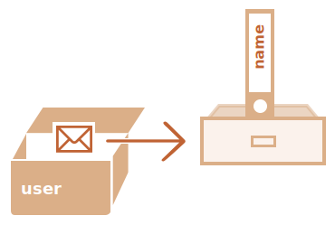

# Tham chiếu và sao chép đối tượng

Một trong những điểm khác biệt cơ bản của đối tượng so với nguyên hàm là đối tượng được lưu trữ và sao chép "theo tham chiếu", trong khi các giá trị nguyên thủy: chuỗi, số, booleans, v.v. -- luôn được sao chép "dưới dạng toàn bộ giá trị".

Điều đó dễ hiểu nếu chúng ta xem xét một chút về những gì xảy ra khi chúng ta sao chép một giá trị.

Hãy bắt đầu với một nguyên hàm, chẳng hạn như một chuỗi.

Ở đây chúng ta đặt một bản sao của `message` vào `phrase`:

```js
let message = "Xin chào!";
let phrase = message;
```

Kết quả là chúng ta có hai biến độc lập, mỗi biến lưu trữ chuỗi `"Xin chào!"`.


Một kết quả khá rõ ràng, phải không?

Đối tượng không phải như vậy.

**Một biến được gán cho một đối tượng không lưu trữ chính đối tượng đó, mà lưu trữ "địa chỉ trong bộ nhớ" của đối tượng -- nói cách khác là "tham chiếu" tới đối tượng đó.**

Hãy xem một ví dụ về một biến như vậy:

```js
let user = {
  name: "John"
};
```

Và đây là cách nó thực sự được lưu trữ trong bộ nhớ:



Đối tượng được lưu trữ ở đâu đó trong bộ nhớ (ở bên phải của hình ảnh), trong khi biến `user` (ở bên trái) có "tham chiếu" đến nó.

Chúng ta có thể nghĩ về một biến đối tượng, chẳng hạn như `người dùng`, giống như một tờ giấy có địa chỉ của đối tượng trên đó.

Khi chúng ta thực hiện các hành động với đối tượng, v.d. lấy một thuộc tính `user.name`, JavaScript engine sẽ xem xét địa chỉ đó có gì và thực hiện thao tác trên đối tượng thực tế.

Bây giờ đây là lý do tại sao nó quan trọng.

**Khi một biến đối tượng được sao chép, tham chiếu được sao chép nhưng bản thân đối tượng không được sao chép.**

Ví dụ:

```js no-beautify
let user = { name: "John" };

let admin = user; // sao chép tham chiếu
```

Bây giờ chúng ta có hai biến, mỗi biến lưu trữ một tham chiếu đến cùng một đối tượng:


Như bạn có thể thấy, vẫn còn một đối tượng, nhưng bây giờ có hai biến tham chiếu đến nó.

Chúng ta có thể sử dụng một trong hai biến để truy cập đối tượng và sửa đổi nội dung của nó:

```js run
let user = { name: 'John' };

let admin = user;

*!*
admin.name = 'Pete'; // được thay đổi bởi tham chiếu "admin"
*/!*

alert(*!*user.name*/!*); // 'Pete', những thay đổi được nhìn thấy từ tham chiếu "user"
```

Giống như thể chúng ta có một chiếc tủ có hai chìa khóa và sử dụng một trong số chúng (`admin`) để mở và thực hiện các thay đổi. Sau đó, nếu sau này chúng ta sử dụng một khóa khác (`user`), thì chúng ta vẫn đang mở cùng một ngăn tủ và có thể truy cập vào nội dung đã thay đổi.

## So sánh theo tham chiếu

Hai đối tượng chỉ bằng nhau nếu chúng là cùng một đối tượng.

Chẳng hạn, ở đây `a` và `b` tham chiếu cùng một đối tượng, do đó chúng bằng nhau:

```js run
let a = {};
let b = a; // sao chép tham chiếu

alert( a == b ); // true, cả hai biến tham chiếu cùng một đối tượng
alert( a === b ); // true
```

Và ở đây, hai đối tượng độc lập không bằng nhau, mặc dù chúng trông giống nhau (cả hai đều trống):

```js run
let a = {};
let b = {}; // hai đối tượng độc lập

alert( a == b ); // false
```

Đối với các so sánh như `obj1 > obj2` hoặc để so sánh với một đối tượng nguyên thủy `obj == 5`, các đối tượng được chuyển đổi thành đối tượng nguyên thủy. Chúng ta sẽ sớm nghiên cứu cách hoạt động của chuyển đổi đối tượng, nhưng nói thật, những phép so sánh như vậy rất hiếm khi cần thiết -- chúng thường xuất hiện do lỗi lập trình.

## Nhân bản và hợp nhất, Object.assign [#cloning-and-merging-object-assign]

Vì vậy, sao chép một biến đối tượng sẽ tạo thêm một tham chiếu đến cùng một đối tượng.

Nhưng nếu chúng ta cần sao chép một đối tượng thì sao? Tạo một bản sao độc lập, một bản sao?

Điều đó cũng có thể thực hiện được, nhưng hơi khó hơn một chút vì không có phương thức tích hợp sẵn nào cho điều đó trong JavaScript. Nhưng hiếm khi có nhu cầu - hầu hết thời gian sao chép theo tham chiếu là tốt.

Nhưng nếu chúng ta thực sự muốn điều đó, thì chúng ta cần tạo một đối tượng mới và sao chép cấu trúc của đối tượng hiện có bằng cách lặp lại các thuộc tính của nó và sao chép chúng ở cấp độ nguyên thủy.

Như thế này:

```js run
let user = {
  name: "John",
  age: 30
};

*!*
let clone = {}; // đối tượng trống mới

// hãy sao chép tất cả các thuộc tính người dùng vào đó
for (let key in user) {
  clone[key] = user[key];
}
*/!*

// bây giờ bản sao là một đối tượng hoàn toàn độc lập với cùng một nội dung
clone.name = "Pete"; // đã thay đổi dữ liệu trong đó

alert( user.name ); // vẫn còn John trong đối tượng ban đầu
```

Ngoài ra, chúng ta có thể sử dụng phương thức [Object.assign](mdn:js/Object/assign) cho việc đó.

Cú pháp là:

```js
Object.assign(dest, ...sources)
```

- Đối số đầu tiên `dest` là một đối tượng đích.
- Các đối số khác là danh sách các đối tượng nguồn.

Nó sao chép các thuộc tính của tất cả các đối tượng nguồn vào `dest` đích, sau đó trả về nó dưới dạng kết quả.

Ví dụ: chúng ta có đối tượng `user`, hãy thêm một số quyền cho đối tượng đó:

```js run
let user = { name: "John" };

let permissions1 = { canView: true };
let permissions2 = { canEdit: true };

*!*
// sao chép tất cả các thuộc tính từ permissions1 và permission2 vào user
Object.assign(user, permissions1, permissions2);
*/!*

// bây giờ người dùng = { name: "John", canView: true, canEdit: true }
alert(user.name); // John
alert(user.canView); // true
alert(user.canEdit); // true
```

Nếu tên thuộc tính được sao chép đã tồn tại, nó sẽ bị ghi đè:

```js run
let user = { name: "John" };

Object.assign(user, { name: "Pete" });

alert(user.name); // now user = { name: "Pete" }
```

Chúng ta cũng có thể sử dụng `Object.assign` để thực hiện nhân bản một đối tượng đơn giản:

```js
let user = {
  name: "John",
  age: 30
};

*!*
let clone = Object.assign({}, user);
*/!*
```

Nó sao chép tất cả các thuộc tính của `user` vào đối tượng trống và trả về nó.

Ngoài ra còn có các phương pháp nhân bản đối tượng khác, ví dụ: sử dụng [cú pháp trải rộng](info:rest-parameters-spread) `clone = {...user}`, sẽ được trình bày sau trong hướng dẫn.

## Nhân bản lồng nhau

Cho đến bây giờ, chúng ta giả định rằng tất cả các thuộc tính của `user` là nguyên hàm. Nhưng các thuộc tính có thể là tham chiếu đến các 
đối tượng khác. Làm gì với chúng đây?

Như thế này:
```js run
let user = {
  name: "John",
  sizes: {
    height: 182,
    width: 50
  }
};

alert( user.sizes.height ); // 182
```

Bây giờ sao chép `clone.sizes = user.sizes` là không đủ, vì `user.sizes` là một đối tượng, nó sẽ được sao chép theo tham chiếu. Vì vậy, `clone` và `user` sẽ có cùng kích thước:

Như thế này:

```js run
let user = {
  name: "John",
  sizes: {
    height: 182,
    width: 50
  }
};

let clone = Object.assign({}, user);

alert( user.sizes === clone.sizes ); // true, cùng một đối tượng

// người dùng và bản sao chia sẻ kích thước
user.sizes.width++;       // thay đổi một thuộc tính từ một nơi
alert(clone.sizes.width); // 51, xem kết quả từ một cái khác
```

Để khắc phục điều đó, chúng ta nên sử dụng một vòng lặp nhân bản để kiểm tra từng giá trị của `user[key]` và nếu đó là một đối tượng thì cũng sao chép cấu trúc của nó. Đó được gọi là "nhân bản sâu".

Chúng ta có thể sử dụng đệ quy để thực hiện nó. Hoặc, để không phát minh lại bánh xe, hãy thực hiện triển khai hiện có, chẳng hạn như [_.cloneDeep(obj)](https://lodash.com/docs#cloneDeep) từ thư viện JavaScript [lodash](https://lodash. com).

````smart header="Các đối tượng const có thể được sửa đổi"
Một tác dụng phụ quan trọng của việc lưu trữ các đối tượng dưới dạng tham chiếu là một đối tượng được khai báo là `const` *có thể* được sửa đổi.

Ví dụ:

```js run
const user = {
  name: "John"
};

*!*
user.name = "Pete"; // (*)
*/!*

alert(user.name); // Pete
```

Có vẻ như dòng `(*)` sẽ gây ra lỗi, nhưng không phải vậy. Giá trị của `user` là hằng số, nó phải luôn tham chiếu cùng một đối tượng, nhưng các thuộc tính của đối tượng đó có thể tự do thay đổi.

Nói cách khác, `const user` chỉ báo lỗi nếu chúng ta cố gắng đặt toàn bộ `user=...`.

Điều đó nói rằng, nếu chúng ta thực sự cần tạo các thuộc tính đối tượng không đổi, thì cũng có thể, nhưng sử dụng các phương thức hoàn toàn khác. Chúng ta sẽ đề cập đến điều đó trong chương <info:property-descriptors>.
````

## Tóm tắt

Các đối tượng được gán và sao chép theo tham chiếu. Nói cách khác, một biến không lưu trữ "giá trị đối tượng", mà là "tham chiếu" (địa chỉ trong bộ nhớ) cho giá trị. Vì vậy, sao chép một biến như vậy hoặc chuyển nó dưới dạng đối số hàm sao chép tham chiếu đó chứ không phải bản thân đối tượng.

Tất cả các hoạt động thông qua các tham chiếu được sao chép (như thêm/xóa thuộc tính) được thực hiện trên cùng một đối tượng.

Để tạo một "bản sao thực" (bản sao), chúng ta có thể sử dụng `Object.assign` cho cái gọi là "bản sao nông" (các đối tượng lồng nhau được sao chép theo tham chiếu) hoặc chức năng "nhân bản sâu", chẳng hạn như [_.cloneDeep (obj)](https://lodash.com/docs#cloneDeep).
