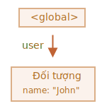
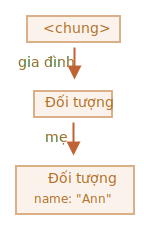

# Thu gom rác

Quản lý bộ nhớ trong JavaScript được thực hiện tự động và vô hình đối với chúng ta. Chúng ta tạo các nguyên hàm, đối tượng, hàm... Tất cả những thứ đó cần bộ nhớ.

Điều gì xảy ra khi một cái gì đó không còn cần thiết nữa? Làm thế nào để JavaScript engine phát hiện ra nó và dọn sạch nó?

## Khả năng tiếp cận

Khái niệm chính về quản lý bộ nhớ trong JavaScript là *khả năng tiếp cận*.

Nói một cách đơn giản, các giá trị "có thể tiếp cận" là những giá trị có thể truy cập hoặc sử dụng được bằng cách nào đó. Chúng được đảm bảo được lưu trữ trong bộ nhớ.

1. Có một tập hợp cơ sở các giá trị vốn có thể truy cập được, không thể xóa vì những lý do rõ ràng.

     Ví dụ:

     - Hàm hiện đang chạy, các biến cục bộ và tham số của nó.
     - Các hàm khác trên chuỗi lệnh gọi lồng nhau hiện tại, các biến cục bộ và tham số của chúng.
     - Biến chung.
     - (có một số khác, cũng có nội bộ)

     Những giá trị này được gọi là *gốc*.

2. Bất kỳ giá trị nào khác được coi là có thể truy cập được nếu giá trị đó có thể truy cập được từ gốc bằng tham chiếu hoặc chuỗi tham chiếu.

     Chẳng hạn, nếu có một đối tượng trong một biến chung và đối tượng đó có một thuộc tính tham chiếu đến một đối tượng khác, thì đối tượng *đó* đó được coi là có thể truy cập được. Và những thứ mà nó tham chiếu cũng có thể truy cập được. Ví dụ chi tiết để làm theo.

Có một quy trình nền trong JavaScript engine được gọi là [bộ gom rác](https://vi.wikipedia.org/wiki/Thu_gom_rác_(khoa_học_máy_tính)). Nó giám sát tất cả các đối tượng và loại bỏ những đối tượng không thể truy cập được.

## Một ví dụ đơn giản

Đây là ví dụ đơn giản nhất:

```js
// người dùng có một tham chiếu đến đối tượng
let user = {
  name: "John"
};
```



Ở đây mũi tên mô tả một tham chiếu đối tượng. Biến chung `"user"` tham chiếu đối tượng `{name: "John"}` (chúng ta sẽ gọi nó là John cho ngắn gọn). Thuộc tính `"name"` của John lưu trữ một nguyên hàm, do đó, nó được vẽ bên trong đối tượng.

Nếu giá trị của `user` bị ghi đè, tham chiếu sẽ bị mất:

```js
user = null;
```


Bây giờ John trở nên không thể truy cập được. Không có cách nào để truy cập nó, không có tham chiếu đến nó. Trình thu gom rác sẽ loại bỏ dữ liệu và giải phóng bộ nhớ.

## Hai tham chiếu

Bây giờ, hãy tưởng tượng chúng ta đã sao chép tham chiếu từ `user` sang `admin`:

```js
// người dùng có một tham chiếu đến đối tượng
let user = {
  name: "John"
};

*!*
let admin = user;
*/!*
```


Bây giờ nếu chúng ta làm như vậy:
```js
user = null;
```

...Sau đó, đối tượng vẫn có thể truy cập được thông qua biến chung `admin`, do đó, đối tượng nằm trong bộ nhớ. Nếu chúng ta ghi đè lên `admin`, thì nó có thể bị xóa.

## Các đối tượng liên kết với nhau

Bây giờ là một ví dụ phức tạp hơn. Gia đình:

```js
function marry(man, woman) {
  woman.husband = man;
  man.wife = woman;

  return {
    father: man,
    mother: woman
  }
}

let family = marry({
  name: "John"
}, {
  name: "Ann"
});
```

Hàm `marry` "kết hôn" hai đối tượng bằng cách cho chúng tham chiếu lẫn nhau và trả về một đối tượng mới chứa cả hai đối tượng.

Cấu trúc bộ nhớ kết quả:


Hiện tại, tất cả các đối tượng đều có thể truy cập được.

Bây giờ hãy xóa hai tham chiếu:

```js
delete family.father;
delete family.mother.husband;
```


Chỉ xóa một trong hai tham chiếu này là không đủ, bởi vì tất cả các đối tượng vẫn có thể truy cập được.

Nhưng nếu chúng ta xóa cả hai, thì chúng ta có thể thấy rằng John không còn tham chiếu nào nữa:


Tham chiếu gửi đi không quan trọng. Chỉ những cái đến mới có thể làm cho một đối tượng có thể truy cập được. Vì vậy, John hiện không thể truy cập được và sẽ bị xóa khỏi bộ nhớ cùng với tất cả dữ liệu của nó cũng không thể truy cập được.

Sau khi thu gom rác:



## Đối tượng không thể tiếp cận

Có thể toàn bộ các đối tượng được liên kết với nhau trở nên không thể truy cập được và bị xóa khỏi bộ nhớ.

Đối tượng nguồn giống như trên. Sau đó:

```js
family = null;
```

Hình ảnh trong bộ nhớ trở thành:


Ví dụ này cho thấy tầm quan trọng của khái niệm khả năng tiếp cận.

Rõ ràng là John và Ann vẫn được liên kết với nhau, cả hai đều có tham chiếu sắp tới. Nhưng điều đó là không đủ.

Đối tượng `"family"` trước đây đã bị hủy liên kết khỏi thư mục gốc, không còn tham chiếu đến nó nữa, vì vậy toàn bộ đối tượng trở nên không thể truy cập được và sẽ bị xóa.

## Thuật toán nội bộ

Thuật toán thu gom rác cơ bản được gọi là "đánh dấu và quét".

Các bước "thu gom rác" sau đây được thực hiện thường xuyên:

- Bộ gom rác lấy gốc và "đánh dấu" (ghi nhớ) chúng.
- Sau đó, nó truy cập và "đánh dấu" tất cả các tham chiếu từ chúng.
- Sau đó, nó truy cập các đối tượng được đánh dấu và đánh dấu các tham chiếu *của chúng*. Tất cả các đối tượng đã truy cập đều được ghi nhớ để không truy cập cùng một đối tượng hai lần trong tương lai.
- ...Và cứ như vậy cho đến khi mọi tham chiếu có thể truy cập (từ gốc) đều được truy cập.
- Tất cả các đối tượng trừ những đối tượng được đánh dấu đều bị xóa.

Chẳng hạn, hãy để cấu trúc đối tượng của chúng ta trông như thế này:


Chúng ta có thể thấy rõ ràng một "đối tượng không thể tiếp cận" ở phía bên phải. Bây giờ hãy xem bộ gom rác "đánh dấu và quét" xử lý nó như thế nào.

Bước đầu tiên đánh dấu gốc:


Sau đó, tham chiếu của chúng được đánh dấu:


...Và tham chiếu của chúng, trong khi có thể:


Bây giờ các đối tượng không thể truy cập được trong quy trình được coi là không thể truy cập và sẽ bị xóa:


Chúng ta cũng có thể tưởng tượng quá trình này giống như đổ một thùng sơn khổng lồ từ gốc, chảy qua tất cả các tham chiếu và đánh dấu tất cả các đối tượng có thể tiếp cận. Những cái không được đánh dấu sau đó được loại bỏ.

Đó là khái niệm về cách hoạt động của thu gom rác. Các JavaScript engine áp dụng nhiều tối ưu hóa để làm cho nó chạy nhanh hơn và không ảnh hưởng đến việc thực thi.

Một số tối ưu hóa:

- **Thu gom thế hệ** -- các đối tượng được chia thành hai bộ: "bộ mới" và "bộ cũ". Nhiều đối tượng xuất hiện, thực hiện công việc của chúng và chết nhanh chóng, chúng có thể được dọn dẹp một cách tích cực. Những đối tượng tồn tại đủ lâu, trở nên "già" và ít được kiểm tra thường xuyên hơn.
- **Thu gom gia tăng** -- nếu có nhiều đối tượng và chúng ta cố gắng đi bộ và đánh dấu toàn bộ tập hợp đối tượng cùng một lúc, có thể mất một chút thời gian và gây ra sự chậm trễ có thể nhìn thấy được trong quá trình thực thi. Vì vậy, engine cố gắng chia bộ thu gom rác thành nhiều phần. Sau đó, các mảnh được thực hiện từng cái một, riêng biệt. Điều đó đòi hỏi một số kế toán bổ sung giữa chúng để theo dõi các thay đổi, nhưng chúng ta có nhiều sự chậm trễ nhỏ thay vì một sự chậm trễ lớn.
- **Thu gom vào thời gian nhàn rỗi** -- bộ thu gom rác cố gắng chỉ chạy khi CPU không hoạt động, để giảm tác động có thể có đối với quá trình thực thi.

Có tồn tại các tối ưu hóa và hương vị khác của thuật toán thu gom rác. Tôi muốn mô tả thêm nhiều nữa nhưng tôi phải dừng lại, bởi vì các engine khác nhau thực hiện các chỉnh sửa và kỹ thuật khác nhau. Và, điều quan trọng hơn nữa, mọi thứ thay đổi khi engine phát triển, vì vậy việc nghiên cứu sâu hơn "trước", nếu không có nhu cầu thực sự có lẽ không đáng. Tất nhiên, trừ khi đó là vấn đề hoàn toàn vì lợi ích, khi đó sẽ có một số liên kết dành cho bạn bên dưới.

## Tóm tắt

Những điều chính cần biết:

- Việc thu gom rác được thực hiện tự động. Chúng ta không thể ép buộc hay ngăn cản.
- Các đối tượng được giữ lại trong bộ nhớ trong khi chúng có thể truy cập được.
- Được tham chiếu không giống như có thể truy cập được (từ gốc): một gói các đối tượng được liên kết với nhau có thể trở nên không thể truy cập được như một tổng thể.

Các engine hiện đại thực hiện các thuật toán thu gom rác tiên tiến.

Một cuốn sách chung "The Garbage Collection Handbook: The Art of Automatic Memory Management" (R. Jones et al) đề cập đến một số trong số chúng.

Nếu bạn đã quen với lập trình cấp thấp, thông tin chi tiết hơn về trình thu gom rác V8 có trong bài viết [Chuyến tham quan V8: Thu gom rác](http://jayconrod.com/posts/55/a-tour-of-v8-garbage-collection).

[Blog V8](https://v8.dev/) thỉnh thoảng cũng xuất bản các bài viết về những thay đổi trong quản lý bộ nhớ. Đương nhiên, để tìm hiểu về thu gom rác, tốt hơn hết bạn nên chuẩn bị bằng cách tìm hiểu về các bộ phận bên trong engine V8 nói chung và đọc blog của [Vyacheslav Egorov](http://mrale.ph), người từng là một trong những kỹ sư của engine V8. Tôi đang nói: "V8", bởi vì nó được đề cập tốt nhất với các bài báo trên internet. Đối với các công cụ khác, nhiều cách tiếp cận tương tự nhau, nhưng việc thu gom rác khác nhau ở nhiều khía cạnh.

Kiến thức chuyên sâu về các công cụ rất hữu ích khi bạn cần tối ưu hóa ở mức độ thấp. Sẽ là khôn ngoan nếu bạn lên kế hoạch cho bước tiếp theo sau khi bạn đã quen thuộc với ngôn ngữ này.
