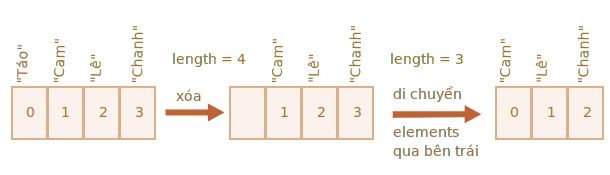
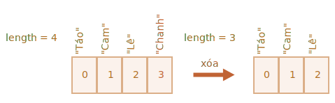

# Array

Các đối tượng cho phép bạn lưu trữ các bộ sưu tập giá trị có khóa. Tốt rồi.

Nhưng khá thường xuyên, chúng ta thấy rằng chúng ta cần một *bộ sưu tập được sắp xếp theo thứ tự*, trong đó chúng ta có phần tử thứ nhất, thứ hai, thứ ba, v.v. Ví dụ: chúng ta cần điều đó để lưu trữ danh sách thứ gì đó: người dùng, hàng hóa, phần tử HTML, v.v.

Sẽ không thuận tiện khi sử dụng một đối tượng ở đây vì nó không cung cấp phương thức nào để quản lý thứ tự của các phần tử. Chúng ta không thể chèn một thuộc tính mới “giữa” những thuộc tính hiện có. Các đối tượng không có nghĩa là để sử dụng như vậy.

Tồn tại một cấu trúc dữ liệu đặc biệt có tên là `Array`, để lưu trữ các bộ sưu tập có thứ tự.

## Khai báo

Có hai cú pháp để tạo một array trống:

```js
let arr = new Array();
let arr = [];
```

Hầu như mọi lúc, cú pháp thứ hai được sử dụng. Chúng ta có thể cung cấp các yếu tố ban đầu trong ngoặc đơn:

```js
let fruits = ["Táo", "Cam", "Mận"];
```

Các phần tử của array được đánh số, bắt đầu bằng số không.

Chúng ta có thể lấy một phần tử theo số của nó trong ngoặc vuông:

```js run
let fruits = ["Táo", "Cam", "Mận"];

alert( fruits[0] ); // Táo
alert( fruits[1] ); // Cam
alert( fruits[2] ); // Mận
```

Chúng ta có thể thay thế một phần tử:

```js
fruits[2] = 'Lê'; // bây giờ là ["Táo", "Cam", "Lê"]
```

...Hoặc thêm một cái mới vào array:

```js
fruits[3] = 'Chanh'; // bây giờ là ["Táo", "Cam", "Lê", "Chanh"]
```

Tổng số phần tử trong array là `length` của nó:

```js run
let fruits = ["Táo", "Cam", "Mận"];

alert( fruits.length ); // 3
```

Chúng ta cũng có thể sử dụng `alert` để hiển thị toàn bộ array.

```js run
let fruits = ["Táo", "Cam", "Mận"];

alert( fruits ); // Táo,Cam,Mận
```

Một array có thể lưu trữ các phần tử thuộc bất kỳ kiểu nào.

Ví dụ:

```js run no-beautify
// hỗn hợp các giá trị
let arr = [ 'Táo', { tên: 'John' }, true, function() { alert('xin chào'); } ];

// lấy đối tượng ở chỉ mục 1 và sau đó hiển thị tên của nó
alert( arr[1].name ); // John

// lấy hàm ở chỉ mục 3 và chạy nó
arr[3](); // xin chào
```


````smart header="Dấu phẩy ở cuối"
Một array, giống như một đối tượng, có thể kết thúc bằng dấu phẩy:
```js
let fruits = [
  "Táo",
  "Cam",
  "Mận"*!*,*/!*
];
```

Kiểu "dấu phẩy ở cuối" giúp chèn/xóa các mục dễ dàng hơn vì tất cả các dòng đều giống nhau.
````

## Nhận các phần tử cuối cùng với "at"

[recent browser="new"]

Giả sử chúng ta muốn phần tử cuối cùng của array.

Một số ngôn ngữ lập trình cho phép việc sử dụng chỉ mục âm cho cùng một mục đích, chẳng hạn như `trái cây[-1]`.

Mặc dù, trong JavaScript nó sẽ không hoạt động. Kết quả sẽ là `undefined`, bởi vì chỉ mục trong ngoặc vuông được xử lý theo nghĩa đen.

Chúng ta có thể tính toán chỉ mục phần tử cuối cùng một cách rõ ràng và sau đó truy cập nó: `fruits[fruits.length - 1]`.

```js run
let fruits = ["Táo", "Cam", "Mận"];
alert( fruits[fruits.length-1] ); // Mận
```

Hơi rườm rà phải không? Chúng ta cần viết tên biến tới hai lần.

May mắn thay, có một cú pháp ngắn hơn: `fruits.at(-1)`:

```js run
let fruits = ["Táo", "Cam", "Mận"];
// giống như fruits[fruits.length-1]
alert( fruits.at(-1) ); // Mận
```

Nói cách khác, `arr.at(i)`:
- hoàn toàn giống với `arr[i]`, nếu `i >= 0`.
- đối với các giá trị âm của `i`, nó lùi lại từ cuối array.

## Các phương thức pop/push, shift/unshift

  [Hàng đợi](https://vi.wikipedia.org/wiki/Hàng đợi) là một trong những cách sử dụng array phổ biến nhất. Trong khoa học máy tính, điều này có nghĩa là một tập hợp các phần tử được sắp xếp theo thứ tự hỗ trợ hai thao tác:

- `push` nối một phần tử vào cuối.
- `shift` lấy phần tử từ đầu, tăng hàng đợi, sao cho phần tử thứ 2 trở thành phần tử thứ nhất.


Array hỗ trợ cả hai hành động.

Trong thực tế, chúng ta cần nó rất thường xuyên. Ví dụ: một hàng tin nhắn cần được hiển thị trên màn hình.

Có một trường hợp sử dụng khác cho array -- cấu trúc dữ liệu có tên [ngăn xếp](https://vi.wikipedia.org/wiki/Ngăn_xếp).

Nó hỗ trợ hai hành động:

- `push` thêm một phần tử vào cuối.
- `pop` lấy một phần tử từ cuối.

Vì vậy, các yếu tố mới được thêm vào hoặc lấy luôn từ "cuối".

Một ngăn xếp thường được minh họa dưới dạng một bộ bài: các quân bài mới được thêm vào trên cùng hoặc lấy ra từ trên cùng:


Đối với ngăn xếp, mục được đẩy mới nhất sẽ được nhận trước, đó còn được gọi là nguyên tắc LIFO (Last-In-First-Out). Đối với hàng đợi, chúng ta có FIFO (First-In-First-Out).

Array trong JavaScript có thể hoạt động như một hàng đợi và ngăn xếp. Chúng cho phép bạn thêm/xóa các phần tử, cả vào đầu hay cuối.

Trong khoa học máy tính, cấu trúc dữ liệu cho phép điều này được gọi là [deque](https://vi.wikipedia.org/wiki/Hàng_đợi).

**Các phương thức hoạt động với phần cuối của array:**

`pop`
: Trích xuất phần tử cuối cùng của array và trả về:

    ```js run
    let fruits = ["Táo", "Cam", "Lê"];

    alert( fruits.pop() ); // loại bỏ "Lê" và alert nó

    alert( fruits ); // Táo,Cam
    ```

  Cả `fruits.pop()` và `fruits.at(-1)` đều trả về phần tử cuối cùng của array, nhưng `fruits.pop()` cũng sửa đổi array bằng cách loại bỏ nó.

`push`
: Nối phần tử vào cuối array:

    ```js run
    let fruits = ["Táo", "Cam"];

    fruits.push("Lê");

    alert( fruits ); // Táo,Cam,Lê
    ```

    Cuộc gọi `fruits.push(...)` bằng `fruits[fruits.length] = ...`.

**Các phương thức hoạt động với phần đầu của array:**

`shift`
: Trích xuất phần tử đầu tiên của array và trả về nó:

    ```js run
      let fruits = ["Táo", "Cam", "Lê"];

    alert( fruits.shift() ); // xóa Táo và alert nó

    alert( fruits ); // Táo,Lê
    ```

`unshift`
: Thêm phần tử vào đầu array:

    ```js run
    let fruits = ["Cam", "Lê"];

    fruits.unshift('Táo');

    alert( fruits ); // Táo,Cam,Lê
    ```

Các phương thức `push` và `unshift` có thể thêm nhiều phần tử cùng một lúc:

```js run
let fruits = ["Táo"];

fruits.push("Cam", "Lê");
fruits.unshift("Dứa", "Chanh");

// ["Dứa", "Chanh", "Táo", "Cam", "Lê"]
alert( fruits );
```

## Bên trong

Array là một loại đối tượng đặc biệt. Dấu ngoặc vuông được sử dụng để truy cập một thuộc tính `arr[0]` thực sự đến từ cú pháp đối tượng. Điều đó về cơ bản giống như `obj[key]`, trong đó `arr` là đối tượng, trong khi các số được sử dụng làm khóa.

Chúng mở rộng các đối tượng cung cấp các phương thức đặc biệt để làm việc với các bộ sưu tập dữ liệu được sắp xếp theo thứ tự và cả thuộc tính `length`. Nhưng cốt lõi nó vẫn là một đối tượng.

Hãy nhớ rằng, chỉ có tám loại dữ liệu cơ bản trong JavaScript (xem chương [Kiểu dữ liệu](info:type) để biết thêm thông tin). Array là một đối tượng và do đó hoạt động như một đối tượng.

Chẳng hạn, nó được sao chép bằng cách tham chiếu:

```js run
let fruits = ["Chuối"]

let arr = fruits; // sao chép theo tham chiếu (hai biến tham chiếu cùng một array)

alert( arr === fruits ); // true

arr.push("Pear"); // sửa đổi array bằng tham chiếu

alert( fruits ); // Chuối,Lê - bây giờ có 2 item
```

...Nhưng điều làm cho aray thực sự đặc biệt là biểu diễn bên trong của chúng. Engine cố gắng lưu trữ các phần tử của nó trong vùng bộ nhớ liền kề, lần lượt, giống như được mô tả trên các hình minh họa trong chương này, và cũng có các tối ưu hóa khác, để làm cho các array hoạt động rất nhanh.

Nhưng tất cả chúng đều hỏng nếu chúng ta ngừng làm việc với một array như với một "bộ sưu tập có thứ tự" và bắt đầu làm việc với nó như thể nó là một đối tượng thông thường.

Chẳng hạn, về mặt kỹ thuật, chúng ta có thể làm điều này:

```js
let fruits = []; // tạo một array

fruits[99999] = 5; // chỉ định một thuộc tính có chỉ số lớn hơn nhiều so với độ dài của nó

fruits.age = 25; // tạo một thuộc tính với một tên tùy ý
```

Điều đó là có thể, bởi vì array là đối tượng ở cơ sở của chúng. Chúng ta có thể thêm bất kỳ thuộc tính nào vào chúng.

Nhưng engine sẽ thấy rằng chúng ta đang làm việc với array như với một đối tượng thông thường. Tối ưu hóa theo array cụ thể không phù hợp với những trường hợp như vậy và sẽ bị tắt, lợi ích của chúng sẽ biến mất.

Các cách để lạm dụng một array:

- Thêm một thuộc tính không phải là số như `arr.test = 5`.
- Tạo lỗ, chẳng hạn như: thêm `arr[0]` và sau đó `arr[1000]` (và không có gì giữa chúng).
- Điền vào array theo thứ tự ngược lại, như `arr[1000]`, `arr[999]`, v.v.

Hãy coi array là cấu trúc đặc biệt để làm việc với *dữ liệu được sắp xếp*. Chúng cung cấp các phương thức đặc biệt cho điều đó. Array được điều chỉnh cẩn thận bên trong các JavaScript engine để hoạt động với dữ liệu được sắp xếp liền kề, hãy sử dụng chúng theo cách này. Và nếu bạn cần các khóa tùy ý, rất có thể bạn thực sự cần một đối tượng thông thường `{}`.

## Hiệu suất

Các phương thức `push/pop` chạy nhanh, trong khi `shift/unshift` chạy chậm.


Tại sao làm việc với phần cuối của một array nhanh hơn so với phần đầu của nó? Hãy xem điều gì xảy ra trong quá trình thực hiện:

```js
fruits.shift(); // lấy 1 phần tử từ phần đầu
```

Việc lấy và xóa phần tử có chỉ mục `0` là không đủ. Các yếu tố khác cũng cần được đánh số lại.

Thao tác `shift` phải thực hiện 3 việc:

1. Xóa phần tử có chỉ số `0`.
2. Di chuyển tất cả các phần tử sang bên trái, đánh số lại chúng từ chỉ số `1` thành `0`, từ `2` thành `1`, v.v.
3. Cập nhật thuộc tính `length`.



**Càng nhiều phần tử trong array, càng có nhiều thời gian để di chuyển chúng, nhiều thao tác trong bộ nhớ hơn.**

Điều tương tự cũng xảy ra với `unshift`: để thêm một phần tử vào đầu array, trước tiên chúng ta cần di chuyển các phần tử hiện có sang bên phải, tăng chỉ số của chúng.

Và chuyện gì xảy ra với `push/pop`? Chúng không cần phải di chuyển bất cứ cái gì. Để trích xuất một phần tử từ cuối, phương thức `pop` sẽ xóa chỉ mục và rút ngắn `length`.

Các hành động cho thao tác `pop`:

```js
fruits.pop(); // lấy 1 phần tử từ phần cuối
```



**Phương thức `pop` không cần di chuyển bất cứ thứ gì, bởi vì các phần tử khác giữ chỉ mục của chúng. Đó là lý do tại sao nó rất nhanh.**

Điều tương tự với phương thức `push`.

## Vòng lặp

Một trong những cách lâu đời nhất để quay vòng các mục array là vòng lặp `for` trên các chỉ mục:

```js run
let arr = ["Táo", "Cam", "Lê"];

*!*
for (let i = 0; i < arr.length; i++) {
*/!*
  alert( arr[i] );
}
```

Nhưng đối với array thì có một dạng vòng lặp khác, `for..of`:

```js run
let fruits = ["Táo", "Cam", "Mận"];

// lặp qua các phần tử array
for (let fruit of fruits) {
  alert( fruit );
}
```

`for..of` không cấp quyền truy cập vào số lượng của phần tử hiện tại, mà chỉ cấp quyền truy cập vào giá trị của phần tử đó, nhưng trong hầu hết các trường hợp, như vậy là đủ. Và nó ngắn hơn.

Về mặt kỹ thuật, vì array là đối tượng nên cũng có thể sử dụng `for..in`:

```js run
  let arr = ["Táo", "Cam", "Lê"];

*!*
for (let key in arr) {
*/!*
  alert( arr[key] ); // Táo,Cam,Lê
}
```

Nhưng đó thực sự là một ý tưởng tồi. Có những vấn đề tiềm ẩn với nó:

1. Vòng lặp `for..in` lặp qua *tất cả các thuộc tính*, không chỉ các thuộc tính số.

     Có cái gọi là các đối tượng "dạng array" trong trình duyệt và trong các môi trường khác *dạng array*. Nghĩa là, chúng có các thuộc tính `length` và chỉ mục, nhưng chúng cũng có thể có các thuộc tính và phương thức không phải là số khác mà chúng ta thường không cần đến. Mặc dù vậy, vòng lặp `for..in` sẽ liệt kê chúng. Vì vậy, nếu chúng ta cần làm việc với các đối tượng dạng array, thì các thuộc tính "phụ" này có thể trở thành một vấn đề.

2. Vòng lặp `for..in` được tối ưu hóa cho các đối tượng chung, không phải array và do đó chậm hơn 10-100 lần. Tất nhiên, nó vẫn rất nhanh. Việc tăng tốc có thể chỉ quan trọng trong các nút cổ chai. Nhưng chúng ta vẫn nên nhận thức được sự khác biệt.

Nói chung, chúng ta không nên sử dụng `for..in` cho array.


## Một từ về "length"

Thuộc tính `length` tự động cập nhật khi chúng ta sửa đổi array. Nói một cách chính xác, nó thực sự không phải là số lượng giá trị trong array, mà là chỉ số lớn nhất cộng với một.

Chẳng hạn, một phần tử có chỉ số lớn sẽ cho độ dài lớn:

```js run
let fruits = [];
fruits[123] = "Táo";

alert( fruits.length ); // 124
```

Lưu ý là chúng ta thường không sử dụng các aray như vậy.

Một điều thú vị khác về thuộc tính `length` là nó có thể ghi được.

Nếu chúng ta tăng nó theo cách thủ công, sẽ không có gì thú vị xảy ra. Nhưng nếu chúng ta giảm nó, array sẽ bị cắt bớt. Quá trình này là không thể đảo ngược, đây là ví dụ:

```js run
let arr = [1, 2, 3, 4, 5];

arr.length = 2; // cắt ngắn thành 2 phần tử
alert( arr ); // [1, 2]

arr.length = 5; // trả lại chiều dài trở lại
alert( arr[3] ); // undefined: các giá trị không trở lại
```

Vì vậy, cách đơn giản nhất để xóa array là: `arr.length = 0;`.


## new Array() [#new-array]

Còn một cú pháp nữa để tạo array:

```js
let arr = *!*new Array*/!*("Táo", "Lê", "v.v");
```

Nó hiếm khi được sử dụng vì dấu ngoặc vuông `[]` ngắn hơn. Ngoài ra, còn có một tính năng phức tạp với nó.

Nếu `new Array` được gọi với một đối số duy nhất là một số, thì nó sẽ tạo một array *không có phần tử, nhưng có độ dài cho trước*.

Hãy xem làm thế nào một người có thể tự bắn vào chân mình:

```js run
let arr = new Array(2); // nó sẽ tạo ra một array [2] ?

alert( arr[0] ); // undefined! không có yếu tố.

alert( arr.length ); // độ dài 2
```

Để tránh những bất ngờ như vậy, chúng ta thường sử dụng dấu ngoặc vuông, trừ khi chúng ta thực sự biết mình đang làm gì.

## Array nhiều chiều

Array có thể có các mục cũng là array. Chúng ta có thể sử dụng nó cho array nhiều chiều, ví dụ để lưu trữ ma trận:

```js run
let matrix = [
  [1, 2, 3],
  [4, 5, 6],
  [7, 8, 9]
];

alert( matrix[1][1] ); // 5, yếu tố trung tâm
```

## toString

Array có phương thức triển khai `toString` riêng để trả về danh sách các phần tử được phân tách bằng dấu phẩy.

Ví dụ:

```js run
let arr = [1, 2, 3];

alert( arr ); // 1,2,3
alert( String(arr) === '1,2,3' ); // true
```

Ngoài ra, hãy thử điều này:

```js run
alert( [] + 1 ); // "1"
alert( [1] + 1 ); // "11"
alert( [1,2] + 1 ); // "1,21"
```

Array không có `Symbol.toPrimitive`, cũng không có `valueOf` khả thi, chúng chỉ chuyển đổi triển khai `toString`, vì vậy ở đây `[]` trở thành một chuỗi rỗng, `[1]` trở thành `"1"` và `[1,2]` trở thành `"1,2"`.

Khi toán tử cộng nhị phân `"+"` thêm một thứ gì đó vào một chuỗi, nó cũng chuyển đổi nó thành một chuỗi, vì vậy bước tiếp theo sẽ như sau:

```js run
alert( "" + 1 ); // "1"
alert( "1" + 1 ); // "11"
alert( "1,2" + 1 ); // "1,21"
```

## Đừng so sánh các array với ==

Array trong JavaScript, không giống như một số ngôn ngữ lập trình khác, không được so sánh với toán tử `==`.

Toán tử này không có cách xử lý đặc biệt nào đối với array, nó hoạt động với chúng như với bất kỳ đối tượng nào.

Hãy nhớ lại các quy tắc:

- Hai đối tượng bằng nhau `==` chỉ khi chúng tham chiếu đến cùng một đối tượng.
- Nếu một trong các đối số của `==` là đối tượng và đối số còn lại là đối số nguyên thủy, thì đối tượng sẽ được chuyển đổi thành đối tượng nguyên hàm, như được giải thích trong chương <info:object-toprimitive>.
- ...Ngoại trừ `null` và `undefined` bằng `==` lẫn nhau và không có gì khác.

So sánh nghiêm ngặt `===` thậm chí còn đơn giản hơn vì nó không chuyển đổi các loại.

Vì vậy, nếu chúng ta so sánh các array bằng `==`, chúng sẽ không bao giờ giống nhau, trừ khi chúng ta so sánh hai biến tham chiếu chính xác cùng một array.

Ví dụ:
```js run
alert( [] == [] ); // false
alert( [0] == [0] ); // false
```

Các array này là các đối tượng khác nhau về mặt kỹ thuật. Vì vậy, chúng không bằng nhau. Toán tử `==` không thực hiện so sánh từng mục.

So sánh với nguyên hàm cũng có thể cho kết quả có vẻ kỳ lạ:

```js run
alert( 0 == [] ); // true

alert('0' == [] ); // false
```

Ở đây, trong cả hai trường hợp, chúng ta so sánh một đối tượng nguyên hàm với một đối tượng array. Vì vậy, array `[]` được chuyển thành nguyên hàm cho mục đích so sánh và trở thành một chuỗi rỗng `''`.

Sau đó, quá trình so sánh tiếp tục với các nguyên hàm, như được mô tả trong chương <info:type-conversions>:

```js run
// sau khi [] được chuyển đổi thành ''
alert( 0 == '' ); // khi '' được chuyển đổi thành số 0

alert('0' == '' ); // false, không chuyển đổi loại, các chuỗi khác nhau
```

Vì vậy, làm thế nào để so sánh các array?

Rất đơn giản: không sử dụng toán tử `==`. Thay vào đó, hãy so sánh từng mục của chúng trong một vòng lặp hoặc sử dụng các phương thức lặp được giải thích trong chương tiếp theo.

## Tóm tắt

Array là một loại đối tượng đặc biệt, phù hợp để lưu trữ và quản lý các mục dữ liệu có thứ tự.

Khai báo:

 ```js
 // ngoặc vuông (thông thường)
let arr = [item1, item2...];

// new Array (đặc biệt hiếm)
let arr = new Array(item1, item2...);
```

Cuộc gọi đến `new Array(number)` tạo một array có độ dài nhất định, nhưng không có phần tử.

- Thuộc tính `length` là độ dài của array hay nói chính xác là chỉ mục cuối cùng của nó cộng với một. Nó được tự động điều chỉnh bằng các phương thức array.
- Nếu chúng ta rút ngắn `độ dài` theo cách thủ công, array sẽ bị cắt bớt.

Lấy các phần tử:

- chúng ta có thể lấy phần tử theo chỉ mục của nó, như `arr[0]`
- ngoài ra, chúng ta có thể sử dụng phương thức `at(i)` cho phép lập chỉ mục âm. Đối với các giá trị âm của `i`, nó lùi lại từ cuối array. Nếu `i >= 0`, nó hoạt động giống như `arr[i]`.

Chúng ta có thể sử dụng một array như một deque với các thao tác sau:

- `push(...items)` thêm `items` vào cuối.
- `pop()` xóa phần tử ở cuối và trả về phần tử đó.
- `shift()` loại bỏ phần tử từ đầu và trả về nó.
- `unshift(...items)` thêm `items` vào đầu.

Để lặp qua các phần tử của array:
   - `for (let i=0; i<arr.length; i++)` -- hoạt động nhanh nhất, tương thích với trình duyệt cũ.
   - `for (let item of arr)` -- cú pháp hiện đại chỉ dành cho các item,
   - `for (let i in arr)` -- không bao giờ sử dụng.

Để so sánh các array, không sử dụng toán tử `==` (cũng như `>`, `<` và các toán tử khác), vì chúng không có cách xử lý đặc biệt nào đối với array. Nó xử lý chúng như bất kỳ đối tượng nào và đó không phải là điều chúng ta thường muốn.

Thay vào đó, bạn có thể sử dụng vòng lặp `for..of` để so sánh từng array một.

Chúng ta sẽ tiếp tục với array và nghiên cứu thêm các phương pháp để thêm, bớt, trích xuất các phần tử và sắp xếp array trong chương tiếp theo <info:array-methods>.
