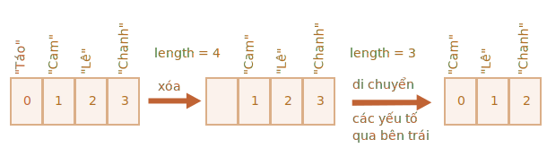

# Arrays

Các đối tượng cho phép bạn lưu trữ các bộ sưu tập giá trị có khóa. Tốt rồi.

Nhưng khá thường xuyên, chúng ta thấy rằng chúng ta cần một *bộ sưu tập được sắp xếp theo thứ tự*, trong đó chúng ta có phần tử thứ nhất, thứ hai, thứ ba, v.v. Ví dụ: chúng ta cần điều đó để lưu trữ danh sách thứ gì đó: người dùng, hàng hóa, phần tử HTML, v.v.

Sẽ không thuận tiện khi sử dụng một đối tượng ở đây vì nó không cung cấp phương thức nào để quản lý thứ tự của các phần tử. Chúng ta không thể chèn một thuộc tính mới “giữa” những thuộc tính hiện có. Các đối tượng không có nghĩa là để sử dụng như vậy.

Tồn tại một cấu trúc dữ liệu đặc biệt có tên `Arrays`, để lưu trữ các bộ sưu tập có thứ tự.

## Tuyên bố

Có hai cú pháp để tạo một array trống:

```js
let arr = new Array();
let arr = [];
```

Hầu như mọi lúc, cú pháp thứ hai được sử dụng. Chúng ta có thể cung cấp các yếu tố ban đầu trong ngoặc đơn:

```js
let fruits = ["Táo", "Cam", "Mận"];
```

Các phần tử của array được đánh số, bắt đầu bằng số không.

Chúng ta có thể lấy một phần tử theo số của nó trong ngoặc vuông:

```js run
let fruits = ["Táo", "Cam", "Mận"];

alert( fruits[0] ); // Táo
alert( fruits[1] ); // Cam
alert( fruits[2] ); // Mận
```

Chúng ta có thể thay thế một phần tử:

```js
fruits[2] = 'Lê'; // bây giờ là ["Táo", "Cam", "Lê"]
```

...Hoặc thêm một cái mới vào array:

```js
fruits[3] = 'Chanh'; // bây giờ là ["Táo", "Cam", "Lê", "Chanh"]
```

Tổng số phần tử trong array là `length` của nó:

```js run
let fruits = ["Táo", "Cam", "Mận"];

alert( fruits.length ); // 3
```

Chúng ta cũng có thể sử dụng `alert` để hiển thị toàn bộ array.

```js run
let fruits = ["Táo", "Cam", "Mận"];

alert( fruits ); // Táo,Cam,Mận
```

Một array có thể lưu trữ các phần tử thuộc bất kỳ kiểu nào.

Ví dụ:

```js run no-beautify
// hỗn hợp các giá trị
let arr = [ 'Táo', { tên: 'John' }, true, function() { alert('xin chào'); } ];

// lấy đối tượng ở chỉ mục 1 và sau đó hiển thị tên của nó
alert( arr[1].name ); // John

// lấy hàm ở chỉ mục 3 và chạy nó
arr[3](); // xin chào
```


````smart header="Dấu phẩy cuối"
Một array, giống như một đối tượng, có thể kết thúc bằng dấu phẩy:
```js
let fruits = [
  "Táo",
  "Cam",
  "Mận"*!*,*/!*
];
```

Kiểu "dấu phẩy ở cuối" giúp chèn/xóa các mục dễ dàng hơn vì tất cả các dòng đều giống nhau.
````


## Các phương thức pop/push, shift/unshift

[Hàng đợi](https://en.wikipedia.org/wiki/Queue_(abstract_data_type)) là một trong những cách sử dụng array phổ biến nhất. Trong khoa học máy tính, điều này có nghĩa là một tập hợp các phần tử được sắp xếp theo thứ tự hỗ trợ hai thao tác:

- `push` nối một phần tử vào cuối.
- `shift` lấy phần tử từ đầu, tăng hàng đợi, sao cho phần tử thứ 2 trở thành phần tử thứ nhất.


Array hỗ trợ cả hai hoạt động.

Trong thực tế, chúng ta cần nó rất thường xuyên. Ví dụ: một hàng thư cần được hiển thị trên màn hình.

Có một trường hợp sử dụng khác cho array -- cấu trúc dữ liệu có tên [ngăn xếp](https://vi.wikipedia.org/wiki/Ng%C4%83n_x%E1%BA%BFp).

Nó hỗ trợ hai hoạt động:

- `push` thêm một phần tử vào cuối.
- `pop` lấy một phần tử từ cuối.

Vì vậy, các yếu tố mới được thêm vào hoặc lấy luôn từ "cuối".

Một ngăn xếp thường được minh họa dưới dạng một bộ bài: các quân bài mới được thêm vào trên cùng hoặc lấy ra từ trên cùng:


Đối với ngăn xếp, mục được đẩy mới nhất sẽ được nhận trước, đó còn được gọi là nguyên tắc LIFO (Last-In-First-Out). Đối với hàng đợi, chúng ta có FIFO (First-In-First-Out).

Array trong JavaScript có thể hoạt động như một hàng đợi và ngăn xếp. Chúng cho phép bạn thêm/xóa các phần tử ở đầu hoặc cuối.

Trong khoa học máy tính, cấu trúc dữ liệu cho phép điều này được gọi là [deque](https://vi.wikipedia.org/wiki/H%C3%A0ng_%C4%91%E1%BB%A3i).

**Các phương thức hoạt động với phần cuối của array:**

`pop`
: Trích xuất phần tử cuối cùng của array và trả về:

    ```js run
    let fruits = ["Táo", "Cam", "Lê"];

    alert( fruits.pop() ); // loại bỏ "Pear" và alert nó

    alert( fruits ); // Táo, Cam
    ```

`push`
: Nối phần tử vào cuối array:

    ```js run
    let fruits = ["Táo", "Cam"];

    fruits.push("Lê");

    alert( fruits ); // Táo, Cam, Lê
    ```

    Cuộc gọi `fruits.push(...)` bằng `fruits[fruits.length] = ...`.

**Các phương thức hoạt động với sự khởi đầu của array:**

`shift`
: Trích xuất phần tử đầu tiên của array và trả về nó:

    ```js run
      let fruits = ["Táo", "Cam", "Lê"];

    alert( fruits.shift() ); // xóa Apple và alert nó

    alert( fruits ); // Táo, Lê
    ```

`unshift`
: Thêm phần tử vào đầu array:

    ```js run
    let fruits = ["Cam", "Lê"];

    fruits.unshift('Táo');

    alert( fruits ); // Táo, Cam, Lê
    ```

Các phương thức `push` và `unshift` có thể thêm nhiều phần tử cùng một lúc:

```js run
let fruits = ["Táo"];

fruits.push("Cam", "Lê");
fruits.unshift("Dứa", "Chanh");

// ["Dứa", "Chanh", "Táo", "Cam", "Lê"]
alert( fruits );
```

## Internals

An array is a special kind of object. The square brackets used to access a property `arr[0]` actually come from the object syntax. That's essentially the same as `obj[key]`, where `arr` is the object, while numbers are used as keys.

They extend objects providing special methods to work with ordered collections of data and also the `length` property. But at the core it's still an object.

Remember, there are only eight basic data types in JavaScript (see the [Data types](info:types) chapter for more info). Array is an object and thus behaves like an object.

For instance, it is copied by reference:

```js run
let fruits = ["Banana"]

let arr = fruits; // copy by reference (two variables reference the same array)

alert( arr === fruits ); // true

arr.push("Pear"); // modify the array by reference

alert( fruits ); // Banana, Pear - 2 items now
```

...But what makes arrays really special is their internal representation. The engine tries to store its elements in the contiguous memory area, one after another, just as depicted on the illustrations in this chapter, and there are other optimizations as well, to make arrays work really fast.

But they all break if we quit working with an array as with an "ordered collection" and start working with it as if it were a regular object.

For instance, technically we can do this:

```js
let fruits = []; // make an array

fruits[99999] = 5; // assign a property with the index far greater than its length

fruits.age = 25; // create a property with an arbitrary name
```

That's possible, because arrays are objects at their base. We can add any properties to them.

But the engine will see that we're working with the array as with a regular object. Array-specific optimizations are not suited for such cases and will be turned off, their benefits disappear.

The ways to misuse an array:

- Add a non-numeric property like `arr.test = 5`.
- Make holes, like: add `arr[0]` and then `arr[1000]` (and nothing between them).
- Fill the array in the reverse order, like `arr[1000]`, `arr[999]` and so on.

Please think of arrays as special structures to work with the *ordered data*. They provide special methods for that. Arrays are carefully tuned inside JavaScript engines to work with contiguous ordered data, please use them this way. And if you need arbitrary keys, chances are high that you actually require a regular object `{}`.

## Performance

Methods `push/pop` run fast, while `shift/unshift` are slow.


Why is it faster to work with the end of an array than with its beginning? Let's see what happens during the execution:

```js
fruits.shift(); // take 1 element from the start
```

It's not enough to take and remove the element with the number `0`. Other elements need to be renumbered as well.

The `shift` operation must do 3 things:

1. Remove the element with the index `0`.
2. Move all elements to the left, renumber them from the index `1` to `0`, from `2` to `1` and so on.
3. Update the `length` property.



**The more elements in the array, the more time to move them, more in-memory operations.**

The similar thing happens with `unshift`: to add an element to the beginning of the array, we need first to move existing elements to the right, increasing their indexes.

And what's with `push/pop`? They do not need to move anything. To extract an element from the end, the `pop` method cleans the index and shortens `length`.

The actions for the `pop` operation:

```js
fruits.pop(); // take 1 element from the end
```


**The `pop` method does not need to move anything, because other elements keep their indexes. That's why it's blazingly fast.**

The similar thing with the `push` method.

## Loops

One of the oldest ways to cycle array items is the `for` loop over indexes:

```js run
let arr = ["Apple", "Orange", "Pear"];

*!*
for (let i = 0; i < arr.length; i++) {
*/!*
  alert( arr[i] );
}
```

But for arrays there is another form of loop, `for..of`:

```js run
let fruits = ["Apple", "Orange", "Plum"];

// iterates over array elements
for (let fruit of fruits) {
  alert( fruit );
}
```

The `for..of` doesn't give access to the number of the current element, just its value, but in most cases that's enough. And it's shorter.

Technically, because arrays are objects, it is also possible to use `for..in`:

```js run
let arr = ["Apple", "Orange", "Pear"];

*!*
for (let key in arr) {
*/!*
  alert( arr[key] ); // Apple, Orange, Pear
}
```

But that's actually a bad idea. There are potential problems with it:

1. The loop `for..in` iterates over *all properties*, not only the numeric ones.

    There are so-called "array-like" objects in the browser and in other environments, that *look like arrays*. That is, they have `length` and indexes properties, but they may also have other non-numeric properties and methods, which we usually don't need. The `for..in` loop will list them though. So if we need to work with array-like objects, then these "extra" properties can become a problem.

2. The `for..in` loop is optimized for generic objects, not arrays, and thus is 10-100 times slower. Of course, it's still very fast. The speedup may only matter in bottlenecks. But still we should be aware of the difference.

Generally, we shouldn't use `for..in` for arrays.


## A word about "length"

The `length` property automatically updates when we modify the array. To be precise, it is actually not the count of values in the array, but the greatest numeric index plus one.

For instance, a single element with a large index gives a big length:

```js run
let fruits = [];
fruits[123] = "Apple";

alert( fruits.length ); // 124
```

Note that we usually don't use arrays like that.

Another interesting thing about the `length` property is that it's writable.

If we increase it manually, nothing interesting happens. But if we decrease it, the array is truncated. The process is irreversible, here's the example:

```js run
let arr = [1, 2, 3, 4, 5];

arr.length = 2; // truncate to 2 elements
alert( arr ); // [1, 2]

arr.length = 5; // return length back
alert( arr[3] ); // undefined: the values do not return
```

So, the simplest way to clear the array is: `arr.length = 0;`.


## new Array() [#new-array]

There is one more syntax to create an array:

```js
let arr = *!*new Array*/!*("Apple", "Pear", "etc");
```

It's rarely used, because square brackets `[]` are shorter. Also there's a tricky feature with it.

If `new Array` is called with a single argument which is a number, then it creates an array *without items, but with the given length*.

Let's see how one can shoot themself in the foot:

```js run
let arr = new Array(2); // will it create an array of [2] ?

alert( arr[0] ); // undefined! no elements.

alert( arr.length ); // length 2
```

In the code above, `new Array(number)` has all elements `undefined`.

To evade such surprises, we usually use square brackets, unless we really know what we're doing.

## Multidimensional arrays

Arrays can have items that are also arrays. We can use it for multidimensional arrays, for example to store matrices:

```js run
let matrix = [
  [1, 2, 3],
  [4, 5, 6],
  [7, 8, 9]
];

alert( matrix[1][1] ); // 5, the central element
```

## toString

Arrays have their own implementation of `toString` method that returns a comma-separated list of elements.

For instance:


```js run
let arr = [1, 2, 3];

alert( arr ); // 1,2,3
alert( String(arr) === '1,2,3' ); // true
```

Also, let's try this:

```js run
alert( [] + 1 ); // "1"
alert( [1] + 1 ); // "11"
alert( [1,2] + 1 ); // "1,21"
```

Arrays do not have `Symbol.toPrimitive`, neither a viable `valueOf`, they implement only `toString` conversion, so here `[]` becomes an empty string, `[1]` becomes `"1"` and `[1,2]` becomes `"1,2"`.

When the binary plus `"+"` operator adds something to a string, it converts it to a string as well, so the next step looks like this:

```js run
alert( "" + 1 ); // "1"
alert( "1" + 1 ); // "11"
alert( "1,2" + 1 ); // "1,21"
```

## Don't compare arrays with ==

Arrays in JavaScript, unlike some other programming languages, shouldn't be compared with operator `==`.

This operator has no special treatment for arrays, it works with them as with any objects.

Let's recall the rules:

- Two objects are equal `==` only if they're references to the same object.
- If one of the arguments of `==` is an object, and the other one is a primitive, then the object gets converted to primitive, as explained in the chapter <info:object-toprimitive>.
- ...With an exception of `null` and `undefined` that equal `==` each other and nothing else.

The strict comparison `===` is even simpler, as it doesn't convert types. 

So, if we compare arrays with `==`, they are never the same, unless we compare two variables that reference exactly the same array.

For example:
```js run
alert( [] == [] ); // false
alert( [0] == [0] ); // false
```

These arrays are technically different objects. So they aren't equal. The `==` operator doesn't do item-by-item comparison.

Comparison with primitives may give seemingly strange results as well:

```js run
alert( 0 == [] ); // true

alert('0' == [] ); // false
```

Here, in both cases, we compare a primitive with an array object. So the array `[]` gets converted to primitive for the purpose of comparison and becomes an empty string `''`. 

Then the comparison process goes on with the primitives, as described in the chapter <info:type-conversions>:

```js run
// after [] was converted to ''
alert( 0 == '' ); // true, as '' becomes converted to number 0

alert('0' == '' ); // false, no type conversion, different strings
```

So, how to compare arrays?

That's simple: don't use the `==` operator. Instead, compare them item-by-item in a loop or using iteration methods explained in the next chapter.

## Summary

Array is a special kind of object, suited to storing and managing ordered data items.

- The declaration:

    ```js
    // square brackets (usual)
    let arr = [item1, item2...];

    // new Array (exceptionally rare)
    let arr = new Array(item1, item2...);
    ```

    The call to `new Array(number)` creates an array with the given length, but without elements.

- The `length` property is the array length or, to be precise, its last numeric index plus one. It is auto-adjusted by array methods.
- If we shorten `length` manually, the array is truncated.

We can use an array as a deque with the following operations:

- `push(...items)` adds `items` to the end.
- `pop()` removes the element from the end and returns it.
- `shift()` removes the element from the beginning and returns it.
- `unshift(...items)` adds `items` to the beginning.

To loop over the elements of the array:
  - `for (let i=0; i<arr.length; i++)` -- works fastest, old-browser-compatible.
  - `for (let item of arr)` -- the modern syntax for items only,
  - `for (let i in arr)` -- never use.

To compare arrays, don't use the `==` operator (as well as `>`, `<` and others), as they have no special treatment for arrays. They handle them as any objects, and it's not what we usually want.

Instead you can use `for..of` loop to compare arrays item-by-item.

We will continue with arrays and study more methods to add, remove, extract elements and sort arrays in the next chapter <info:array-methods>.
