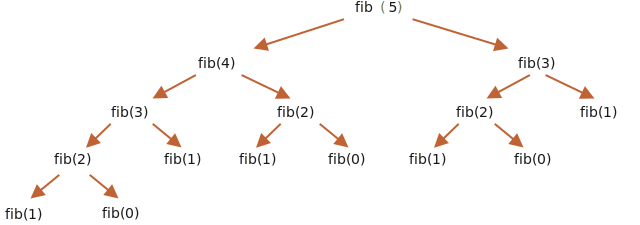

Giải pháp đầu tiên chúng ta có thể thử ở đây là giải pháp đệ quy.

Các số Fibonacci được đệ quy theo định nghĩa:

```js run
function fib(n) {
  return n <= 1 ? n : fib(n - 1) + fib(n - 2);
}

alert( fib(3) ); // 2
alert( fib(7) ); // 13
// fib(77); // will be extremely slow!
```

...Nhưng đối với các giá trị lớn của `n` thì tốc độ rất chậm. Chẳng hạn, `fib(77)` có thể làm treo engine trong một thời gian và ăn hết tài nguyên CPU.

Đó là bởi vì hàm thực hiện quá nhiều cuộc gọi phụ. Các giá trị tương tự được đánh giá lại nhiều lần.

Chẳng hạn, chúng ta hãy xem một đoạn tính toán cho `fib(5)`:

```js no-beautify
...
fib(5) = fib(4) + fib(3)
fib(4) = fib(3) + fib(2)
...
```

Ở đây chúng ta có thể thấy rằng giá trị của `fib(3)` là cần thiết cho cả `fib(5)` và `fib(4)`. Vì vậy, `fib(3)` sẽ được gọi và đánh giá hai lần hoàn toàn độc lập.

Đây là cây đệ quy đầy đủ:



Chúng ta có thể nhận thấy rõ ràng rằng `fib(3)` được đánh giá hai lần và `fib(2)` được đánh giá ba lần. Tổng lượng tính toán tăng nhanh hơn nhiều so với `n`, khiến nó trở nên khổng lồ ngay cả đối với `n=77`.

Chúng ta có thể tối ưu hóa điều đó bằng cách ghi nhớ các giá trị đã được đánh giá: nếu giá trị nói `fib(3)` được tính một lần, thì chúng ta chỉ có thể sử dụng lại giá trị đó trong các tính toán trong tương lai.

Một biến thể khác là từ bỏ đệ quy và sử dụng thuật toán dựa trên vòng lặp hoàn toàn khác.

Thay vì đi từ `n` xuống các giá trị thấp hơn, chúng ta có thể tạo một vòng lặp bắt đầu từ `1` và `2`, sau đó lấy `fib(3)` làm tổng, rồi `fib(4)` làm tổng của hai giá trị trước đó, sau đó là `fib(5)` và tăng dần cho đến khi đạt giá trị cần thiết. Trên mỗi bước chúng ta chỉ cần nhớ hai giá trị trước đó.

Dưới đây là các bước của thuật toán mới một cách chi tiết.

Bắt đầu:

```js
// a = fib(1), b = fib(2), các giá trị này theo định nghĩa 1
let a = 1, b = 1;

// lấy c = fib(3) làm tổng của chúng
let c = a + b;

/* bây giờ chúng ta có  fib(1), fib(2), fib(3)
a  b  c
1, 1, 2
*/
```

Bây giờ chúng ta muốn có `fib(4) = fib(2) + fib(3)`.

Hãy dịch chuyển các biến: `a,b` sẽ nhận được `fib(2),fib(3)`, và `c` sẽ nhận được tổng của chúng:

```js no-beautify
a = b; // bây giờ a = fib(2)
b = c; // bây giờ b = fib(3)
c = a + b; // c = fib(4)

/* bây giờ chúng ta có trình tự:
   a  b  c
1, 1, 2, 3
*/
```

Bước tiếp theo đưa ra một số thứ tự khác:

```js no-beautify
a = b; // bây giờ a = fib(3)
b = c; // bây giờ b = fib(4)
c = a + b; // c = fib(5)

/* bây giờ trình tự là (thêm một số):
      a  b  c
1, 1, 2, 3, 5
*/
```

...Và cứ như vậy cho đến khi chúng ta nhận được giá trị cần thiết. Điều đó nhanh hơn nhiều so với đệ quy và không cần tính toán trùng lặp.

Mã đầy đủ:

```js run
function fib(n) {
  let a = 1;
  let b = 1;
  for (let i = 3; i <= n; i++) {
    let c = a + b;
    a = b;
    b = c;
  }
  return b;
}

alert( fib(3) ); // 2
alert( fib(7) ); // 13
alert( fib(77) ); // 5527939700884757
```

Vòng lặp bắt đầu với `i=3`, bởi vì các giá trị chuỗi thứ nhất và thứ hai được mã hóa cứng thành các biến `a=1`, `b=1`.

Cách tiếp cận này được gọi là [quy hoạch động](https://vi.wikipedia.org/wiki/Quy_ho%E1%BA%A1ch_%C4%91%E1%BB%99ng).
