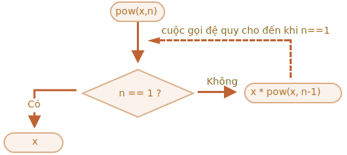
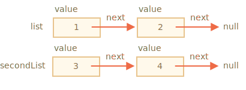

# Đệ quy và ngăn xếp

Hãy quay lại các hàm và nghiên cứu chúng sâu hơn.

Chủ đề đầu tiên của chúng ta sẽ là *đệ quy*.

Nếu bạn không phải là người mới lập trình, thì nó có thể đã quen thuộc và bạn có thể bỏ qua chương này.

Đệ quy là một mẫu lập trình hữu ích trong các tình huống khi một tác vụ có thể được chia thành nhiều tác vụ cùng loại nhưng đơn giản hơn. Hoặc khi một nhiệm vụ có thể được đơn giản hóa thành một hành động dễ dàng cộng với một biến thể đơn giản hơn của cùng một nhiệm vụ. Hoặc, như chúng ta sẽ sớm thấy, để xử lý các cấu trúc dữ liệu nhất định.

Khi một hàm giải quyết một nhiệm vụ, trong quá trình đó, nó có thể gọi nhiều hàm khác. Một phần trường hợp này là khi một hàm gọi *chính nó*. Cái đó được gọi là *đệ quy*.

## Hai cách suy nghĩ

Để bắt đầu một cái gì đó đơn giản -- hãy viết một hàm `pow(x, n)` để nâng `x` lên lũy thừa tự nhiên của `n`. Nói cách khác, nhân `x` với chính nó `n` lần.

```js
pow(2, 2) = 4
pow(2, 3) = 8
pow(2, 4) = 16
```

Có hai cách để thực hiện nó.

1. Tư duy lặp: vòng lặp `for`:

    ```js run
    function pow(x, n) {
      let result = 1;

      // nhân kết quả với x n lần trong vòng lặp
      for (let i = 0; i < n; i++) {
        result *= x;
      }

      return result;
    }

    alert( pow(2, 3) ); // 8
    ```

2. Tư duy đệ quy: đơn giản hóa nhiệm vụ và tự gọi:

    ```js run
    function pow(x, n) {
      if (n == 1) {
        return x;
      } else {
        return x * pow(x, n - 1);
      }
    }

    alert( pow(2, 3) ); // 8
    ```

Hãy lưu ý cách biến thể đệ quy khác nhau về cơ bản.

Khi `pow(x, n)` được gọi, quá trình thực thi sẽ chia thành hai nhánh:

```js
              if n==1  = x
             /
pow(x, n) =
             \       
              else     = x * pow(x, n - 1)
```

1. Nếu `n == 1`, thì mọi thứ đều tầm thường. Nó được gọi là *cơ sở* của đệ quy, bởi vì nó ngay lập tức tạo ra kết quả hiển nhiên: `pow(x, 1)` bằng `x`.
2. Mặt khác, chúng ta có thể biểu diễn `pow(x, n)` dưới dạng `x * pow(x, n - 1)`. Trong toán học, người ta sẽ viết <code>x<sup>n</sup> = x * x<sup>n-1</sup></code>. Đây được gọi là *bước đệ quy*: chúng ta chuyển đổi tác vụ thành một tác vụ đơn giản hơn (nhân với `x`) và một lệnh gọi đơn giản hơn cho cùng một tác vụ (`pow` với `n` thấp hơn). Các bước tiếp theo sẽ ngày càng đơn giản hóa nó cho đến khi `n` đạt đến `1`.

Chúng ta cũng có thể nói rằng `pow` *gọi chính nó một cách đệ quy* cho đến khi `n == 1`.




Ví dụ: để tính `pow(2, 4)` biến thể đệ quy thực hiện các bước sau:

1. `pow(2, 4) = 2 * pow(2, 3)`
2. `pow(2, 3) = 2 * pow(2, 2)`
3. `pow(2, 2) = 2 * pow(2, 1)`
4. `pow(2, 1) = 2`

Vì vậy, đệ quy rút gọn lời gọi hàm thành một lời gọi hàm đơn giản hơn, và sau đó -- đơn giản hơn nữa, v.v., cho đến khi kết quả trở nên rõ ràng.

````smart header="Đệ quy thường ngắn hơn"
Giải pháp đệ quy thường ngắn hơn giải pháp lặp lại.

Ở đây chúng ta có thể viết lại tương tự bằng cách sử dụng toán tử điều kiện `?` thay vì `if` để làm cho `pow(x, n)` ngắn gọn hơn và vẫn rất dễ đọc:

```js run
function pow(x, n) {
  return (n == 1) ? x : (x * pow(x, n - 1));
}
```
````

Số lượng cuộc gọi lồng nhau tối đa (bao gồm cả cuộc gọi đầu tiên) được gọi là *độ sâu đệ quy*. Trong trường hợp của chúng ta, nó sẽ chính xác là `n`.

Độ sâu đệ quy tối đa bị giới hạn bởi JavaScript engine. Chúng ta có thể dựa vào nó là 10000, một số engine cho phép nhiều hơn, nhưng 100000 có thể vượt quá giới hạn đối với phần lớn trong số chúng. Có các tối ưu hóa tự động giúp giảm bớt điều này ("tối ưu hóa cuộc gọi đuôi"), nhưng chúng chưa được hỗ trợ ở mọi nơi và chỉ hoạt động trong các trường hợp đơn giản.

Điều đó hạn chế việc áp dụng đệ quy, nhưng nó vẫn còn rất rộng. Có nhiều tác vụ mà cách suy nghĩ đệ quy cho mã đơn giản hơn, dễ bảo trì hơn.

## Bối cảnh thực thi và ngăn xếp

Bây giờ hãy kiểm tra xem các cuộc gọi đệ quy hoạt động như thế nào. Đối với điều đó, chúng ta sẽ xem xét các hàm.

Thông tin về quá trình thực hiện một hàm đang chạy được lưu trữ trong *bối cảnh thực thi* của nó.

[Bối cảnh thực thi](https://tc39.github.io/ecma262/#sec-execution-contexts) là một cấu trúc dữ liệu nội bộ chứa thông tin chi tiết về việc thực thi một hàm: vị trí hiện tại của luồng điều khiển, các biến hiện tại , giá trị của `this` (chúng ta không sử dụng nó ở đây) và một số chi tiết nội bộ khác.

Một lệnh gọi hàm có chính xác một ngữ cảnh thực thi được liên kết với nó.

Khi một hàm thực hiện một cuộc gọi lồng nhau, điều sau đây sẽ xảy ra:

- Hàm hiện tại đang tạm dừng.
- Bối cảnh thực thi được liên kết với nó được ghi nhớ trong một cấu trúc dữ liệu đặc biệt được gọi là *ngăn xếp ngữ cảnh thực thi*.
- Cuộc gọi lồng nhau thực hiện.
- Sau khi nó kết thúc, bối cảnh thực thi cũ được lấy ra từ ngăn xếp và hàm bên ngoài được tiếp tục từ nơi nó dừng lại.

Hãy xem điều gì xảy ra trong lệnh gọi `pow(2, 3)`.

### pow(2, 3)

Khi bắt đầu gọi `pow(2, 3)` ngữ cảnh thực thi sẽ lưu các biến: `x = 2, n = 3`, luồng thực thi nằm ở dòng `1` của hàm.

Chúng ta có thể phác họa nó như sau:

<ul class="function-execution-context-list">
  <li>
    <span class="function-execution-context">Ngữ cảnh: { x: 2, n: 3, ở dòng 1 }</span>
    <span class="function-execution-context-call">pow(2, 3)</span>
  </li>
</ul>

Đó là khi hàm bắt đầu thực thi. Điều kiện `n == 1` là sai, vì vậy luồng tiếp tục vào nhánh thứ hai của `if`:

```js run
function pow(x, n) {
  if (n == 1) {
    return x;
  } else {
*!*
    return x * pow(x, n - 1);
*/!*
  }
}

alert( pow(2, 3) );
```


Các biến giống nhau, nhưng dòng thay đổi, vì vậy ngữ cảnh bây giờ là:

<ul class="function-execution-context-list">
  <li>
    <span class="function-execution-context">Ngữ cảnh: { x: 2, n: 3, ở dòng 5 }</span>
    <span class="function-execution-context-call">pow(2, 3)</span>
  </li>
</ul>

Để tính `x * pow(x, n - 1)`, chúng ta cần thực hiện lệnh gọi con của `pow` với các đối số mới `pow(2, 2)`.

### pow(2, 2)

Để thực hiện lệnh gọi lồng nhau, JavaScript ghi nhớ ngữ cảnh thực thi hiện tại trong *ngăn xếp ngữ cảnh thực thi*.

Ở đây chúng ta gọi hàm tương tự là `pow`, nhưng nó hoàn toàn không thành vấn đề. Quá trình này giống nhau đối với tất cả các hàm:

1. Bối cảnh hiện tại được "ghi nhớ" trên đầu ngăn xếp.
2. Bối cảnh mới được tạo cho cuộc gọi phụ.
3. Khi cuộc gọi con kết thúc -- bối cảnh trước đó được bật ra khỏi ngăn xếp và quá trình thực thi của nó tiếp tục.

Đây là ngăn xếp ngữ cảnh khi chúng ta nhập lệnh gọi phụ `pow(2, 2)`:

<ul class="function-execution-context-list">
  <li>
    <span class="function-execution-context">Ngữ cảnh: { x: 2, n: 2, ở dòng 1 }</span>
    <span class="function-execution-context-call">pow(2, 2)</span>
  </li>
  <li>
    <span class="function-execution-context">Ngữ cảnh: { x: 2, n: 3, ở dòng 5 }</span>
    <span class="function-execution-context-call">pow(2, 3)</span>
  </li>
</ul>

Bối cảnh thực thi hiện tại mới ở trên cùng (và được in đậm) và các bối cảnh được ghi nhớ trước đó ở bên dưới.

Khi chúng ta kết thúc cuộc gọi phụ -- thật dễ dàng để tiếp tục ngữ cảnh trước đó, bởi vì nó giữ cả hai biến và vị trí chính xác của mã nơi nó dừng lại.

```smart
Ở đây trong hình, chúng ta sử dụng từ "dòng", vì trong ví dụ của chúng ta chỉ có một lệnh gọi phụ trong dòng, nhưng nói chung một dòng mã có thể chứa nhiều lệnh gọi phụ, như `pow(…) + pow(…) + somethingElse(… )`.

Vì vậy, sẽ chính xác hơn khi nói rằng quá trình thực thi sẽ tiếp tục "ngay sau cuộc gọi phụ".
```

### pow(2, 1)

Quá trình lặp lại: một cuộc gọi phụ mới được thực hiện tại dòng `5`, bây giờ với các đối số `x=2`, `n=1`.

Một bối cảnh thực thi mới được tạo, bối cảnh trước đó được đẩy lên trên cùng của ngăn xếp:

<ul class="function-execution-context-list">
  <li>
    <span class="function-execution-context">Ngữ cảnh: { x: 2, n: 1, ở dòng 1 }</span>
    <span class="function-execution-context-call">pow(2, 1)</span>
  </li>
  <li>
    <span class="function-execution-context">Ngữ cảnh: { x: 2, n: 2, ở dòng 5 }</span>
    <span class="function-execution-context-call">pow(2, 2)</span>
  </li>
  <li>
    <span class="function-execution-context">Ngữ cảnh: { x: 2, n: 3, ở dòng 5 }</span>
    <span class="function-execution-context-call">pow(2, 3)</span>
  </li>
</ul>

Hiện có 2 ngữ cảnh cũ và 1 ngữ cảnh hiện đang chạy cho `pow(2, 1)`.

### Lối thoát

Trong quá trình thực thi `pow(2, 1)`, không giống như trước đây, điều kiện `n == 1` là đúng, vì vậy nhánh đầu tiên của `if` hoạt động:

```js
function pow(x, n) {
  if (n == 1) {
*!*
    return x;
*/!*
  } else {
    return x * pow(x, n - 1);
  }
}
```

Không còn lệnh gọi lồng nhau nào nữa, vì vậy hàm kết thúc, trả về `2`.

Khi hàm kết thúc, bối cảnh thực thi của nó không còn cần thiết nữa, do đó, nó bị xóa khỏi bộ nhớ. Cái trước đó được khôi phục khỏi đầu ngăn xếp:


<ul class="function-execution-context-list">
  <li>
    <span class="function-execution-context">Ngữ cảnh: { x: 2, n: 2, ở dòng 5 }</span>
    <span class="function-execution-context-call">pow(2, 2)</span>
  </li>
  <li>
    <span class="function-execution-context">Ngữ cảnh: { x: 2, n: 3, ở dòng 5 }</span>
    <span class="function-execution-context-call">pow(2, 3)</span>
  </li>
</ul>

Quá trình thực thi `pow(2, 2)` được tiếp tục. Nó có kết quả của lệnh gọi phụ `pow(2, 1)`, vì vậy nó cũng có thể kết thúc việc đánh giá `x * pow(x, n - 1)`, trả về `4`.

Sau đó, bối cảnh trước đó được khôi phục:

<ul class="function-execution-context-list">
  <li>
    <span class="function-execution-context">Ngữ cảnh: { x: 2, n: 3, ở dòng 5 }</span>
    <span class="function-execution-context-call">pow(2, 3)</span>
  </li>
</ul>

Khi nó kết thúc, chúng ta có kết quả là `pow(2, 3) = 8`.

Độ sâu đệ quy trong trường hợp này là: **3**.

Như chúng ta có thể thấy từ các hình minh họa ở trên, độ sâu đệ quy bằng với số lượng ngữ cảnh tối đa trong ngăn xếp.

Lưu ý các yêu cầu bộ nhớ. Bối cảnh chiếm bộ nhớ. Trong trường hợp của chúng ta, việc nâng lên lũy thừa của `n` thực sự yêu cầu bộ nhớ cho ngữ cảnh `n`, cho tất cả các giá trị thấp hơn của `n`.

Thuật toán dựa trên vòng lặp tiết kiệm bộ nhớ hơn:

```js
function pow(x, n) {
  let result = 1;

  for (let i = 0; i < n; i++) {
    result *= x;
  }

  return result;
}
```

`pow` lặp lại sử dụng một ngữ cảnh duy nhất thay đổi `i` và `kết quả` trong quy trình. Yêu cầu bộ nhớ của nó nhỏ, cố định và không phụ thuộc vào `n`.

**Bất kỳ đệ quy nào cũng có thể được viết lại dưới dạng vòng lặp. Biến thể vòng lặp thường có thể được thực hiện hiệu quả hơn.**

...Nhưng đôi khi việc viết lại không hề nhỏ, đặc biệt là khi hàm sử dụng các cuộc gọi con đệ quy khác nhau tùy thuộc vào điều kiện và hợp nhất kết quả của chúng hoặc khi việc phân nhánh phức tạp hơn. Và việc tối ưu hóa có thể không cần thiết và hoàn toàn không xứng đáng với những nỗ lực.

Đệ quy có thể đưa ra đoạn mã ngắn hơn, dễ hiểu và dễ hỗ trợ hơn. Tối ưu hóa không phải bắt buộc ở mọi nơi, chủ yếu là chúng ta cần một mã tốt, đó là lý do tại sao nó được sử dụng.

## Truyền tải đệ quy

Một ứng dụng tuyệt vời khác của đệ quy là truyền tải đệ quy.

Hãy tưởng tượng, chúng ta có một công ty. Cấu trúc nhân viên có thể được trình bày dưới dạng một đối tượng:

```js
let company = {
  sales: [{
    name: 'John',
    salary: 1000
  }, {
    name: 'Alice',
    salary: 1600
  }],

  development: {
    sites: [{
      name: 'Peter',
      salary: 2000
    }, {
      name: 'Alex',
      salary: 1800
    }],

    internals: [{
      name: 'Jack',
      salary: 1300
    }]
  }
};
```

Nói cách khác, một công ty có các phòng ban.

- Một bộ phận có thể có một array nhân viên. Chẳng hạn, bộ phận `sales` có 2 nhân viên: John và Alice.
- Hoặc một bộ phận có thể chia thành các bộ phận nhỏ, như `development` có hai nhánh: `sites` và `internal`. Mỗi người trong số họ có nhân viên riêng của họ.
- Cũng có thể khi một chi cục lớn lên thì chia thành các chi cục (hoặc tổ).

     Chẳng hạn, bộ phận `sites` trong tương lai có thể được chia thành các nhóm cho `siteA` và `siteB`. Và họ, có khả năng, có thể chia nhiều hơn nữa. Đó không phải là hình ảnh, chỉ là một cái gì đó để có trong tâm trí.

Bây giờ, giả sử chúng ta muốn một hàm lấy tổng của tất cả các mức lương. Làm thế nào chúng ta có thể làm điều đó?

Một cách tiếp cận lặp đi lặp lại là không dễ dàng, bởi vì cấu trúc không đơn giản. Ý tưởng đầu tiên có thể là tạo vòng lặp `for` trên `company` với vòng lặp con lồng nhau trên các phòng ban cấp 1. Nhưng sau đó, chúng ta cần nhiều vòng lặp con lồng nhau hơn để lặp lại nhân viên ở các phòng ban cấp 2 như `sites`... Và sau đó, một vòng lặp con khác bên trong các vòng lặp con đó dành cho các phòng ban cấp 3 có thể xuất hiện trong tương lai? Nếu chúng ta đặt 3-4 vòng lặp con lồng nhau trong mã để duyệt qua một đối tượng, nó sẽ trở nên khá xấu.

Hãy thử đệ quy.

Như chúng ta có thể thấy, khi hàm của chúng ta tính tổng một bộ phận, có hai trường hợp có thể xảy ra:

1. Hoặc đó là một bộ phận "đơn giản" với *array* người -- thì chúng ta có thể tính tổng tiền lương trong một vòng lặp đơn giản.
2. Hoặc đó là *một đối tượng* có `N` bộ phận con -- khi đó chúng ta có thể thực hiện lệnh gọi đệ quy `N` để lấy tổng cho từng bộ phận con và kết hợp các kết quả.

Trường hợp đầu tiên là cơ sở của đệ quy, trường hợp tầm thường, khi chúng ta nhận được một array.

Trường hợp thứ 2 khi chúng ta lấy một đối tượng là bước đệ quy. Một nhiệm vụ phức tạp được chia thành các nhiệm vụ con cho các bộ phận nhỏ hơn. Họ có thể lần lượt chia tách một lần nữa, nhưng sớm hay muộn sự phân chia sẽ kết thúc ở (1).

Thuật toán có lẽ còn dễ đọc hơn từ mã:


```js run
let company = { // cùng một đối tượng, được nén cho ngắn gọn
  sales: [{name: 'John', salary: 1000}, {name: 'Alice', salary: 1600 }],
  development: {
    sites: [{name: 'Peter', salary: 2000}, {name: 'Alex', salary: 1800 }],
    internals: [{name: 'Jack', salary: 1300}]
  }
};

// Hàm thực hiện công việc
*!*
function sumSalaries(department) {
  if (Array.isArray(department)) { // trường hợp (1)
    return department.reduce((prev, current) => prev + current.salary, 0); // tính tổng array
  } else { // case (2)
    let sum = 0;
    for (let subdep of Object.values(department)) {
      sum += sumSalaries(subdep); // gọi đệ quy các phân khu, tính tổng kết quả
    }
    return sum;
  }
}
*/!*

alert(sumSalaries(company)); // 7700
```

Mã ngắn và dễ hiểu (mong rằng?). Đó là sức mạnh của đệ quy. Nó cũng hoạt động đối với bất kỳ cấp độ nào của việc lồng ghép các bộ phận phụ.

Đây là sơ đồ của các cuộc gọi:


Ta có thể dễ dàng nhận thấy nguyên tắc: đối với một đối tượng `{...}` thì thực hiện gọi con, còn mảng `[...]` là các "lá" của cây đệ quy thì cho kết quả ngay.

Lưu ý rằng mã này sử dụng các tính năng thông minh mà chúng ta đã đề cập trước đây:

- Phương thức `arr.reduce` được giải thích trong chương <info:array-methods> để lấy tổng của array.
- Vòng lặp `for(val of Object.values(obj))` để lặp qua các giá trị đối tượng: `Object.values` trả về một array của chúng.


## Cấu trúc đệ quy

Cấu trúc dữ liệu đệ quy (được xác định đệ quy) là cấu trúc sao chép chính nó thành từng phần.

Chúng ta vừa thấy nó trong ví dụ về cấu trúc công ty ở trên.

Một *bộ phận* của công ty là:
- Hoặc là một array người.
- Hoặc một đối tượng có *các phòng ban*.

Đối với các nhà phát triển web, có nhiều ví dụ nổi tiếng hơn: tài liệu HTML và XML.

Trong tài liệu HTML, một *HTML-tag* có thể chứa danh sách:
- Đoạn văn bản.
- Nhận xét HTML.
- *Thẻ HTML* khác (có thể chứa các đoạn văn bản/nhận xét hoặc các thẻ khác, v.v.).

Đó là một lần nữa một định nghĩa đệ quy.

Để hiểu rõ hơn, chúng ta sẽ đề cập đến một cấu trúc đệ quy khác có tên là "Danh sách được liên kết" có thể là một giải pháp thay thế tốt hơn cho array trong một số trường hợp.

### Danh sách liên kết

Hãy tưởng tượng, chúng ta muốn lưu trữ một danh sách các đối tượng được sắp xếp theo thứ tự.

Sự lựa chọn tự nhiên sẽ là một array:

```js
let arr = [obj1, obj2, obj3];
```

...Nhưng có một vấn đề với array. Thao tác "xóa phần tử" và "chèn phần tử" rất tốn kém. Chẳng hạn, thao tác `arr.unshift(obj)` phải đánh số lại tất cả các phần tử để nhường chỗ cho một `obj` mới và nếu array lớn thì sẽ mất thời gian. Tương tự với `arr.shift()`.

Các sửa đổi cấu trúc duy nhất không yêu cầu đánh số lại hàng loạt là những sửa đổi hoạt động với phần cuối của array: `arr.push/pop`. Vì vậy, một array có thể khá chậm đối với các hàng đợi lớn, khi chúng ta phải làm việc từ đầu.

Ngoài ra, nếu chúng ta thực sự cần chèn/xóa nhanh, chúng ta có thể chọn một cấu trúc dữ liệu khác được gọi là [danh sách được liên kết](https://en.wikipedia.org/wiki/Linked_list).

*Phần tử danh sách được liên kết* được định nghĩa đệ quy là một đối tượng có:
- `giá trị`.
- Thuộc tính `next` tham chiếu đến *phần tử danh sách được liên kết* tiếp theo hoặc `null` nếu đó là phần cuối.

Ví dụ:

```js
let list = {
  value: 1,
  next: {
    value: 2,
    next: {
      value: 3,
      next: {
        value: 4,
        next: null
      }
    }
  }
};
```

Graphical representation of the list:


An alternative code for creation:

```js no-beautify
let list = { value: 1 };
list.next = { value: 2 };
list.next.next = { value: 3 };
list.next.next.next = { value: 4 };
list.next.next.next.next = null;
```

Here we can even more clearly see that there are multiple objects, each one has the `value` and `next` pointing to the neighbour. The `list` variable is the first object in the chain, so following `next` pointers from it we can reach any element.

The list can be easily split into multiple parts and later joined back:

```js
let secondList = list.next.next;
list.next.next = null;
```



To join:

```js
list.next.next = secondList;
```

And surely we can insert or remove items in any place.

For instance, to prepend a new value, we need to update the head of the list:

```js
let list = { value: 1 };
list.next = { value: 2 };
list.next.next = { value: 3 };
list.next.next.next = { value: 4 };

*!*
// prepend the new value to the list
list = { value: "new item", next: list };
*/!*
```


To remove a value from the middle, change `next` of the previous one:

```js
list.next = list.next.next;
```


We made `list.next` jump over `1` to value `2`. The value `1` is now excluded from the chain. If it's not stored anywhere else, it will be automatically removed from the memory.

Unlike arrays, there's no mass-renumbering, we can easily rearrange elements.

Naturally, lists are not always better than arrays. Otherwise everyone would use only lists.

The main drawback is that we can't easily access an element by its number. In an array that's easy: `arr[n]` is a direct reference. But in the list we need to start from the first item and go `next` `N` times to get the Nth element.

...But we don't always need such operations. For instance, when we need a queue or even a [deque](https://en.wikipedia.org/wiki/Double-ended_queue) -- the ordered structure that must allow very fast adding/removing elements from both ends, but access to its middle is not needed.

Lists can be enhanced:
- We can add property `prev` in addition to `next` to reference the previous element, to move back easily.
- We can also add a variable named `tail` referencing the last element of the list (and update it when adding/removing elements from the end).
- ...The data structure may vary according to our needs.

## Summary

Terms:
- *Recursion*  is a programming term that means calling a function from itself. Recursive functions can be used to solve tasks in elegant ways.

    When a function calls itself, that's called a *recursion step*. The *basis* of recursion is function arguments that make the task so simple that the function does not make further calls.

- A [recursively-defined](https://en.wikipedia.org/wiki/Recursive_data_type) data structure is a data structure that can be defined using itself.

    For instance, the linked list can be defined as a data structure consisting of an object referencing a list (or null).

    ```js
    list = { value, next -> list }
    ```

    Trees like HTML elements tree or the department tree from this chapter are also naturally recursive: they branch and every branch can have other branches.

    Recursive functions can be used to walk them as we've seen in the `sumSalary` example.

Any recursive function can be rewritten into an iterative one. And that's sometimes required to optimize stuff. But for many tasks a recursive solution is fast enough and easier to write and support.
