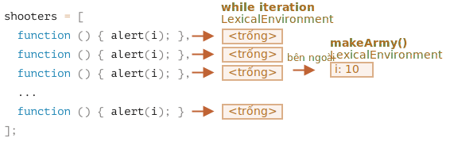
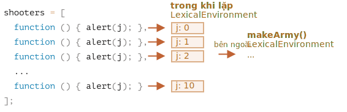
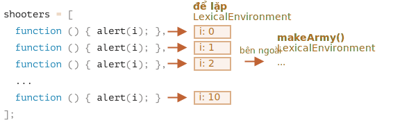

Hãy xem xét chính xác điều gì xảy ra bên trong `makeArmy` và giải pháp sẽ trở nên rõ ràng.

1. Nó tạo ra một array `shooters` trống:

    ```js
    let shooters = [];
    ```
2. Điền vào nó các hàm thông qua `shooters.push(function)` trong vòng lặp.

    Mỗi phần tử là một hàm, vì vậy array kết quả trông như thế này:

    ```js no-beautify
    shooters = [
      function () { alert(i); },
      function () { alert(i); },
      function () { alert(i); },
      function () { alert(i); },
      function () { alert(i); },
      function () { alert(i); },
      function () { alert(i); },
      function () { alert(i); },
      function () { alert(i); },
      function () { alert(i); }
    ];
    ```

3. Array được trả về từ hàm.
    
    Sau đó, sau đó, cuộc gọi đến bất kỳ thành viên nào, ví dụ:. `army[5]()` sẽ lấy phần tử `army[5]` từ array (là một hàm) và gọi nó.
    
    Bây giờ tại sao tất cả các chức năng như vậy hiển thị cùng một giá trị, `10`?
    
    Đó là bởi vì không có biến cục bộ `i` bên trong các hàm `shooter`. Khi một hàm như vậy được gọi, nó sẽ lấy `i` từ lexical environment bên ngoài của nó.
    
    Khi đó, giá trị của `i` sẽ là bao nhiêu?
    
    Nếu chúng ta nhìn vào nguồn:
    
    ```js
    function makeArmy() {
      ...
      let i = 0;
      while (i < 10) {
        let shooter = function() { // hàm shooter
          alert( i ); // nên hiển thị số của nó
        };
        shooters.push(shooter); // thêm hàm vào array
        i++;
      }
      ...
    }
    ```
    
    Chúng ta có thể thấy rằng tất cả các hàm `shooter` đều được tạo trong lexical environment của hàm `makeArmy()`. Nhưng khi `army[5]()` được gọi, `makeArmy` đã hoàn thành công việc của nó và giá trị cuối cùng của `i` là `10` (`while` dừng ở `i=10`).
    
    Kết quả là, tất cả các hàm `shooter` nhận cùng một giá trị từ lexical environment bên ngoài và đó là giá trị cuối cùng, `i=10`.
    
    
    
    Như bạn có thể thấy ở trên, trên mỗi lần lặp của khối `while {...}`, một lexical environment mới được tạo. Vì vậy, để khắc phục điều này, chúng ta có thể sao chép giá trị của `i` vào một biến trong khối `while {...}`, như sau:
    
    ```js run
    function makeArmy() {
      let shooters = [];
    
      let i = 0;
      while (i < 10) {
        *!*
          let j = i;
        */!*
          let shooter = function() { // hàm shooter
            alert( *!*j*/!* ); // nên hiển thị số của nó
          };
        shooters.push(shooter);
        i++;
      }
    
      return shooters;
    }
    
    let army = makeArmy();
    
    // Bây giờ mã hoạt động đúng
    army[0](); // 0
    army[5](); // 5
    ```
    
    Ở đây `let j = i` khai báo một biến "lặp cục bộ" `j` và sao chép `i` vào đó. Các bản gốc được sao chép "theo giá trị", vì vậy chúng ta thực sự nhận được một bản sao độc lập của `i`, thuộc về phép lặp vòng lặp hiện tại.
    
    The shooters work correctly, because the value of `i` now lives a little bit closer. Not in `makeArmy()` Lexical Environment, but in the Lexical Environment that corresponds to the current loop iteration:
    
    
    
    Vấn đề như vậy cũng có thể tránh được nếu chúng ta sử dụng `for` ngay từ đầu, như sau:
    
    ```js run demo
    function makeArmy() {
    
      let shooters = [];
    
    *!*
      for(let i = 0; i < 10; i++) {
    */!*
        let shooter = function() { // hàm shooter
          alert( i ); // nên hiển thị số của nó
        };
        shooters.push(shooter);
      }
    
      return shooters;
    }
    
    let army = makeArmy();
    
    army[0](); // 0
    army[5](); // 5
    ```
    
    Điều đó về cơ bản là giống nhau, bởi vì `for` trên mỗi lần lặp tạo ra một lexical environment mới, với biến riêng `i`. Vì vậy, `shooter` được tạo trong mỗi lần lặp tham chiếu `i` của chính nó, từ chính lần lặp đó.
    
    

Bây giờ, vì bạn đã bỏ ra rất nhiều công sức để đọc nó, và công thức cuối cùng rất đơn giản - chỉ cần sử dụng `for`, bạn có thể tự hỏi -- nó có đáng không?

Chà, nếu bạn có thể dễ dàng trả lời câu hỏi, bạn sẽ không đọc lời giải. Vì vậy, hy vọng nhiệm vụ này đã giúp bạn hiểu mọi thứ tốt hơn một chút.

Bên cạnh đó, thực sự có những trường hợp khi một người thích `while` hơn là `for`, và các tình huống khác, trong đó các vấn đề như vậy là có thật.

