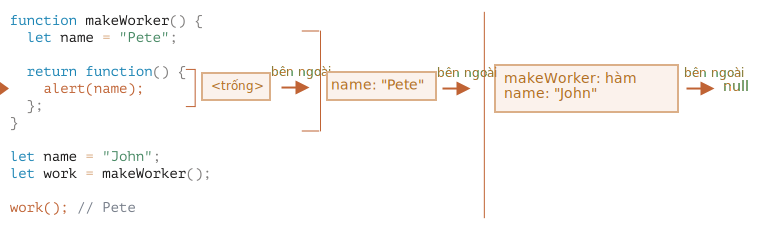

Đáp án là: **Pete**.

Hàm `work()` trong đoạn mã bên dưới lấy `name` từ nơi xuất phát của nó thông qua tham chiếu lexical environment bên ngoài:

Vì vậy, kết quả là `"Pete"` ở đây.

Nhưng nếu không có `let name` trong `makeWorker()`, thì tìm kiếm sẽ ra bên ngoài và lấy biến cục bộ như chúng ta có thể thấy từ chuỗi bên trên. Trong trường hợp đó, kết quả sẽ là `"John"`.
