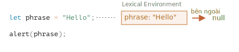
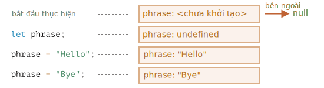
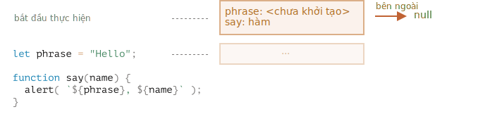
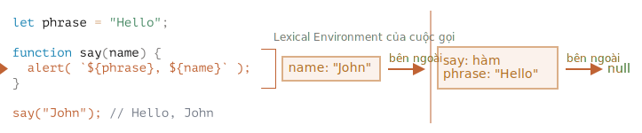
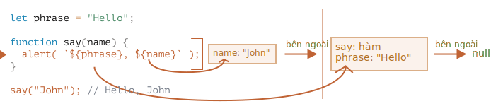
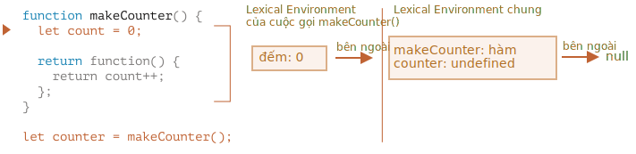
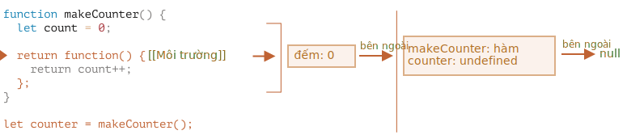
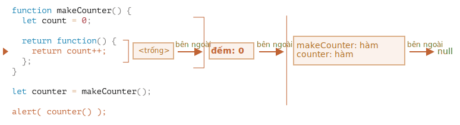
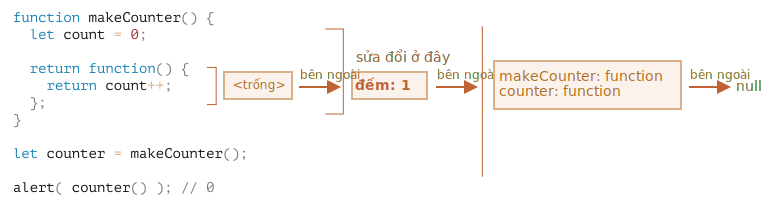

# Phạm vi biến, bao đóng

JavaScript là một ngôn ngữ rất hướng hàm. Nó cho chúng ta rất nhiều tự do. Một hàm có thể được tạo bất cứ lúc nào, được chuyển dưới dạng đối số cho một hàm khác và sau đó được gọi từ một vị trí mã hoàn toàn khác sau đó.

Chúng ta đã biết rằng một hàm có thể truy cập các biến bên ngoài nó (các biến "bên ngoài").

Nhưng điều gì sẽ xảy ra nếu các biến bên ngoài thay đổi kể từ khi một hàm được tạo? Hàm sẽ nhận giá trị mới hơn hay giá trị cũ?

Và điều gì sẽ xảy ra nếu một hàm được truyền dưới dạng tham số và được gọi từ một vị trí khác của mã, liệu nó có được truy cập vào các biến bên ngoài ở vị trí mới không?

Hãy mở rộng kiến thức của chúng ta để hiểu những tình huống này và những tình huống phức tạp hơn.

```smart header="Chúng ta sẽ nói về các biến `let/const` ở đây"
Trong JavaScript, có 3 cách để khai báo một biến: `let`, `const` (cách hiện đại) và `var` (phần còn lại của quá khứ).

- Trong bài viết này, chúng ta sẽ sử dụng các biến `let` trong các ví dụ.
- Các biến, được khai báo bằng `const`, hoạt động giống nhau, vì vậy bài viết này cũng nói về `const`.
- `var` cũ có một số điểm khác biệt đáng chú ý, chúng sẽ được đề cập trong bài viết <info:var>.
```

## Khối mã

Nếu một biến được khai báo bên trong khối mã `{...}`, thì nó chỉ hiển thị bên trong khối đó.

Ví dụ:

```js run
{
  // thực hiện một số công việc với các biến cục bộ không nên nhìn thấy bên ngoài

  let message = "Hello"; // chỉ hiển thị trong khối này

  alert(message); // Hello
}

alert(message); // Lỗi: tin nhắn không xác định
```

Chúng ta có thể sử dụng điều này để cô lập một đoạn mã thực hiện nhiệm vụ riêng của nó, với các biến chỉ thuộc về nó:

```js run
{
  // hiển thị tin nhắn
  let message = "Hello";
  alert(message);
}

{
  // hiển thị một tin nhắn khác
  let message = "Bye";
  alert(message);
}
```

````smart header="Sẽ có lỗi nếu không có khối"
Hãy lưu ý, nếu không có các khối riêng biệt sẽ xảy ra lỗi, nếu chúng ta sử dụng `let` với tên biến hiện có:

```js run
// hiển thị tin nhắn
let message = "Hello";
alert(message);

// hiển thị một tin nhắn khác
*!*
let message = "Bye"; // Lỗi: biến đã được khai báo
*/!*
alert(message);
```
````

Đối với `if`, `for`, `while`, v.v., các biến được khai báo trong `{...}` cũng chỉ hiển thị bên trong:

```js run
if (true) {
  let phrase = "Hello!";

  alert(phrase); // Hello!
}

alert(phrase); // Lỗi, không có biến như vậy!
```

Ở đây, sau khi `if` kết thúc, `alert` bên dưới sẽ không thấy `phrase`, do đó xảy ra lỗi.

Điều đó thật tuyệt, vì nó cho phép chúng ta tạo các biến cục bộ khối, dành riêng cho một nhánh `if`.

Điều tương tự cũng đúng với các vòng lặp `for` và `while`:

```js run
for (let i = 0; i < 3; i++) {
  // biến i chỉ hiển thị bên trong cái này cho
  alert(i); // 0, then 1, then 2
}

alert(i); // Lỗi, không có biến như vậy
```

Về mặt trực quan, `let i` nằm ngoài `{...}`. Nhưng cấu trúc `for` ở đây đặc biệt: biến, được khai báo bên trong nó, được coi là một phần của khối.

## Các hàm lồng nhau

Một hàm được gọi là "lồng nhau" khi nó được tạo bên trong một hàm khác.

Có thể dễ dàng làm điều này với JavaScript.

Chúng ta có thể sử dụng nó để sắp xếp mã của ta, như thế này:

```js
function sayHiBye(firstName, lastName) {

  // hàm lồng nhau của người trợ giúp để sử dụng bên dưới
  function getFullName() {
    return firstName + " " + lastName;
  }

  alert( "Xin chào, " + getFullName() );
  alert( "Tạm biệt, " + getFullName() );

}
```

Ở đây, hàm *lồng nhau* `getFullName()` được tạo ra để thuận tiện. Nó có thể truy cập các biến bên ngoài và do đó có thể trả về tên đầy đủ. Các hàm lồng nhau khá phổ biến trong JavaScript.

Điều thú vị hơn nhiều, một hàm lồng nhau có thể được trả về: dưới dạng thuộc tính của một đối tượng mới hoặc là kết quả của chính nó. Sau đó nó có thể được sử dụng ở một nơi khác. Bất kể ở đâu, nó vẫn có quyền truy cập vào các biến bên ngoài giống nhau.

Bên dưới, `makeCounter` tạo hàm "bộ đếm" trả về số tiếp theo trên mỗi lệnh gọi:

```js run
function makeCounter() {
  let count = 0;

  return function() {
    return count++;
  };
}

let counter = makeCounter();

alert( counter() ); // 0
alert( counter() ); // 1
alert( counter() ); // 2
```

Mặc dù đơn giản, các biến thể được sửa đổi một chút của mã đó có những ứng dụng thực tế, chẳng hạn như [trình tạo số ngẫu nhiên](https://vi.wikipedia.org/wiki/B%E1%BB%99_sinh_s%E1%BB%91_gi%E1%BA%A3_ng%E1%BA%ABu_nhi%C3%AAn) để tạo các giá trị ngẫu nhiên cho các bài kiểm tra tự động.

Cái này hoạt động ra sao? Nếu chúng ta tạo nhiều bộ đếm, chúng có độc lập không? Điều gì đang xảy ra với các biến ở đây?

Hiểu những điều như vậy là rất tốt cho kiến thức tổng thể về JavaScript và có lợi cho các tình huống phức tạp hơn. Vì vậy, chúng ta hãy đi sâu hơn một chút.

## Môi trường Từ vựng

```warn header="Đây là những con rồng!"
Phần giải thích kỹ thuật chuyên sâu nằm ở phía trước.

Theo như tôi muốn tránh các chi tiết ngôn ngữ cấp thấp, mọi hiểu biết nếu không có chúng sẽ thiếu sót và không đầy đủ, vì vậy hãy sẵn sàng.
```

Để rõ ràng, giải thích được chia thành nhiều bước.

### Bước 1. Biến

Trong JavaScript, mọi hàm đang chạy, khối mã `{...}` và toàn bộ tập lệnh đều có một đối tượng liên quan (ẩn) bên trong được gọi là *Môi trường Từ vựng*.

Đối tượng Môi trường Từ vựng bao gồm hai phần:

1. *Bản ghi Môi trường* -- một đối tượng lưu trữ tất cả các biến cục bộ làm thuộc tính của nó (và một số thông tin khác như giá trị của `this`).
2. Tham chiếu đến *Môi trường Từ vựng bên ngoài*, môi trường được liên kết với mã bên ngoài.

**"Biến" chỉ là thuộc tính của đối tượng bên trong đặc biệt, `Bản ghi Môi trường`. "Nhận hoặc thay đổi một biến" có nghĩa là "lấy hoặc thay đổi một thuộc tính của đối tượng đó".**

Trong mã đơn giản không có hàm này, chỉ có một Môi trường Từ vựng:



Đây được gọi là Môi trường Từ vựng *chung*, được liên kết với toàn bộ tập lệnh.

Trong hình trên, hình chữ nhật có nghĩa là Bản ghi Môi trường (lưu trữ biến) và mũi tên có nghĩa là tham chiếu bên ngoài. Môi trường Từ vựng chung không có tham chiếu bên ngoài, đó là lý do tại sao mũi tên trỏ đến `null`.

Khi mã bắt đầu thực thi và tiếp tục, Môi trường Từ vựng sẽ thay đổi.

Đây là mã dài hơn một chút:



Các hình chữ nhật ở phía bên tay phải thể hiện cách Môi trường Từ vựng chung thay đổi trong quá trình thực thi:

1. Khi tập lệnh bắt đầu, Môi trường Từ vựng được điền trước với tất cả các biến đã khai báo.
     - Ban đầu, chúng ở trạng thái "Chưa khởi tạo". Đó là một trạng thái bên trong đặc biệt, nó có nghĩa là engine biết về biến, nhưng nó không thể được tham chiếu cho đến khi nó được khai báo với `let`. Nó gần giống như thể biến không tồn tại.
2. Sau đó, định nghĩa `let phrase` xuất hiện. Chưa có nhiệm vụ nào, vì vậy giá trị của nó là `undefined`. Chúng ta có thể sử dụng biến từ thời điểm này trở đi.
3. `phrase` được gán một giá trị.
4. `phrase` thay đổi giá trị.

Mọi thứ có vẻ đơn giản cho bây giờ, phải không?

- Biến là thuộc tính của một đối tượng bên trong đặc biệt, được liên kết với khối/hàm/tập lệnh hiện đang thực thi.
- Làm việc với biến thực chất là làm việc với thuộc tính của đối tượng đó.

```smart header="Môi trường Từ vựng là một đối tượng thông số"
"Môi trường Từ vựng" là một đối tượng thông số: nó chỉ tồn tại "về mặt lý thuyết" trong [thông số kỹ thuật ngôn ngữ](https://tc39.es/ecma262/#sec-lexical-environments) để mô tả cách mọi thứ hoạt động. Chúng ta không thể lấy đối tượng này trong mã của mình và thao tác trực tiếp với nó.

Các JavaScript engine cũng có thể tối ưu hóa nó, loại bỏ các biến không được sử dụng để tiết kiệm bộ nhớ và thực hiện các thủ thuật nội bộ khác, miễn là hành vi hiển thị vẫn như mô tả.
```

### Bước 2. Khai báo hàm

Một hàm cũng là một giá trị, giống như một biến.

**Sự khác biệt là một Khai báo hàm được khởi tạo đầy đủ ngay lập tức.**

Khi một Môi trường Từ vựng được tạo, một Khai báo hàm ngay lập tức trở thành một hàm sẵn sàng sử dụng (không giống như `let`, không thể sử dụng được cho đến khi khai báo).

Đó là lý do tại sao chúng ta có thể sử dụng một hàm, được khai báo là Khai báo hàm, ngay cả trước khi chính khai báo đó.

Ví dụ: đây là trạng thái ban đầu của Môi trường Từ vựng chung khi chúng ta thêm một hàm:



Đương nhiên, hành vi này chỉ áp dụng cho Khai báo hàm, không áp dụng cho Biểu thức hàm trong đó chúng ta gán một hàm cho một biến, chẳng hạn như `hãy nói = hàm(tên)...`.

### Bước 3. Môi trường Từ vựng bên trong và bên ngoài

Khi một hàm chạy, khi bắt đầu cuộc gọi, một Môi trường Từ vựng mới được tạo tự động để lưu trữ các biến cục bộ và tham số của cuộc gọi.

Chẳng hạn, đối với `say("John")`, nó trông như thế này (việc thực thi nằm ở dòng, được đánh dấu bằng một mũi tên):

<!--
    ```js
    let phrase = "Xin chào";

    function say(name) {
     alert( `${phrase}, ${name}` );
    }

    say("John"); // Xin chào, John
    ```-->



Trong khi gọi hàm, chúng ta có hai Môi trường Từ vựng: môi trường bên trong (đối với lệnh gọi hàm) và môi trường bên ngoài (chung):

- Môi trường Từ vựng bên trong tương ứng với việc thực thi `say` hiện tại. Nó có một thuộc tính duy nhất: `name`, đối số của hàm. Chúng ta đã gọi `say("John")`, vì vậy giá trị của `name` là `"John"`.
- Môi trường Từ vựng bên ngoài là Môi trường Từ vựng chung. Nó có biến `phrase` và chính hàm đó.

Môi trường Từ vựng bên trong có tham chiếu đến môi trường `bên ngoài`.

**Khi mã muốn truy cập một biến -- Môi trường Từ vựng bên trong được tìm kiếm trước, sau đó đến môi trường bên ngoài, rồi đến môi trường bên ngoài hơn, v.v. cho đến môi trường chung.**

Nếu không tìm thấy biến ở bất kỳ đâu, thì đó là lỗi trong chế độ nghiêm ngặt (không có `usestrict`, việc gán cho một biến không tồn tại sẽ tạo ra một biến chung mới, để tương thích với mã cũ).

Trong ví dụ này, quá trình tìm kiếm diễn ra như sau:

- Đối với biến `name`, `alert` bên trong `say` tìm thấy nó ngay lập tức trong Môi trường Từ vựng bên trong.
- Khi nó muốn truy cập `phrase`, thì không có `phrase` cục bộ, vì vậy nó sẽ theo tham chiếu đến Môi trường Từ vựng bên ngoài và tìm thấy nó ở đó.




### Bước 4. Trả về một hàm

Hãy quay lại ví dụ `makeCounter`.

```js
function makeCounter() {
  let count = 0;

  return function() {
    return count++;
  };
}

let counter = makeCounter();
```

Khi bắt đầu mỗi lệnh gọi `makeCounter()`, một đối tượng Môi trường Từ vựng mới được tạo để lưu trữ các biến cho lần chạy `makeCounter` này.

Vì vậy, chúng ta có hai Môi trường Từ vựng lồng nhau, giống như trong ví dụ trên:



Điều khác biệt là, trong quá trình thực thi `makeCounter()`, một hàm nhỏ lồng nhau được tạo chỉ từ một dòng: `return count++`. Chúng ta chưa chạy nó, chỉ tạo.

Tất cả các hàm ghi nhớ Môi trường Từ vựng mà chúng được tạo ra. Về mặt kỹ thuật, không có phép thuật nào ở đây: tất cả các hàm đều có thuộc tính ẩn có tên `[[Môi trường]]`, giữ tham chiếu đến Môi trường Từ vựng nơi hàm được tạo:



Vì vậy, `counter.[[Environment]]` có tham chiếu đến `{count: 0}` Môi trường Từ vựng. Đó là cách hàm ghi nhớ nơi nó được tạo, bất kể nó được gọi ở đâu. Tham chiếu `[[Môi trường]]` được đặt một lần và mãi mãi tại thời điểm tạo hàm.

Sau đó, khi `counter()` được gọi, một Môi trường Từ vựng mới được tạo cho lệnh gọi và tham chiếu Môi trường từ vựng bên ngoài của nó được lấy từ `bộ đếm.[[Environment]]`:



Bây giờ, khi mã bên trong `counter()` tìm kiếm biến `count`, trước tiên, nó tìm kiếm Môi trường Từ vựng của chính nó (trống, vì không có biến cục bộ nào ở đó), sau đó là Môi trường Từ vựng của lệnh gọi `makeCounter()` bên ngoài, nơi nó tìm thấy và thay đổi nó.

**Một biến được cập nhật trong Môi trường Từ vựng nơi nó tồn tại.**

Đây là trạng thái sau khi thực hiện:



Nếu chúng ta gọi `counter()` nhiều lần, biến `count` sẽ được tăng lên thành `2`, `3`, v.v., tại cùng một vị trí.

```smart header="Bao đóng"
Có một thuật ngữ lập trình chung là "bao đóng" mà các nhà phát triển thường nên biết.

[Bao đóng](https://vi.wikipedia.org/wiki/Bao_%C4%91%C3%B3ng_(l%E1%BA%ADp_tr%C3%ACnh_m%C3%A1y_t%C3%ADnh)) là một hàm ghi nhớ các biến bên ngoài của nó và có thể truy cập chúng. Trong một số ngôn ngữ, điều đó là không thể, hoặc một hàm phải được viết theo một cách đặc biệt để làm cho nó xảy ra. Nhưng như đã giải thích ở trên, trong JavaScript, tất cả các hàm đều là các hàm đóng một cách tự nhiên (chỉ có một ngoại lệ, được đề cập trong <info:new-function>).

Đó là: chúng tự động ghi nhớ nơi chúng được tạo bằng thuộc tính `[[Môi trường]]` ẩn, và sau đó mã của chúng có thể truy cập các biến bên ngoài.

Khi tham gia một cuộc phỏng vấn, một nhà phát triển giao diện người dùng nhận được câu hỏi về "bao đóng là gì?", một câu trả lời hợp lệ sẽ là định nghĩa về bao đóng và giải thích rằng tất cả các hàm trong JavaScript đều là đóng và có thể thêm một vài từ về chi tiết kỹ thuật: thuộc tính `[[Môi trường]]` và cách thức hoạt động của Môi trường Từ vựng.
```

## Thu gom rác

Thông thường, một Môi trường Từ vựng sẽ bị xóa khỏi bộ nhớ cùng với tất cả các biến sau khi lệnh gọi hàm kết thúc. Đó là bởi vì không có tham chiếu cho nó. Giống như bất kỳ đối tượng JavaScript nào, nó chỉ được lưu trong bộ nhớ khi có thể truy cập được.

Tuy nhiên, nếu có một hàm lồng nhau vẫn có thể truy cập được sau khi kết thúc hàm, thì hàm đó có thuộc tính `[[Environment]]` tham chiếu Môi trường Từ vựng.

Trong trường hợp đó, Môi trường Từ vựng vẫn có thể truy cập được ngay cả sau khi hoàn thành hàm, vì vậy nó vẫn tồn tại.

Ví dụ:

```js
function f() {
  let value = 123;

  return function() {
    alert(value);
  }
}

let g = f(); // g.[[Environment]] lưu trữ một tham chiếu đến Môi trường Từ vựng
// của f() call tương ứng
```

Hãy lưu ý rằng nếu `f()` được gọi nhiều lần và các hàm kết quả được lưu, thì tất cả các đối tượng Môi trường Từ vựng tương ứng cũng sẽ được giữ lại trong bộ nhớ. Trong đoạn mã dưới đây, cả 3 cái trong số chúng:

```js
function f() {
  let value = Math.random();

  return function() { alert(value); };
}

// 3 hàm trong array, mỗi hàm đều liên kết với Môi trường Từ vựng
// từ f() run tương ứng
let arr = [f(), f(), f()];
```

Một đối tượng Môi trường Từ vựng sẽ chết khi không thể truy cập được (giống như bất kỳ đối tượng nào khác). Nói cách khác, nó chỉ tồn tại khi có ít nhất một hàm lồng nhau tham chiếu đến nó.

Trong mã bên dưới, sau khi hàm lồng nhau bị xóa, Môi trường Từ vựng kèm theo của nó (và do đó, `value`) sẽ bị xóa khỏi bộ nhớ:

```js
function f() {
  let value = 123;

  return function() {
    alert(value);
  }
}

let g = f(); // trong khi hàm g tồn tại, giá trị vẫn nằm trong bộ nhớ

g = null; // ...và bây giờ bộ nhớ đã được dọn sạch
```

### Tối ưu hóa thực tế

Như chúng ta đã thấy, theo lý thuyết, khi một hàm còn hoạt động, tất cả các biến bên ngoài cũng được giữ lại.

Nhưng trên thực tế, các JavaScript engine cố gắng tối ưu hóa điều đó. Họ phân tích việc sử dụng biến và nếu mã cho thấy rõ ràng rằng biến bên ngoài không được sử dụng -- biến đó sẽ bị xóa.

**Một tác dụng phụ quan trọng trong V8 (Chrome, Edge, Opera) là biến đó sẽ không khả dụng trong quá trình gỡ lỗi.**

Hãy thử chạy ví dụ bên dưới trong Chrome khi mở Công cụ dành cho nhà phát triển (console).

Khi nó tạm dừng, trong bảng điều khiển hãy nhập `alert(value)`.

```js run
function f() {
  let value = Math.random();

  function g() {
    debugger; // trong bảng điều khiển: nhập alert (value); Không có biến như vậy!
  }

  return g;
}

let g = f();
g();
```

Như bạn có thể thấy -- không có biến như vậy! Về lý thuyết, nó có thể truy cập được, nhưng engine đã tối ưu hóa nó.

Điều đó có thể dẫn đến các vấn đề gỡ lỗi buồn cười (nếu không muốn nói là tốn thời gian). Một trong số chúng -- chúng ta có thể thấy một biến ngoài cùng tên thay vì biến như mong đợi:

```js run global
let value = "Bất ngờ chưa!";

function f() {
  let value = "giá trị gần nhất";

  function g() {
    debugger; // trong bảng điều khiển: nhập alert (value); Bất ngờ chưa!
  }

  return g;
}

let g = f();
g();
```

Tính năng này của V8 là tốt để biết. Nếu bạn đang gỡ lỗi bằng Chrome/Edge/Opera, sớm muộn gì bạn cũng sẽ gặp nó.

Đó không phải là một lỗi trong trình gỡ lỗi, mà là một tính năng đặc biệt của V8. Có lẽ nó sẽ được thay đổi đôi khi. Bạn luôn có thể kiểm tra nó bằng cách chạy các ví dụ trên trang này.
