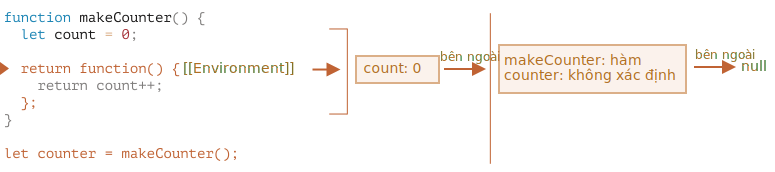

# Phạm vi biến, đóng kín

JavaScript là một ngôn ngữ rất hướng hàm. Nó cho chúng ta rất nhiều tự do. Một hàm có thể được tạo bất cứ lúc nào, được chuyển dưới dạng đối số cho một hàm khác và sau đó được gọi từ một vị trí mã hoàn toàn khác sau đó.

Chúng ta đã biết rằng một hàm có thể truy cập các biến bên ngoài nó (các biến "bên ngoài").

Nhưng điều gì sẽ xảy ra nếu các biến bên ngoài thay đổi kể từ khi một hàm được tạo? Hàm sẽ nhận giá trị mới hơn hay giá trị cũ?

Và điều gì sẽ xảy ra nếu một hàm được truyền dưới dạng tham số và được gọi từ một vị trí khác của mã, liệu nó có được truy cập vào các biến bên ngoài ở vị trí mới không?

Hãy mở rộng kiến thức của chúng ta để hiểu những tình huống này và những tình huống phức tạp hơn.

```smart header="Chúng ta sẽ nói về các biến `let/const` ở đây"
Trong JavaScript, có 3 cách để khai báo một biến: `let`, `const` (cách hiện đại) và `var` (phần còn lại của quá khứ).

- Trong bài viết này, chúng ta sẽ sử dụng các biến `let` trong các ví dụ.
- Các biến, được khai báo bằng `const`, hoạt động giống nhau, vì vậy bài viết này cũng nói về `const`.
- `var` cũ có một số điểm khác biệt đáng chú ý, chúng sẽ được đề cập trong bài viết <info:var>.
```

## Khói mã

Nếu một biến được khai báo bên trong khối mã `{...}`, thì nó chỉ hiển thị bên trong khối đó.

Ví dụ:

```js run
{
  // thực hiện một số công việc với các biến cục bộ không nên nhìn thấy bên ngoài

  let message = "Xin chào"; // chỉ hiển thị trong khối này

  alert(message); // Xin chào
}

alert(message); // Lỗi: tin nhắn không xác định
```

Chúng ta có thể sử dụng điều này để cô lập một đoạn mã thực hiện nhiệm vụ riêng của nó, với các biến chỉ thuộc về nó:

```js run
{
  // hiển thị tin nhắn
  let message = "Xin chào";
  alert(message);
}

{
  // hiển thị một tin nhắn khác
  let message = "Tạm biệt";
  alert(message);
}
```

````smart header="Sẽ có lỗi nếu không có khối"
Hãy lưu ý, nếu không có các khối riêng biệt sẽ xảy ra lỗi, nếu chúng ta sử dụng `let` với tên biến hiện có:

```js run
// hiển thị tin nhắn
let message = "Xin chào";
alert(message);

// hiển thị một tin nhắn khác
*!*
let message = "Tạm biệt"; // Lỗi: biến đã được khai báo
*/!*
alert(message);
```
````

Đối với `if`, `for`, `while`, v.v., các biến được khai báo trong `{...}` cũng chỉ hiển thị bên trong:

```js run
if (true) {
  let phrase = "Xin chào!";

  alert(phrase); // Xin chào!
}

alert(phrase); // Lỗi, không có biến như vậy!
```

Ở đây, sau khi `if` kết thúc, `alert` bên dưới sẽ không thấy `phrase`, do đó xảy ra lỗi.

Điều đó thật tuyệt, vì nó cho phép chúng ta tạo các biến cục bộ khối, dành riêng cho một nhánh `if`.

Điều tương tự cũng đúng với các vòng lặp `for` và `while`:

```js run
for (let i = 0; i < 3; i++) {
  // biến i chỉ hiển thị bên trong cái này cho
  alert(i); // 0, then 1, then 2
}

alert(i); // Lỗi, không có biến như vậy
```

Về mặt trực quan, `let i` nằm ngoài `{...}`. Nhưng cấu trúc `for` ở đây đặc biệt: biến, được khai báo bên trong nó, được coi là một phần của khối.

## Các hàm lồng nhau

Một hàm được gọi là "lồng nhau" khi nó được tạo bên trong một hàm khác.

Có thể dễ dàng làm điều này với JavaScript.

Chúng ta có thể sử dụng nó để sắp xếp mã của ta, như thế này:

```js
function sayHiBye(firstName, lastName) {

  // hàm lồng nhau của người trợ giúp để sử dụng bên dưới
  function getFullName() {
    return firstName + " " + lastName;
  }

  alert( "Xin chào, " + getFullName() );
  alert( "Tạm biệt, " + getFullName() );

}
```

Ở đây, hàm *lồng nhau* `getFullName()` được tạo ra để thuận tiện. Nó có thể truy cập các biến bên ngoài và do đó có thể trả về tên đầy đủ. Các hàm lồng nhau khá phổ biến trong JavaScript.

Điều thú vị hơn nhiều, một hàm lồng nhau có thể được trả về: dưới dạng thuộc tính của một đối tượng mới hoặc là kết quả của chính nó. Sau đó nó có thể được sử dụng ở một nơi khác. Bất kể ở đâu, nó vẫn có quyền truy cập vào các biến bên ngoài giống nhau.

Bên dưới, `makeCounter` tạo hàm "bộ đếm" trả về số tiếp theo trên mỗi lệnh gọi:

```js run
function makeCounter() {
  let count = 0;

  return function() {
    return count++;
  };
}

let counter = makeCounter();

alert( counter() ); // 0
alert( counter() ); // 1
alert( counter() ); // 2
```

Mặc dù đơn giản, các biến thể được sửa đổi một chút của mã đó có những ứng dụng thực tế, chẳng hạn như [trình tạo số ngẫu nhiên](https://vi.wikipedia.org/wiki/B%E1%BB%99_sinh_s%E1%BB%91_gi%E1%BA%A3_ng%E1%BA%ABu_nhi%C3%AAn) để tạo các giá trị ngẫu nhiên cho các bài kiểm tra tự động.

Cái này hoạt động ra sao? Nếu chúng ta tạo nhiều bộ đếm, chúng có độc lập không? Điều gì đang xảy ra với các biến ở đây?

Hiểu những điều như vậy là rất tốt cho kiến thức tổng thể về JavaScript và có lợi cho các tình huống phức tạp hơn. Vì vậy, chúng ta hãy đi sâu hơn một chút.

## Môi trường từ vựng

```warn header="Đây là những con rồng!"
Phần giải thích kỹ thuật chuyên sâu nằm ở phía trước.

Theo như tôi muốn tránh các chi tiết ngôn ngữ cấp thấp, mọi hiểu biết nếu không có chúng sẽ thiếu sót và không đầy đủ, vì vậy hãy sẵn sàng.
```

Để rõ ràng, giải thích được chia thành nhiều bước.

### Bước 1. Biến

Trong JavaScript, mọi chức năng đang chạy, khối mã `{...}` và toàn bộ tập lệnh đều có một đối tượng liên quan (ẩn) bên trong được gọi là *Môi trường từ vựng*.

Đối tượng Môi trường từ vựng bao gồm hai phần:

1. *Bản ghi Môi trường* -- một đối tượng lưu trữ tất cả các biến cục bộ làm thuộc tính của nó (và một số thông tin khác như giá trị của `this`).
2. Tham chiếu đến *Môi trường từ vựng bên ngoài*, môi trường được liên kết với mã bên ngoài.

**"Biến" chỉ là thuộc tính của đối tượng bên trong đặc biệt, `Bản ghi Môi trường`. "Nhận hoặc thay đổi một biến" có nghĩa là "lấy hoặc thay đổi một thuộc tính của đối tượng đó".**

Trong mã đơn giản không có hàm này, chỉ có một Môi trường từ vựng:


This is the so-called *global* Lexical Environment, associated with the whole script.

On the picture above, the rectangle means Environment Record (variable store) and the arrow means the outer reference. The global Lexical Environment has no outer reference, that's why the arrow points to `null`.

As the code starts executing and goes on, the Lexical Environment changes.

Here's a little bit longer code:


Rectangles on the right-hand side demonstrate how the global Lexical Environment changes during the execution:

1. When the script starts, the Lexical Environment is pre-populated with all declared variables.
    - Initially, they are in the "Uninitialized" state. That's a special internal state, it means that the engine knows about the variable, but it cannot be referenced until it has been declared with `let`. It's almost the same as if the variable didn't exist.
2. Then `let phrase` definition appears. There's no assignment yet, so its value is `undefined`. We can use the variable from this point forward.
3. `phrase` is assigned a value.
4. `phrase` changes the value.

Everything looks simple for now, right?

- A variable is a property of a special internal object, associated with the currently executing block/function/script.
- Working with variables is actually working with the properties of that object.

```smart header="Lexical Environment is a specification object"
"Lexical Environment" is a specification object: it only exists "theoretically" in the [language specification](https://tc39.es/ecma262/#sec-lexical-environments) to describe how things work. We can't get this object in our code and manipulate it directly.

JavaScript engines also may optimize it, discard variables that are unused to save memory and perform other internal tricks, as long as the visible behavior remains as described.
```

### Step 2. Function Declarations

A function is also a value, like a variable.

**The difference is that a Function Declaration is instantly fully initialized.**

When a Lexical Environment is created, a Function Declaration immediately becomes a ready-to-use function (unlike `let`, that is unusable till the declaration).

That's why we can use a function, declared as Function Declaration, even before the declaration itself.

For example, here's the initial state of the global Lexical Environment when we add a function:


Naturally, this behavior only applies to Function Declarations, not Function Expressions where we assign a function to a variable, such as `let say = function(name)...`.

### Step 3. Inner and outer Lexical Environment

When a function runs, at the beginning of the call, a new Lexical Environment is created automatically to store local variables and parameters of the call.

For instance, for `say("John")`, it looks like this (the execution is at the line, labelled with an arrow):

<!--
    ```js
    let phrase = "Hello";

    function say(name) {
     alert( `${phrase}, ${name}` );
    }

    say("John"); // Hello, John
    ```-->


During the function call we have two Lexical Environments: the inner one (for the function call) and the outer one (global):

- The inner Lexical Environment corresponds to the current execution of `say`. It has a single property: `name`, the function argument. We called `say("John")`, so the value of the `name` is `"John"`.
- The outer Lexical Environment is the global Lexical Environment. It has the `phrase` variable and the function itself.

The inner Lexical Environment has a reference to the `outer` one.

**When the code wants to access a variable -- the inner Lexical Environment is searched first, then the outer one, then the more outer one and so on until the global one.**

If a variable is not found anywhere, that's an error in strict mode (without `use strict`, an assignment to a non-existing variable creates a new global variable, for compatibility with old code).

In this example the search proceeds as follows:

- For the `name` variable, the `alert` inside `say` finds it immediately in the inner Lexical Environment.
- When it wants to access `phrase`, then there is no `phrase` locally, so it follows the reference to the outer Lexical Environment and finds it there.


### Step 4. Returning a function

Let's return to the `makeCounter` example.

```js
function makeCounter() {
  let count = 0;

  return function() {
    return count++;
  };
}

let counter = makeCounter();
```

At the beginning of each `makeCounter()` call, a new Lexical Environment object is created, to store variables for this `makeCounter` run.

So we have two nested Lexical Environments, just like in the example above:


What's different is that, during the execution of `makeCounter()`, a tiny nested function is created of only one line: `return count++`. We don't run it yet, only create.

All functions remember the Lexical Environment in which they were made. Technically, there's no magic here: all functions have the hidden property named `[[Environment]]`, that keeps the reference to the Lexical Environment where the function was created:



So, `counter.[[Environment]]` has the reference to `{count: 0}` Lexical Environment. That's how the function remembers where it was created, no matter where it's called. The `[[Environment]]` reference is set once and forever at function creation time.

Later, when `counter()` is called, a new Lexical Environment is created for the call, and its outer Lexical Environment reference is taken from `counter.[[Environment]]`:


Now when the code inside `counter()` looks for `count` variable, it first searches its own Lexical Environment (empty, as there are no local variables there), then the Lexical Environment of the outer `makeCounter()` call, where it finds and changes it.

**A variable is updated in the Lexical Environment where it lives.**

Here's the state after the execution:


If we call `counter()` multiple times, the `count` variable will be increased to `2`, `3` and so on, at the same place.

```smart header="Closure"
There is a general programming term "closure", that developers generally should know.

A [closure](https://en.wikipedia.org/wiki/Closure_(computer_programming)) is a function that remembers its outer variables and can access them. In some languages, that's not possible, or a function should be written in a special way to make it happen. But as explained above, in JavaScript, all functions are naturally closures (there is only one exception, to be covered in <info:new-function>).

That is: they automatically remember where they were created using a hidden `[[Environment]]` property, and then their code can access outer variables.

When on an interview, a frontend developer gets a question about "what's a closure?", a valid answer would be a definition of the closure and an explanation that all functions in JavaScript are closures, and maybe a few more words about technical details: the `[[Environment]]` property and how Lexical Environments work.
```

## Garbage collection

Usually, a Lexical Environment is removed from memory with all the variables after the function call finishes. That's because there are no references to it. As any JavaScript object, it's only kept in memory while it's reachable.

However, if there's a nested function that is still reachable after the end of a function, then it has `[[Environment]]` property that references the lexical environment.

In that case the Lexical Environment is still reachable even after the completion of the function, so it stays alive.

For example:

```js
function f() {
  let value = 123;

  return function() {
    alert(value);
  }
}

let g = f(); // g.[[Environment]] stores a reference to the Lexical Environment
// of the corresponding f() call
```

Please note that if `f()` is called many times, and resulting functions are saved, then all corresponding Lexical Environment objects will also be retained in memory. In the code below, all 3 of them:

```js
function f() {
  let value = Math.random();

  return function() { alert(value); };
}

// 3 functions in array, every one of them links to Lexical Environment
// from the corresponding f() run
let arr = [f(), f(), f()];
```

A Lexical Environment object dies when it becomes unreachable (just like any other object). In other words, it exists only while there's at least one nested function referencing it.

In the code below, after the nested function is removed, its enclosing Lexical Environment (and hence the `value`) is cleaned from memory:

```js
function f() {
  let value = 123;

  return function() {
    alert(value);
  }
}

let g = f(); // while g function exists, the value stays in memory

g = null; // ...and now the memory is cleaned up
```

### Real-life optimizations

As we've seen, in theory while a function is alive, all outer variables are also retained.

But in practice, JavaScript engines try to optimize that. They analyze variable usage and if it's obvious from the code that an outer variable is not used -- it is removed.

**An important side effect in V8 (Chrome, Edge, Opera) is that such variable will become unavailable in debugging.**

Try running the example below in Chrome with the Developer Tools open.

When it pauses, in the console type `alert(value)`.

```js run
function f() {
  let value = Math.random();

  function g() {
    debugger; // in console: type alert(value); No such variable!
  }

  return g;
}

let g = f();
g();
```

As you could see -- there is no such variable! In theory, it should be accessible, but the engine optimized it out.

That may lead to funny (if not such time-consuming) debugging issues. One of them -- we can see a same-named outer variable instead of the expected one:

```js run global
let value = "Surprise!";

function f() {
  let value = "the closest value";

  function g() {
    debugger; // in console: type alert(value); Surprise!
  }

  return g;
}

let g = f();
g();
```

This feature of V8 is good to know. If you are debugging with Chrome/Edge/Opera, sooner or later you will meet it.

That is not a bug in the debugger, but rather a special feature of V8. Perhaps it will be changed sometime. You can always check for it by running the examples on this page.
