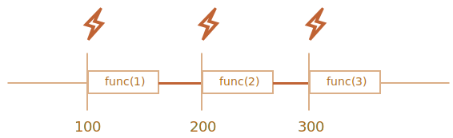

# Lên lịch: setTimeout và setInterval

Chúng ta có thể quyết định thực hiện một hàm không phải ngay bây giờ mà vào một thời điểm nhất định sau đó. Đó gọi là "lên lịch cuộc gọi".

Có hai phương pháp cho nó:

- `setTimeout` cho phép chúng ta chạy một hàm một lần sau khoảng thời gian.
- `setInterval` cho phép chúng ta chạy lặp đi lặp lại một hàm, bắt đầu sau khoảng thời gian, sau đó lặp lại liên tục ở khoảng thời gian đó.

Các phương pháp này không phải là một phần của thông số kỹ thuật JavaScript. Nhưng hầu hết các môi trường đều có bộ lên lịch nội bộ và cung cấp các phương thức này. Đặc biệt, chúng được hỗ trợ trên tất cả các trình duyệt và Node.js.

## setTimeout

Cú pháp:

```js
let timerId = setTimeout(func|code, [delay], [arg1], [arg2], ...)
```

Tham số:

`func|code`
: Hàm hoặc một chuỗi mã để thực thi.
Thông thường, đó là một hàm. Vì lý do lịch sử, một chuỗi mã có thể được chuyển, nhưng điều đó không được khuyến khích.

`delay`
: Độ trễ trước khi chạy, tính bằng mili giây (1000 ms = 1 giây), theo mặc định là 0.

`arg1`, `arg2`...
: Đối số cho hàm (không được hỗ trợ trong IE9-)

Chẳng hạn, mã này gọi `sayHi()` sau một giây:

```js run
function sayHi() {
  alert('Hello');
}

*!*
setTimeout(sayHi, 1000);
*/!*
```

Với đối số:

```js run
function sayHi(phrase, who) {
  alert( phrase + ', ' + who );
}

*!*
setTimeout(sayHi, 1000, "Xin chào", "John"); // Xin chào, John
*/!*
```

Nếu đối số đầu tiên là một chuỗi, thì JavaScript sẽ tạo một hàm từ nó.

Vì vậy, cái này cũng sẽ hoạt động:

```js run no-beautify
setTimeout("alert('Xin chào')", 1000);
```

Nhưng việc sử dụng các chuỗi không được khuyến nghị, hãy sử dụng các arrow function thay vì chúng, như sau:

```js run no-beautify
setTimeout(() => alert('Hello'), 1000);
```

````smart header="Vượt qua một hàm, nhưng không chạy nó"
Các nhà phát triển mới làm quen đôi khi mắc lỗi khi thêm dấu ngoặc `()` sau hàm:

```js
// sai!
setTimeout(sayHi(), 1000);
```
Điều đó không hoạt động, bởi vì `setTimeout` mong đợi một tham chiếu đến một hàm. Và ở đây `sayHi()` chạy hàm này và *kết quả thực thi của nó* được chuyển đến `setTimeout`. Trong trường hợp của chúng ta, kết quả của `sayHi()` là `undefined` (hàm không trả về gì cả), vì vậy không có gì được lên lịch.
````

### Hủy với ClearTimeout

Một cuộc gọi đến `setTimeout` trả về một "số nhận dạng hẹn giờ" `timerId` mà chúng ta có thể sử dụng để hủy thực thi.

Cú pháp hủy:

```js
let timerId = setTimeout(...);
clearTimeout(timerId);
```

Trong mã bên dưới, chúng ta lên lịch cho hàm và sau đó hủy bỏ hàm đó (đã thay đổi ý định). Kết quả là, không có gì xảy ra:

```js run no-beautify
let timerId = setTimeout(() => alert("không bao giờ xảy ra"), 1000);
alert(timerId); // mã định danh hẹn giờ

clearTimeout(timerId);
alert(timerId); // cùng một mã định danh (không trở thành null sau khi hủy)
```

Như chúng ta có thể thấy từ đầu ra `alert`, trong trình duyệt, mã định danh hẹn giờ là một số. Trong các môi trường khác, đây có thể là một cái gì đó khác. Chẳng hạn, Node.js trả về một đối tượng hẹn giờ với các phương thức bổ sung.

Một lần nữa, không có thông số kỹ thuật chung cho các phương pháp này, vì vậy điều đó không sao cả.

Đối với trình duyệt, bộ hẹn giờ được mô tả trong phần [bộ hẹn giờ](https://www.w3.org/TR/html5/webappapis.html#timers) của chuẩn HTML5.

## setInterval

Phương thức `setInterval` có cùng cú pháp với `setTimeout`:

```js
let timerId = setInterval(func|code, [delay], [arg1], [arg2], ...)
```

Tất cả các đối số có cùng một ý nghĩa. Nhưng không giống như `setTimeout`, hàm này không chỉ chạy một lần mà thường xuyên sau một khoảng thời gian nhất định.

Để dừng các cuộc gọi tiếp theo, chúng ta nên gọi `clearInterval(timerId)`.

Ví dụ sau sẽ hiển thị thông báo cứ sau 2 giây. Sau 5 giây, đầu ra bị dừng:

```js run
// lặp lại với khoảng thời gian 2 giây
let timerId = setInterval(() => alert('tick'), 2000);

// sau 5 giây dừng lại
setTimeout(() => { clearInterval(timerId); alert('stop'); }, 5000);
```

```smart header="Thời gian tiếp tục trong khi `alert` được hiển thị"
Trong hầu hết các trình duyệt, kể cả Chrome và Firefox, bộ đếm thời gian bên trong tiếp tục "tích tắc" trong khi hiển thị `alert/confirm/prompt`.

Vì vậy, nếu bạn chạy mã ở trên và không đóng cửa sổ `alert` trong một thời gian, thì `cảnh báo` tiếp theo sẽ được hiển thị ngay lập tức khi bạn thực hiện. Khoảng thời gian thực tế giữa các cảnh báo sẽ ngắn hơn 2 giây.
```

## setTimeout lồng nhau

Có hai cách để chạy một cái gì đó thường xuyên.

Một là `setInterval`. Cái còn lại là `setTimeout` lồng nhau, như thế này:

```js
/** thay vì:
let timerId = setInterval(() => alert('tick'), 2000);
*/

let timerId = setTimeout(function tick() {
  alert('tick');
*!*
  timerId = setTimeout(tick, 2000); // (*)
*/!*
}, 2000);
```

`setTimeout` ở trên lên lịch cuộc gọi tiếp theo ngay khi kết thúc cuộc gọi hiện tại `(*)`.

`setTimeout` lồng nhau là một phương thức linh hoạt hơn `setInterval`. Bằng cách này, cuộc gọi tiếp theo có thể được lên lịch khác nhau, tùy thuộc vào kết quả của cuộc gọi hiện tại.

Ví dụ chúng ta cần viết một dịch vụ cứ 5 giây lại gửi một yêu cầu đến server yêu cầu dữ liệu, nhưng trong trường hợp server bị quá tải thì nên tăng khoảng thời gian lên 10, 20, 40 giây...

Đây là mã giả:
```js
let delay = 5000;

let timerId = setTimeout(yêu cầu hàm() {
  ...gửi yêu cầu...

  if (yêu cầu không thành công do quá tải máy chủ) {
    // tăng khoảng thời gian cho lần chạy tiếp theo
    delay *= 2;
  }

  timerId = setTimeout(yêu cầu, delay);

}, delay);
```


Và nếu các hàm mà chúng ta đang lập lịch sử dụng nhiều CPU, thì chúng ta có thể đo thời gian thực hiện và lập kế hoạch cho cuộc gọi tiếp theo sớm hay muộn.

**`setTimeout` lồng nhau cho phép đặt độ trễ giữa các lần thực thi chính xác hơn `setInterval`.**

Hãy so sánh hai đoạn mã. Cái đầu tiên sử dụng `setInterval`:

```js
let i = 1;
setInterval(hàm() {
  func(i++);
}, 100);
```

Cái thứ hai sử dụng `setTimeout` lồng nhau:

```js
let i = 1;
setTimeout(function run() {
  func(i++);
  setTimeout(run, 100);
}, 100);
```

Đối với `setInterval`, bộ lên lịch nội bộ sẽ chạy `func(i++)` cứ sau 100 mili giây:



Bạn có để ý không?

**Độ trễ thực sự giữa các lệnh gọi `func` cho `setInterval` nhỏ hơn trong mã!**

Điều đó là bình thường, bởi vì thời gian thực thi của `func` "tiêu tốn" một phần của khoảng thời gian.

Có thể quá trình thực thi của `func` kéo dài hơn chúng ta mong đợi và mất hơn 100 mili giây.

Trong trường hợp này, engine đợi `func` hoàn thành, sau đó kiểm tra bộ lên lịch và nếu hết thời gian, hãy chạy lại *ngay lập tức*.

Trong trường hợp cạnh, nếu hàm luôn thực thi lâu hơn `delay` ms, thì các cuộc gọi sẽ diễn ra mà không có khoảng dừng nào cả.

Và đây là hình ảnh cho `setTimeout` lồng nhau:


**`setTimeout` lồng nhau đảm bảo độ trễ cố định (ở đây là 100 mili giây).**

Đó là bởi vì một cuộc gọi mới được lên kế hoạch vào cuối cuộc gọi trước đó.

````smart header="Thu gom rác và gọi lại setInterval/setTimeout"
Khi một chức năng được chuyển vào `setInterval/setTimeout`, một tham chiếu nội bộ được tạo cho nó và được lưu trong bộ lên lịch. Nó ngăn hàm bị thu gom rác, ngay cả khi không có tham chiếu nào khác đến nó.

```js
// hàm vẫn còn trong bộ nhớ cho đến khi bộ lên lịch gọi nó
setTimeout(function() {...}, 100);
```

Đối với `setInterval`, hàm này sẽ nằm trong bộ nhớ cho đến khi `clearInterval` được gọi.

Có một tác dụng phụ. Một hàm tham chiếu đến lexical environment bên ngoài, vì vậy, trong khi nó hoạt động, các biến bên ngoài cũng hoạt động. Chúng có thể chiếm nhiều bộ nhớ hơn chính hàm đó. Vì vậy, khi chúng ta không cần đến hàm đã lên lịch nữa, tốt hơn hết là hủy bỏ nó, ngay cả khi nó rất nhỏ.
````

## Zero delay setTimeout

There's a special use case: `setTimeout(func, 0)`, or just `setTimeout(func)`.

This schedules the execution of `func` as soon as possible. But the scheduler will invoke it only after the currently executing script is complete.

So the function is scheduled to run "right after" the current script.

For instance, this outputs "Hello", then immediately "World":

```js run
setTimeout(() => alert("World"));

alert("Hello");
```

The first line "puts the call into calendar after 0ms". But the scheduler will only "check the calendar" after the current script is complete, so `"Hello"` is first, and `"World"` -- after it.

There are also advanced browser-related use cases of zero-delay timeout, that we'll discuss in the chapter <info:event-loop>.

````smart header="Zero delay is in fact not zero (in a browser)"
In the browser, there's a limitation of how often nested timers can run. The [HTML5 standard](https://html.spec.whatwg.org/multipage/timers-and-user-prompts.html#timers) says: "after five nested timers, the interval is forced to be at least 4 milliseconds.".

Let's demonstrate what it means with the example below. The `setTimeout` call in it re-schedules itself with zero delay. Each call remembers the real time from the previous one in the `times` array. What do the real delays look like? Let's see:

```js run
let start = Date.now();
let times = [];

setTimeout(function run() {
  times.push(Date.now() - start); // remember delay from the previous call

  if (start + 100 < Date.now()) alert(times); // show the delays after 100ms
  else setTimeout(run); // else re-schedule
});

// an example of the output:
// 1,1,1,1,9,15,20,24,30,35,40,45,50,55,59,64,70,75,80,85,90,95,100
```

First timers run immediately (just as written in the spec), and then we see `9, 15, 20, 24...`. The 4+ ms obligatory delay between invocations comes into play.

The similar thing happens if we use `setInterval` instead of `setTimeout`: `setInterval(f)` runs `f` few times with zero-delay, and afterwards with 4+ ms delay.

That limitation comes from ancient times and many scripts rely on it, so it exists for historical reasons.

For server-side JavaScript, that limitation does not exist, and there exist other ways to schedule an immediate asynchronous job, like [setImmediate](https://nodejs.org/api/timers.html#timers_setimmediate_callback_args) for Node.js. So this note is browser-specific.
````

## Summary

- Methods `setTimeout(func, delay, ...args)` and `setInterval(func, delay, ...args)` allow us to run the `func` once/regularly after `delay` milliseconds.
- To cancel the execution, we should call `clearTimeout/clearInterval` with the value returned by `setTimeout/setInterval`.
- Nested `setTimeout` calls are a more flexible alternative to `setInterval`, allowing us to set the time *between* executions more precisely.
- Zero delay scheduling with `setTimeout(func, 0)` (the same as `setTimeout(func)`) is used to schedule the call "as soon as possible, but after the current script is complete".
- The browser limits the minimal delay for five or more nested calls of `setTimeout` or for `setInterval` (after 5th call) to 4ms. That's for historical reasons.

Please note that all scheduling methods do not *guarantee* the exact delay.

For example, the in-browser timer may slow down for a lot of reasons:
- The CPU is overloaded.
- The browser tab is in the background mode.
- The laptop is on battery.

All that may increase the minimal timer resolution (the minimal delay) to 300ms or even 1000ms depending on the browser and OS-level performance settings.
