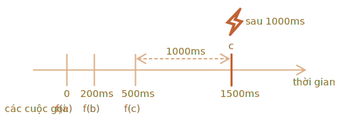

importance: 5

---

# Decorator gỡ lỗi

Kết quả của decorator `debounce(f, ms)` là một wrapper tạm dừng các lệnh gọi đến `f` cho đến khi có `ms` mili giây không hoạt động (không có lệnh gọi, "thời gian hồi"), sau đó gọi `f` một lần với các đối số mới nhất .

Nói cách khác, `debounce` giống như một thư ký chấp nhận "các cuộc điện thoại" và đợi cho đến khi có `ms` mili giây để im lặng. Và chỉ khi đó nó mới chuyển thông tin cuộc gọi mới nhất cho "ông chủ" (gọi `f` thực tế).

Chẳng hạn, chúng ta có một hàm `f` và thay thế nó bằng `f = debounce(f, 1000)`.

Sau đó, nếu hàm được gói được gọi ở 0ms, 200ms và 500ms, sau đó không có lệnh gọi nào, thì `f` thực tế sẽ chỉ được gọi một lần, ở 1500ms. Đó là: sau khoảng thời gian hồi 1000ms kể từ lần gọi cuối cùng.



...Và nó sẽ nhận được các đối số của cuộc gọi cuối cùng, các cuộc gọi khác sẽ bị bỏ qua.

Đây là mã cho nó (sử dụng decorator gỡ lỗi từ [thư viện Lodash](https://lodash.com/docs/4.17.15#debounce)):

```js
let f = _.debounce(alert, 1000);

f("a");
setTimeout( () => f("b"), 200);
setTimeout( () => f("c"), 500);
// hàm gỡ lỗi đợi 1000 mili giây sau cuộc gọi cuối cùng rồi chạy: alert("c")
```

Bây giờ là một ví dụ thực tế. Giả sử, người dùng nhập nội dung nào đó và chúng ta muốn gửi yêu cầu đến máy chủ khi quá trình nhập kết thúc.

Không có lý do nào để gửi yêu cầu cho mọi ký tự được nhập. Thay vào đó, chúng ta muốn đợi và sau đó xử lý toàn bộ kết quả.

Trong trình duyệt web, chúng ta có thể thiết lập trình xử lý sự kiện -- một hàm được gọi trên mọi thay đổi của vùng nhập vào. Thông thường, một trình xử lý sự kiện được gọi rất thường xuyên cho mỗi phím được nhập. Nhưng nếu chúng ta `debounce` nó sau 1000 mili giây, thì nó sẽ chỉ được gọi một lần, sau 1000 mili giây sau lần nhập cuối cùng.

```online

Trong ví dụ trực tiếp này, trình xử lý đặt kết quả vào hộp bên dưới, hãy thử:

[iframe border=1 src="debounce" height=200]

Nhìn thấy? Đầu vào thứ hai gọi hàm gỡ lỗi, vì vậy nội dung của nó được xử lý sau 1000 mili giây kể từ đầu vào cuối cùng.
```

Vì vậy, `debounce` là một cách tuyệt vời để xử lý một chuỗi sự kiện: có thể là chuỗi các lần nhấn phím, di chuyển chuột hoặc thứ gì đó khác.

Nó đợi thời gian nhất định sau cuộc gọi cuối cùng, rồi chạy hàm của nó, có thể xử lý kết quả.

Nhiệm vụ là triển khai decorator `debounce`.

Gợi ý: đó chỉ là một vài dòng nếu bạn nghĩ về nó :)
