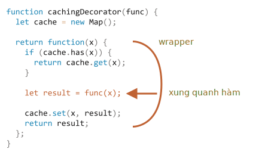

# Decorator và chuyển tiếp, gọi/áp dụng

JavaScript mang đến sự linh hoạt đặc biệt khi xử lý các hàm. Chúng có thể được truyền đi khắp nơi, được sử dụng làm đối tượng và bây giờ chúng ta sẽ xem cách *chuyển tiếp* lệnh gọi giữa chúng và *trang trí* chúng.

## Bộ nhớ đệm trong suốt

Giả sử chúng ta có một hàm `slow(x)` nặng về CPU, nhưng kết quả của nó ổn định. Nói cách khác, với cùng một `x`, nó luôn trả về cùng một kết quả.

Nếu hàm được gọi thường xuyên, chúng ta có thể muốn lưu trữ (ghi nhớ) các kết quả để tránh tốn thêm thời gian cho việc tính toán lại.

Nhưng thay vì thêm hàm đó vào `slow()`, chúng ta sẽ tạo một hàm wrapper, có thêm bộ nhớ đệm. Như chúng ta sẽ thấy, có rất nhiều lợi ích khi làm như vậy.

Đây là mã và giải thích như sau:

```js run
function slow(x) {
  // có thể có một công việc sử dụng nhiều CPU ở đây
  alert(`Gọi với ${x}`);
  return x;
}

function cachingDecorator(func) {
  let cache = new Map();

  return function(x) {
    if (cache.has(x)) {    // nếu có khóa như vậy trong bộ đệm
      return cache.get(x); // đọc kết quả từ nó
    }

    let result = func(x);  // nếu không thì gọi func

    cache.set(x, result);  // và cache (ghi nhớ) kết quả
    return result;
  };
}

slow = cachingDecorator(slow);

alert( slow(1) ); // slow(1) được lưu trữ và kết quả trả về
alert( "Lại: " + slow(1) ); // kết quả slow(1) được trả về từ bộ nhớ đệm

alert( slow(2) ); // slow(2) được lưu trữ và kết quả trả về
alert( "Lại: " + slow(2) ); // kết quả slow(2) được trả về từ bộ đệm
```

Trong đoạn mã trên `cachingDecorator` là một *decorator*: một hàm đặc biệt nhận một hàm khác và thay đổi hành vi của nó.

Ý tưởng là chúng ta có thể gọi `cachingDecorator` cho bất kỳ hàm nào và nó sẽ trả về wrapper bộ nhớ đệm. Điều đó thật tuyệt, bởi vì chúng ta có thể có nhiều hàm có thể sử dụng một tính năng như vậy và tất cả những gì chúng ta cần làm là áp dụng `cachingDecorator` cho chúng.

Bằng cách tách bộ nhớ đệm khỏi mã hàm chính, chúng ta cũng giữ cho mã chính đơn giản hơn.

Kết quả của `cachingDecorator(func)` là một "wrapper": `function(x)` "bao bọc" cuộc gọi của `func(x)` vào logic bộ nhớ đệm:



Từ một mã bên ngoài, hàm `slow` được bao bọc vẫn hoạt động như vậy. Nó chỉ có một khía cạnh lưu trữ được thêm vào hành vi của nó

Tóm lại, có một số lợi ích khi sử dụng `cachingDecorator` riêng biệt thay vì thay đổi mã của chính `slow`:

- `cachingDecorator` có thể tái sử dụng. Chúng ta có thể áp dụng nó cho một hàm khác.
- Logic bộ nhớ đệm là riêng biệt, nó không làm tăng độ phức tạp của bản thân `slow` (nếu có).
- Chúng ta có thể kết hợp nhiều decorator nếu cần (các decorator khác sẽ làm theo).

## Sử dụng "func.call" cho ngữ cảnh

Decorator bộ nhớ đệm được đề cập ở trên không phù hợp để hoạt động với các phương thức đối tượng.

Chẳng hạn, trong mã bên dưới `worker.slow()` ngừng hoạt động sau khi trang trí:

```js run
// chúng ta sẽ tạo bộ nhớ đệm worker.slow
let worker = {
  someMethod() {
    return 1;
  },

  slow(x) {
    // nhiệm vụ nặng về CPU đáng sợ ở đây
    alert("Gọi với " + x);
    return x * this.someMethod(); // (*)
  }
};

// mã giống như trước đây
function cachingDecorator(func) {
  let cache = new Map();
  return function(x) {
    if (cache.has(x)) {
      return cache.get(x);
    }
*!*
    let result = func(x); // (**)
*/!*
    cache.set(x, result);
    return result;
  };
}

alert( worker.slow(1) ); // phương thức ban đầu hoạt động

worker.slow = cachingDecorator(worker.slow); // bây giờ làm cho nó lưu vào bộ nhớ đệm

*!*
alert( worker.slow(2) ); // Rất tiếc! Error: Cannot read property 'someMethod' of undefined
*/!*
```

Lỗi xảy ra trong dòng `(*)` cố truy cập `this.someMethod` nhưng không thành công. Bạn có thể thấy tại sao không?

Lý do là wrapper gọi hàm ban đầu là `func(x)` trong dòng `(**)`. Và, khi được gọi như vậy, hàm nhận được `this = undefined`.

Chúng ta sẽ quan sát thấy một triệu chứng tương tự nếu chúng ta cố chạy:

```js
let func = worker.slow;
func(2);
```

Vì vậy, wrapper chuyển lệnh gọi đến phương thức ban đầu, nhưng không có ngữ cảnh `this`. Do đó lỗi.

Hãy sửa nó.

Có một phương thức hàm tích hợp đặc biệt [func.call(context, ...args)](mdn:js/Function/call) cho phép gọi một hàm thiết lập rõ ràng `this`.

Cú pháp là:

```js
func.call(context, arg1, arg2, ...)
```

Nó chạy `func` cung cấp đối số đầu tiên là `this` và đối số tiếp theo là các đối số.

Nói một cách đơn giản, hai cuộc gọi này thực hiện gần như giống nhau:
```js
func(1, 2, 3);
func.call(obj, 1, 2, 3)
```

Cả hai đều gọi `func` với các đối số `1`, `2` và `3`. Điểm khác biệt duy nhất là `func.call` cũng đặt `this` thành `obj`.

Ví dụ: trong mã bên dưới, chúng ta gọi `sayHi` trong ngữ cảnh của các đối tượng khác nhau: `sayHi.call(user)` chạy `sayHi` cung cấp `this=user` và dòng tiếp theo đặt `this=admin`:

```js run
function sayHi() {
  alert(this.name);
}

let user = { name: "John" };
let admin = { name: "Admin" };

// sử dụng lệnh gọi để chuyển các đối tượng khác nhau dưới dạng "this"
sayHi.call( user ); // John
sayHi.call( admin ); // Admin
```

Và ở đây chúng ta sử dụng `call` để gọi `say` với ngữ cảnh và cụm từ đã cho:


```js run
function say(phrase) {
  alert(this.name + ': ' + phrase);
}

let user = { name: "John" };

// người dùng trở thành this và "Xin chào" trở thành đối số đầu tiên
say.call( user, "Xin chào" ); // John: Xin chào
```

Trong trường hợp của chúng ta, chúng ta có thể sử dụng `call` trong wrapper để chuyển ngữ cảnh cho hàm ban đầu:

```js run
let worker = {
  someMethod() {
    return 1;
  },

  slow(x) {
    alert("Called with " + x);
    return x * this.someMethod(); // (*)
  }
};

function cachingDecorator(func) {
  let cache = new Map();
  return function(x) {
    if (cache.has(x)) {
      return cache.get(x);
    }
*!*
    let result = func.call(this, x); // "this" bây giờ được thông qua một cách chính xác
*/!*
    cache.set(x, result);
    return result;
  };
}

worker.slow = cachingDecorator(worker.slow); // bây giờ làm cho nó lưu vào bộ nhớ đệm

alert( worker.slow(2) ); // hoạt động
alert( worker.slow(2) ); // hoạt động, không gọi bản gốc (được lưu trong bộ nhớ cache)
```

Bây giờ mọi thứ đều ổn.

Để làm cho mọi thứ rõ ràng, chúng ta hãy tìm hiểu sâu hơn về cách thức `this` được truyền lại:

1. Sau phần trang trí `worker.slow` bây giờ là wrapper `function (x) { ... }`.
2. Vì vậy, khi `worker.slow(2)` được chạy, wrapper sẽ lấy `2` làm đối số và `this=worker` (nó là đối tượng trước dấu chấm).
3. Bên trong wrapper, giả sử kết quả chưa được lưu vào bộ nhớ cache, `func.call(this, x)` chuyển `this` (`=worker`) hiện tại và đối số hiện tại (`=2`) sang phương thức ban đầu.

## Đi nhiều đối số

Bây giờ, hãy làm cho `cachingDecorator` trở nên phổ biến hơn nữa. Cho đến bây giờ nó chỉ hoạt động với các hàm một đối số.

Bây giờ làm cách nào để lưu trữ phương thức `worker.slow` đa đối số?

```js
let worker = {
  slow(min, max) {
    return min + max; // quái vật huỷ diệt CPU đáng sợ được giả định :)
  }
};

// nên nhớ các cuộc gọi cùng đối số
worker.slow = cachingDecorator(worker.slow);
```

Trước đây, đối với một đối số `x`, chúng ta chỉ có thể `cache.set(x, result)` để lưu kết quả và `cache.get(x)` để truy xuất nó. Nhưng bây giờ chúng ta cần ghi nhớ kết quả cho *tổ hợp các đối số* `(min, max`. `Map` gốc chỉ lấy một giá trị làm khóa.

Có nhiều giải pháp khả thi:

1. Triển khai cấu trúc dữ liệu giống như map mới (hoặc sử dụng bên thứ ba) linh hoạt hơn và cho phép nhiều khóa.
2. Sử dụng các map lồng nhau: `cache.set(min)` sẽ là một `Map` lưu trữ cặp `(max, result)`. Vì vậy, chúng ta có thể nhận được `result` là `cache.get(min).get(max)`.
3. Nối hai giá trị thành một. Trong trường hợp cụ thể của chúng ta, chúng ta chỉ có thể sử dụng một chuỗi `"min,max"` làm khóa `Map`. Để linh hoạt, chúng ta có thể cho phép cung cấp *hàm băm* cho decorator, biết cách tạo một giá trị từ nhiều giá trị.

Đối với nhiều ứng dụng thực tế, biến thể thứ 3 là đủ tốt, vì vậy chúng ta sẽ sử dụng nó.

Ngoài ra, chúng ta không chỉ cần chuyển `x` mà tất cả các đối số trong `func.call`. Hãy nhớ lại rằng trong `function()` chúng ta có thể nhận được một array giả các đối số của nó là `arguments`, vì vậy `func.call(this, x)` nên được thay thế bằng `func.call(this, ... lập luận)`.

Đây là một `cachingDecorator` mạnh mẽ hơn:

```js run
let worker = {
  slow(min, max) {
    alert(`Gọi với ${min},${max}`);
    return min + max;
  }
};

function cachingDecorator(func, hash) {
  let cache = new Map();
  return function() {
*!*
    let key = hash(arguments); // (*)
*/!*
    if (cache.has(key)) {
      return cache.get(key);
    }

*!*
    let result = func.call(this, ...arguments); // (**)
*/!*

    cache.set(key, result);
    return result;
  };
}

function hash(args) {
  return args[0] + ',' + args[1];
}

worker.slow = cachingDecorator(worker.slow, hash);

alert( worker.slow(3, 5) ); // hoạt động
alert( "Lại " + worker.slow(3, 5) ); // giống nhau (được lưu trong bộ nhớ cache)
```

Bây giờ nó hoạt động với bất kỳ số lượng đối số nào (mặc dù hàm băm cũng cần được điều chỉnh để cho phép bất kỳ số lượng đối số nào. Một cách thú vị để xử lý vấn đề này sẽ được trình bày bên dưới).

Có hai thay đổi:

- Trong dòng `(*)`, nó gọi `hash` để tạo một khóa duy nhất từ `arguments`. Ở đây, chúng ta sử dụng một hàm "nối" đơn giản để biến đối số `(3, 5)` thành khóa `"3,5"`. Các trường hợp phức tạp hơn có thể yêu cầu các hàm băm khác.
- Sau đó, `(**)` sử dụng `func.call(this, ...arguments)` để chuyển cả ngữ cảnh và tất cả các đối số mà wrapper nhận được (không chỉ đối số đầu tiên) cho hàm ban đầu.

## func.apply

Thay vì `func.call(this, ...arguments)` chúng ta có thể sử dụng `func.apply(this, arguments)`.

Cú pháp của phương thức tích hợp [func.apply](mdn:js/Function/apply) là:

```js
func.apply(context, args)
```

Nó chạy cài đặt `func` `this=context` và sử dụng một đối tượng dạng array `args` làm danh sách các đối số.

Sự khác biệt duy nhất về cú pháp giữa `call` và `apply` là `call` cần một danh sách các đối số, trong khi `apply` mang theo một đối tượng dạng array.

Vì vậy, hai cuộc gọi này gần như tương đương:

```js
func.call(context, ...args); // chuyển một array dưới dạng danh sách với cú pháp trải rộng
func.apply(context, args);   // giống như sử dụng cuộc gọi
```

Chỉ có một sự khác biệt rất nhỏ:

- Cú pháp trải rộng `...` cho phép chuyển *iterable* `args` dưới dạng danh sách tới `call`.
- `apply` chỉ chấp nhận *dạng array* `args`.

Vì vậy, nơi chúng ta mong đợi một lần lặp, `call` hoạt động và nơi chúng ta mong đợi một array giống như `apply` hoạt động.

Và đối với các đối tượng vừa có thể lặp lại vừa có dạng array, giống như một array thực, chúng ta có thể sử dụng bất kỳ đối tượng nào trong số chúng, nhưng `apply` có thể sẽ nhanh hơn, bởi vì hầu hết các JavaScript engine bên trong tối ưu hóa nó tốt hơn.

Việc chuyển tất cả các đối số cùng với ngữ cảnh sang một hàm khác được gọi là *chuyển tiếp cuộc gọi*.

Đây là hình thức đơn giản nhất của nó:

```js
let wrapper = function() {
  return func.apply(this, arguments);
};
```

Khi một mã bên ngoài gọi `wrapper` như vậy, nó không thể phân biệt được với lệnh gọi của hàm ban đầu `func`.

## Mượn một phương thức [#method-borrowing]

Bây giờ, hãy thực hiện thêm một cải tiến nhỏ nữa trong hàm băm:

```js
function hash(args) {
  return args[0] + ',' + args[1];
}
```

Hiện tại, nó chỉ hoạt động trên hai đối số. Sẽ tốt hơn nếu nó có thể dán bất kỳ số lượng `args` nào.

Giải pháp tự nhiên sẽ là sử dụng phương thức [arr.join](mdn:js/Array/join):

```js
function hash(args) {
  return args.join();
}
```

...Thật không may, điều đó sẽ không làm việc. Bởi vì chúng ta đang gọi `băm(đối số)` và đối tượng `đối số` vừa có thể lặp lại vừa có dạng array, nhưng không phải là một array thực.

Vì vậy, việc gọi `join` trên đó sẽ thất bại, như chúng ta có thể thấy bên dưới:

```js run
function hash() {
*!*
  alert( arguments.join() ); // Error: arguments.join is not a function
*/!*
}

hash(1, 2);
```

Tuy nhiên, vẫn có một cách dễ dàng để sử dụng phép nối array:

```js run
function hash() {
*!*
  alert( [].join.call(arguments) ); // 1,2
*/!*
}

hash(1, 2);
```

Thủ thuật được gọi là *mượn phương thức*.

Chúng ta lấy (mượn) một phương thức nối từ một array thông thường (`[].join`) và sử dụng `[].join.call` để chạy nó trong ngữ cảnh của `arguments`.

Tại sao nó lại hoạt động?

Đó là vì thuật toán bên trong của phương thức gốc `arr.join(glue)` rất đơn giản.

Lấy từ thông số kỹ thuật gần như "nguyên trạng":

1. Đặt `glue` là đối số đầu tiên hoặc nếu không có đối số thì dấu phẩy `","`.
2. Đặt `result` là một chuỗi rỗng.
3. Nối `this[0]` vào `kết quả`.
4. Nối `glue` và `this[1]`.
5. Nối `glue` và `this[2]`.
6. ...Làm như vậy cho đến khi các mục `this.length` được dán.
7. Trả về `result`.

Vì vậy, về mặt kỹ thuật, nó cần `this` và nối `this[0]`, `this[1]` ...v.v với nhau. Nó được cố ý viết theo cách cho phép bất kỳ `this` nào dạng array (không phải ngẫu nhiên, nhiều phương thức tuân theo cách làm này). Đó là lý do tại sao nó cũng hoạt động với `this=arguments`.

## Decorator và thuộc tính hàm

Nói chung là an toàn khi thay thế một hàm hoặc một phương thức bằng một hàm được trang trí, ngoại trừ một điều nhỏ. Nếu hàm ban đầu có các thuộc tính trên đó, chẳng hạn như `func.calledCount` hoặc bất cứ thứ gì, thì hàm được trang trí sẽ không cung cấp các thuộc tính đó. Bởi vì đó là một wrapper. Vì vậy, hàm này cần phải cẩn thận nếu hàm kia sử dụng chúng.

Ví dụ. trong ví dụ trên nếu hàm `slow` có bất kỳ thuộc tính nào trên đó, thì `cachingDecorator(slow)` là wrapper không có thuộc tính đó.

Một số decorator có thể cung cấp các thuộc tính riêng của chúng. Ví dụ. một decorator có thể đếm số lần một hàm được gọi và mất bao nhiêu thời gian, đồng thời hiển thị thông tin này thông qua các thuộc tính của wrapper.

Có một cách để tạo các decorator giữ quyền truy cập vào các thuộc tính của hàm, nhưng điều này yêu cầu sử dụng một đối tượng `Proxy` đặc biệt để bọc một hàm. Chúng ta sẽ thảo luận về nó sau trong bài viết <info:proxy#proxy-apply>.

## Tóm tắt

*Decorator* là một wrapper xung quanh một hàm làm thay đổi hành vi của nó. Công việc chính vẫn do hàm thực hiện.

Decorator có thể được coi là "tính năng" hoặc "khía cạnh" có thể được thêm vào một hàm. Chúng ta có thể thêm một hoặc thêm nhiều. Và tất cả điều này mà không thay đổi mã của nó!

Để triển khai `cachingDecorator`, chúng ta đã nghiên cứu các phương thức:

- [func.call(context, arg1, arg2...)](mdn:js/Function/call) -- gọi `func` với ngữ cảnh và đối số đã cho.
- [func.apply(context, args)](mdn:js/Function/apply) -- gọi `func` chuyển `context` dưới dạng `this` và `args` dạng array vào một danh sách các đối số.

*Chuyển tiếp cuộc gọi* chung chung thường được thực hiện với `apply`:

```js
let wrapper = function() {
  return original.apply(this, arguments);
};
```

Chúng ta cũng đã thấy một ví dụ về *mượn phương thức* khi chúng ta lấy một phương thức từ một đối tượng và `gọi` nó trong ngữ cảnh của một đối tượng khác. Việc sử dụng các phương thức array và áp dụng chúng cho `arguments` là khá phổ biến. Cách khác là sử dụng đối tượng tham số còn lại là một array thực.

Có rất nhiều decorator trong tự nhiên. Kiểm tra xem bạn đã hiểu chúng tốt như thế nào bằng cách giải quyết các nhiệm vụ của chương này.
