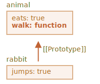
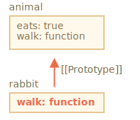

# Kế thừa dựa trên nguyên mẫu

Trong lập trình, chúng ta thường muốn lấy một thứ gì đó rồi mở rộng nó.

Ví dụ, chúng ta có đối tượng `user` với nhiều thuộc tính và phương thức, và muốn tạo ra `admin` và `guest` như là các biến thể với một chút thay đổi từ nó. Chúng ta muốn tái sử dụng những gì chúng ta có trong `user`, không phải sao-chép/cài-đặt-lại các phương thức của nó, mà chỉ xây dựng một đối tượng mới dựa trên nó.

*Kế thừa nguyên mẫu* (Prototypal inheritance) là một tính năng của ngôn ngữ giúp thực hiện điều đó.

## [[Prototype]]

Trong JavaScript, các đối tượng có một thuộc tính ẩn đặc biệt `[[Prototype]]` (như được đặt tên trong đặc tả) mà tham chiếu đến một đối tượng khác hoặc là `null`. Đối tượng đó được gọi là "nguyên mẫu" (prototype):


Khi chúng ta đọc một thuộc tính từ `object` và nó bị thiếu, JavaScript sẽ tự động lấy nó từ nguyên mẫu. Trong lập trình, điều đó được gọi là "kế thừa nguyên mẫu". Và chúng ta sẽ sớm nghiên cứu nhiều ví dụ về sự kế thừa như vậy, cũng như các tính năng ngôn ngữ hay ho hơn được xây dựng dựa trên nó.

Thuộc tính `[[Prototype]]` là thuộc tính nội bộ và bị ẩn đi, nhưng có nhiều cách để thiết lập nó:

Một trong số đó là sử dụng tên đặc biệt `__proto__`, như sau:

```js run
let animal = {
  eats: true
};
let rabbit = {
  jumps: true
};

*!*
rabbit.__proto__ = animal;
*/!*
```

Bây giờ nếu chúng ta đọc một thuộc tính từ `rabbit`, và nó bị thiếu, JavaScript sẽ tự động lấy nó từ `animal`.

Ví dụ:

```js
let animal = {
  eats: true
};
let rabbit = {
  jumps: true
};

*!*
rabbit.__proto__ = animal; // (*)
*/!*

// bây giờ chúng ta có thể tìm thấy cả hai thuộc tính trong rabbit
*!*
alert( rabbit.eats ); // true (**)
*/!*
alert( rabbit.jumps ); // true
```

Ở đây, dòng `(*)` đặt `animal` làm nguyên mẫu của `rabbit`.

Sau đó, khi `alert` cố đọc thuộc tính `rabbit.eats` `(**)`, nó không có trong `rabbit`, nên JavaScript lần theo tham chiếu `[[Prototype]]` và tìm thấy nó trong `animal` (tìm từ dưới lên trên):


Ở đây chúng ta có thể nói rằng "`animal` là nguyên mẫu của `rabbit`" hoặc "`rabbit` kế thừa nguyên mẫu từ `animal`".

Vậy nên nếu `animal` có nhiều thuộc tính và phương thức, thì chúng tự động trở thành có sẵn trong `rabbit`. Các thuộc tính đó được gọi là "được kế thừa".

Nếu chúng ta có một phương thức trong `animal`, thì nó có thể gọi từ `rabbit`:

```js run
let animal = {
  eats: true,
*!*
  walk() {
    alert("Con vật bước đi");
  }
*/!*
};

let rabbit = {
  jumps: true,
  __proto__: animal
};

// walk được lấy từ nguyên mẫu
*!*
rabbit.walk(); // Con vật bước đi
*/!*
```

Phương thức được tự động lấy từ nguyên mẫu như sau:



Chuỗi nguyên mẫu có thể dài hơn:

```js run
let animal = {
  eats: true,
  walk() {
    alert("Con vật bước đi");
  }
};

let rabbit = {
  jumps: true,
*!*
  __proto__: animal
*/!*
};

let longEar = {
  earLength: 10,
*!*
  __proto__: rabbit
*/!*
};

// walk được lấy từ chuỗi nguyên mẫu
longEar.walk(); // Con vật bước đi
alert(longEar.jumps); // true (lấy từ rabbit)
```


Bây giờ nếu chúng ta đọc gì đó từ `longEar` và nó bị thiếu, JavaScript sẽ tìm nó trong `rabbit`, và sau đó trong `animal`.

Chỉ có hai hạn chế:

1. Các tham chiếu không thể tạo thành vòng tròn. JavaScript sẽ báo lỗi nếu chúng ta cố gán `__proto__` thành một vòng tròn.
2. Giá trị của `__proto__` chỉ có thể là một đối tượng hoặc `null`. Các giá trị khác bị bỏ qua.

Ngoài ra, nó có thể là hiển nhiên, nhưng vẫn phải nói: chỉ có thể có duy nhất một `[[Prototype]]`. Một đối tượng không được kế thừa từ hai đối tượng khác.

```smart header="`__proto__` là một bộ getter/setter lịch sử cho `[[Prototype]]`"
Đó là một sai lầm phổ biến của các nhà phát triển ít kinh nghiệm khi không biết sự khác biệt giữa hai điều này.

Xin lưu ý rằng `__proto__` *không đồng nhất* với thuộc tính nội bộ `[[Prototype]]`. Nó là một bộ getter/setter cho `[[Prototype]]`. Bây giờ chúng ta chỉ cần ghi nhớ điều đó, sau này chúng ta sẽ gặp các tình huống mà điều đó là quan trọng.

Thuộc tính `__proto__` hơi lỗi thời một chút. Nó tồn tại vì các lí do lịch sử, JavaScript hiện đại gợi ý rằng chúng ta nên sử dụng các hàm `Object.getPrototypeOf/Object.setPrototypeOf` để lấy/thiết-lập nguyên mẫu. Chúng ta cũng sẽ đề cập đến các chức năng này sau.

Theo đặc tả, `__proto__` chỉ được hỗ trợ bởi các trình duyệt. Mặc dầu vậy trên thực tế, tất cả các môi trường bao gồm cả phía server cũng hỗ trợ `__proto__`, vì vậy chúng ta khá an toàn khi sử dụng nó.

Vì về mặt trực quan, ký hiệu `__proto__` trông rõ ràng hơn một chút nên chúng ta sử dụng nó trong các ví dụ.
```

## Hành động ghi dữ liệu không sử dụng nguyên mẫu

Nguyên mẫu chỉ được dùng để đọc các thuộc tính.

Các hoạt động ghi/xóa thực hiện trực tiếp trên đối tượng.

Trong ví dụ dưới đây, chúng ta gán phương thức riêng `walk` cho `rabbit`:

```js run
let animal = {
  eats: true,
  walk() {
    /* phương thức này không được sử dụng bởi rabbit */
  }
};

let rabbit = {
  __proto__: animal
};

*!*
rabbit.walk = function() {
  alert("Rabbit! Bounce-bounce!");
};
*/!*

rabbit.walk(); // Rabbit! Bounce-bounce!
```

Từ giờ, lời gọi `rabbit.walk()` tìm thấy phương thức ngay trong đối tượng và thực thi nó, chứ không sử dụng nguyên mẫu:



Các thuộc tính truy cập là một ngoại lệ, vì phép gán được xử lý bởi một hàm setter. Vì thế ghi dữ liệu vào một thuộc tính như thế quả thực giống như gọi một hàm.

Vì lý do đó, `admin.fullName` hoạt động chính xác trong mã bên dưới:

```js run
let user = {
  name: "John",
  surname: "Smith",

  set fullName(value) {
    [this.name, this.surname] = value.split(" ");
  },

  get fullName() {
    return `${this.name} ${this.surname}`;
  }
};

let admin = {
  __proto__: user,
  isAdmin: true
};

alert(admin.fullName); // John Smith (*)

// setter triggers!
admin.fullName = "Alice Cooper"; // (**)

alert(admin.fullName); // Alice Cooper, trạng thái của admin bị thay đổi
alert(user.fullName); // John Smith, trái thái của user được bảo vệ
```

Ở đây trong dòng `(*)` thuộc tính `admin.fullName` có một getter trong nguyên mẫu `user`, vì vậy nó được gọi. Và trong dòng `(**)`, thuộc tính có một setter trong nguyên mẫu, vì vậy nó được gọi.

## Giá trị của "this"

Một câu hỏi thú vị có thể nảy sinh trong ví dụ trên: Giá trị của `this` trong `set fullName(value)` là gì? Các thuộc tính `this.name` và `this.surname` được ghi vào đâu: `user` hay `admin`?

Câu trả lời thật đơn giản: `this` không bị ảnh hưởng bởi nguyên mẫu chút nào.

**Bất kể phương thức được tìm thấy ở đâu: trong một đối tượng hay nguyên mẫu của nó, trong một lời gọi phương thức, `this` luôn là đối tượng trước dấu chấm.**

Cho nên, lời gọi setter `admin.fullName=` sử dụng `admin` làm `this`, chứ không phải `user`.

Điều đó quả thực vô cùng quan trọng, vì chúng ta có thể có một đối tượng lớn với rất nhiều phương thức, và có nhiều đối tượng khác kế thừa từ nó. Và khi các đối tượng kế thừa chạy những phương thức kế thừa, chúng sẽ chỉ thay đổi trạng thái của riêng chúng, chứ không phải trạng thái của đối tượng lớn kia.

Ví dụ, ở đây `animal` đại diện cho một "kho lưu trữ phương thức" và `rabbit` sử dụng nó.

Lời gọi `rabbit.sleep()` thiết lập `this.isSleeping` trên đối tượng `rabbit`:

```js run
// animal có các phương thức
let animal = {
  walk() {
    if (!this.isSleeping) {
      alert(`I walk`);
    }
  },
  sleep() {
    this.isSleeping = true;
  }
};

let rabbit = {
  name: "White Rabbit",
  __proto__: animal
};

// thay đổi rabbit.isSleeping
rabbit.sleep();

alert(rabbit.isSleeping); // true
alert(animal.isSleeping); // undefined (không có thuộc tính này trong nguyên mẫu)
```

Hình ảnh của kết quả trên:


Nếu chúng ta có các đối tượng khác như `bird`, `snake` v.v. kế thừa từ `animal`, chúng cũng có thể truy cập các phương thức của `animal`. Nhưng `this` trong mỗi lời gọi phương thức thì luôn là đối tượng tương ứng, được tính toán tại thời điểm gọi (trước dấu chấm), không phải `animal`. Cho nên khi chúng ta ghi dữ liệu vào `this`, nó được lưu trong các đối tượng này.

Kết quả là, các phương thức được chia sẻ, nhưng trạng thái đối tượng thì không.

## Vòng lặp for..in

Vòng lặp `for..in` liệt kê cả các thuộc tính được kế thừa.

Ví dụ:

```js run
let animal = {
  eats: true
};

let rabbit = {
  jumps: true,
  __proto__: animal
};

*!*
// Object.keys chỉ trả về các khóa của riêng nó
alert(Object.keys(rabbit)); // jumps
*/!*

*!*
// vòng lặp for..in liệt kê cả khóa riêng và khóa được kế thừa
for(let prop in rabbit) alert(prop); // jumps, rồi eats
*/!*
```

Nếu đó không phải là những gì chúng ta muốn, và chúng ta muốn loại trừ các thuộc tính được kế thừa, có một phương thức có sẵn [obj.hasOwnProperty(key)](mdn:js/Object/hasOwnProperty): nó trả về `true` nếu `obj` có một thuộc tính riêng (không phải được kế thừa) tên là `key`.

Nên chúng ta có thể loại bỏ các thuộc tính được kế thừa (hoặc làm gì đó với chúng):

```js run
let animal = {
  eats: true
};

let rabbit = {
  jumps: true,
  __proto__: animal
};

for(let prop in rabbit) {
  let isOwn = rabbit.hasOwnProperty(prop);

  if (isOwn) {
    alert(`Của chúng ta: ${prop}`); // Của chúng ta: jumps
  } else {
    alert(`Được kế thừa: ${prop}`); // Được kế thừa: eats
  }
}
```

Ở đây chúng ta có chuỗi thừa kế sau: `rabbit` kế thừa từ `animal`, `animal` kế thừa từ `Object.prototype` (vì `animal` là một literal object `{...}`, nên mặc định nhận `Object.prototype` làm nguyên mẫu), `Object.prototype` không có nguyên mẫu nên `[[Prototype]]` của nó là `null`:


Lưu ý, có một điều thú vị. Phương thức `rabbit.hasOwnProperty` đến từ đâu? Chúng ta đã không định nghĩa nó. Nhìn vào chuỗi, chúng ta có thể thấy rằng phương thức được cung cấp bởi `Object.prototype.hasOwnProperty`. Nói cách khác, nó được kế thừa.

...Nhưng tại sao `hasOwnProperty` lại không xuất hiện trong vòng lặp `for..in`, như `eats` và `jumps`, nếu `for..in` cũng liệt kê các thuộc tính được kế thừa?

Câu trả lời thật đơn giản: nó là thuộc tính không liệt kê. Cũng giống như mọi thuộc tính khác của `Object.prototype`, nó có cờ `enumerable:false`. Và `for..in` chỉ liệt kê các thuộc tính liệt kê được. Đó là lý do tại sao nó và các thuộc tính còn lại của `Object.prototype` không được liệt kê.

```smart header="Hầu hết tất cả các phương thức lấy ra khóa/giá-trị khác đều bỏ qua các thuộc tính kế thừa"
Hầu hết tất cả các phương thức lấy ra khóa/giá-trị khác, như là `Object.keys`, `Object.values` v.v. đều bỏ qua các thuộc tính kế thừa.

Chúng chỉ hoạt động trên chính đối tượng. Các thuộc tính từ nguyên mẫu *không* được tính đến.
```

## Tóm tắt

- Trong JavaScript, tất cả các đối tượng có một thuộc tính ẩn là `[[Prototype]]` mà tham chiếu tới một đối tượng khác hoặc `null`.
- Chúng ta có thể sử dụng `obj.__proto__` để truy cập nó (đây là một bộ getter/setter lịch sử, còn có các cách khác nữa sẽ được đề cập sau).
- Đối tượng được tham chiếu bởi `[[Prototype]]` được gọi là "nguyên mẫu" (prototype).
- Nếu chúng ta muốn đọc một thuộc tính hay gọi một phương thức của `obj`, mà nó không tồn tại, thì JavaScript sẽ cố tìm chúng trong nguyên mẫu.
- Các hoạt động ghi / xóa tiến hành trực tiếp trên đối tượng, chúng không sử dụng nguyên mẫu (giả sử đó là một thuộc tính dữ liệu, không phải một setter).
- Nếu chúng ta gọi `obj.method()` và `method` được lấy từ nguyên mẫu, thì `this` tham chiếu đến `obj`. Cho nên các phương thức luôn làm việc với đối tượng hiện tại, ngay cả khi chúng là các phương thức được kế thừa.
- Vòng lặp `for..in` lặp qua cả thuộc tính riêng lẫn thuộc tính được kế thừa của đối tượng. Mọi phương thức khác lấy ra các cặp khóa/giá-trị của đối tượng chỉ hoạt động trên chính đối tượng đó.
