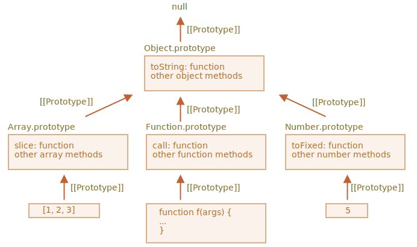

# Các nguyên mẫu có sẵn

Thuộc tính `"prototype"` được dùng rộng rãi bởi chính JavaScript. Tất cả các hàm constructor có sẵn đều sử dụng nó.

Đầu tiên chúng ta sẽ xem chi tiết và sau đó là cách sử dụng nó để thêm các khả năng mới cho các đối tượng có sẵn.

## Object.prototype

Giả sử chúng ta xuất ra một đối tượng rỗng:

```js run
let obj = {};
alert( obj ); // "[object Object]" ?
```

Đâu là đoạn mã tạo chuỗi `"[object Object]"`? Đó là một phương thức `toString` có sẵn, nhưng nó ở đâu? Đối tượng `obj` là rỗng mà!

...Nhưng ký pháp ngắn gọn `obj = {}` là giống với `obj = new Object()`, trong đó `Object` là một hàm tạo đối tượng có sẵn, với `prototype` của riêng nó tham chiếu đến một đối tượng lớn với `toString` và các phương thức khác.

Đây là những gì đang xảy ra:


Khi `new Object()` được gọi (hoặc một literal object `{...}` được tạo), `[[Prototype]]` của nó được đặt thành `Object.prototype` theo quy tắc mà chúng ta đã thảo luận trong chương trước:


Cho nên khi `obj.toString()` được gọi thì phương thức này được lấy từ `Object.prototype`.

Chúng ta có thể kiểm tra nó như thế này:

```js run
let obj = {};

alert(obj.__proto__ === Object.prototype); // true

alert(obj.toString === obj.__proto__.toString); //true
alert(obj.toString === Object.prototype.toString); //true
```

Xin lưu ý rằng không còn `[[Prototype]]` trong chuỗi phía trên `Object.prototype`:

```js run
alert(Object.prototype.__proto__); // null
```

## Các nguyên mẫu có sẵn khác

Các đối tượng có sẵn khác như `Array`, `Date`, `Function` và các đối tượng khác cũng giữ các phương thức trong nguyên mẫu.

Ví dụ: khi chúng ta tạo một mảng `[1, 2, 3]`, hàm tạo `new Array ()` mặc định được sử dụng. Vì vậy, `Array.prototype` trở thành nguyên mẫu của nó và cung cấp các phương thức. Điều đó rất tiết kiệm bộ nhớ.

Theo đặc tả, tất cả các nguyên mẫu có sẵn đều có `Object.prototype` ở trên cùng. Đó là lý do tại sao một số người nói rằng "mọi thứ kế thừa từ các đối tượng".

Đây là hình ảnh minh họa với 3 nguyên mẫu:



Hãy kiểm tra các nguyên mẫu theo cách thủ công:

```js run
let arr = [1, 2, 3];

// nó kế thừa từ Array.prototype?
alert( arr.__proto__ === Array.prototype ); // true

// sau đó từ Object.prototype?
alert( arr.__proto__.__proto__ === Object.prototype ); // true

// và null ở trên cùng.
alert( arr.__proto__.__proto__.__proto__ ); // null
```

Một số phương thức trong nguyên mẫu có thể trùng lặp, ví dụ: `Array.prototype` có `toString` riêng liệt kê các phần tử được phân tách bằng dấu phẩy:

```js run
let arr = [1, 2, 3]
alert(arr); // 1,2,3 <-- là kết quả của Array.prototype.toString
```

Như chúng ta đã thấy trước đây, `Object.prototype` cũng có `toString`, nhưng `Array.prototype` gần hơn trong chuỗi, vì vậy biến thể của mảng được sử dụng.


Các công cụ trong trình duyệt như Developer Console của Chrome cũng hiển thị sự kế thừa (`console.dir` có thể cần được sử dụng cho các đối tượng có sẵn):


Các đối tượng có sẵn khác cũng hoạt động tương tự. Ngay cả các hàm -- chúng là các đối tượng tạo ra bởi hàm tạo `Function` có sẵn, và các phương thức của nó (`call`/`apply` và phương thức khác) là lấy từ `Function.prototype`. Các hàm cũng có thể có phương thức `toString` của riêng chúng.

```js run
function f() {}

alert(f.__proto__ == Function.prototype); // true
alert(f.__proto__.__proto__ == Object.prototype); // true, kết thừa từ các đối tượng
```

## Các giá trị cơ bản

Điều khó hiểu nhất xảy ra với các chuỗi, số và boolean.

Như chúng ta vẫn nhớ, chúng không phải là các đối tượng. Nhưng nếu chúng ta cố gắng truy cập các thuộc tính của chúng, các đối tượng bao tạm thời được tạo ra bằng cách sử dụng các hàm tạo có sẵn `String`, `Number` và `Boolean`. Chúng cung cấp các phương thức rồi biến mất.

Những đối tượng này được tạo ra một cách vô hình đối với chúng ta và hầu hết các engine tối ưu hóa chúng, nhưng đặc tả mô tả chính xác theo cách này. Các phương thức của các đối tượng này cũng nằm trong các nguyên mẫu, có sẵn dưới dạng `String.prototype`, `Number.prototype` và `Boolean.prototype`.

```warn header="Các giá trị `null` và `undefined` không có đối tượng bao"
Các giá trị đặc biệt `null` và `undefined` thì khác biệt. Chúng không có các bao đối tượng, vì vậy không có sẵn các phương thức và thuộc tính cho chúng. Và cũng không có các nguyên mẫu tương ứng.
```

## Thay đổi các nguyên mẫu có sẵn [#native-prototype-change]

Các nguyên mẫu có sẵn có thể thay đổi được. Ví dụ, nếu chúng ta thêm vào `String.prototype` một phương thức, phương thức này trở nên sẵn có cho mọi chuỗi:

```js run
String.prototype.show = function() {
  alert(this);
};

"BOOM!".show(); // BOOM!
```

Trong quá trình phát triển, chúng ta có thể có những ý tưởng về các phương thức mới mà chúng ta muốn có, và chúng ta có thể bị cám dỗ để thêm chúng vào các nguyên mẫu có sẵn. Nhưng đó nói chung là một ý kiến tồi.

```warn
Các nguyên mẫu là toàn cục, vì vậy rất dễ xảy ra xung đột. Nếu hai thư viện cùng thêm một phương thức `String.prototype.show`, thì một trong số chúng sẽ ghi đè phương thức của cái kia.

Vì thế, nói chung sửa đổi một nguyên mẫu có sẵn là một ý kiến tồi.
```

**Trong lập trình hiện đại, chỉ có một trường hợp duy nhất có thể thay đổi các nguyên mẫu có sẵn. Đó là polyfilling.**

Polyfilling là một thuật ngữ cho việc tạo một phương thức thay thế cho một phương thức đã có trong đặc tả nhưng chưa được hỗ trợ bởi một JavaScript engine cụ thể.

Sau đó, chúng ta có thể cài đặt nó theo cách thủ công và thêm nó vào nguyên mẫu như trong đặc tả.

Ví dụ:

```js run
if (!String.prototype.repeat) { // nếu không có phương thức
  // thêm nó vào nguyên mẫu này

  String.prototype.repeat = function(n) {
    // lặp lại chuỗi n lần

    // thực tế mã phức tạp hơn một chút
    // (toàn bộ thuật toán có trong đặc tả)
    // nhưng ngay cả một polyfill không hoàn hảo cũng thường được coi là đủ tốt
    return new Array(n + 1).join(this);
  };
}

alert( "La".repeat(3) ); // LaLaLa
```

## Mượn phương thức từ các nguyên mẫu

Trong chương <info:call-apply-decorators#method-borrowing> chúng ta đã nói về mượn phương thức.

Đó là khi chúng ta lấy phương thức của một đối tượng và sao chép nó vào một đối tượng khác.

Một số phương thức của các nguyên mẫu có sẵn thường được mượn.

Ví dụ, nếu chúng ta đang tạo một đối tượng tựa như mảng, chúng ta có thể muốn sao chép một số phương thức của `Array` cho nó.

Ví dụ:

```js run
let obj = {
  0: "Chào",
  1: "thế giới!",
  length: 2,
};

*!*
obj.join = Array.prototype.join;
*/!*

alert( obj.join(',') ); // Chào thế giới!
```

Nó hoạt động tốt vì thuật toán nội bộ của phương thức `join` có sẵn chỉ quan tâm đến các chỉ mục chính xác và thuộc tính `length`. Nó không kiểm tra xem đối tượng có thực sự là một mảng hay không. Nhiều phương thức có sẵn cũng giống như vậy.

Một khả năng khác là kế thừa bằng cách đặt `obj.__proto__` bằng `Array.prototype`, vì thế tất cả các phương thức của `Array` đều tự động có sẵn trong `obj`.

Nhưng điều đó là không thể nếu `obj` đã kế thừa từ một đối tượng khác. Hãy nhớ rằng, chúng ta chỉ có thể kế thừa từ một đối tượng tại một thời điểm.

Việc mượn phương thức rất linh hoạt, nó cho phép kết hợp các chức năng từ các đối tượng khác nhau nếu cần.

## Tóm tắt

- Tất cả các đối tượng có sẵn đều tuân theo cùng một khuôn mẫu:
    - Các phương thức được lưu trong nguyên mẫu (`Array.prototype`, `Object.prototype`, `Date.prototype`...).
    - Đối tượng chỉ chứa dữ liệu (phần tử mảng, thuộc tính, ngày/tháng).
- Các giá trị cơ bản cũng lưu các phương thức trong nguyên mẫu của các đối tượng bao: `Number.prototype`, `String.prototype` và `Boolean.prototype`. Chỉ `undefined` và `null` không có các đối tượng bao.
- Các nguyên mẫu có sẵn có thể được thay đổi hoặc bổ sung thêm các phương thức mới. Nhưng không nên sửa chúng. Trường hợp được phép duy nhất có lẽ là khi chúng ta bổ sung một tiêu chuẩn mới, nhưng nó chưa được hỗ trợ bởi JavaScript engine
