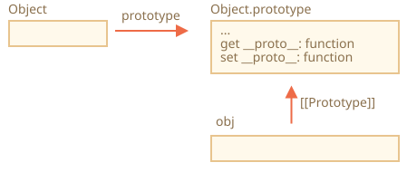

# Các phương thức và đối tượng nguyên mẫu không có __proto__

Trong chương đầu tiên của phần này, chúng ta đã đề cập rằng có các phương pháp hiện đại để thiết lập một nguyên mẫu.

`__proto__` được coi là lỗi thời và có phần không được tán thành (trong phần chỉ dành cho trình duyệt của tiêu chuẩn JavaScript).

<<<<<<< HEAD
Các phương thức hiện đại là:

- [Object.create(proto, [descriptors])](mdn:js/Object/create) -- tạo một đối tượng rỗng với `proto` làm `[[Prototype]]` và tùy chọn descriptors của thuộc tính.
- [Object.getPrototypeOf(obj)](mdn:js/Object/getPrototypeOf) -- trả về `[[Prototype]]` của `obj`.
- [Object.setPrototypeOf(obj, proto)](mdn:js/Object/setPrototypeOf) -- thiết lập `[[Prototype]]` của `obj` bằng `proto`.

Những phương thức này nên được dùng thay cho `__proto__`.

Ví dụ:
=======
Setting or reading the prototype with `obj.__proto__` is considered outdated and somewhat deprecated (moved to the so-called "Annex B" of the JavaScript standard, meant for browsers only).

The modern methods to get/set a prototype are:

- [Object.getPrototypeOf(obj)](mdn:js/Object/getPrototypeOf) -- returns the `[[Prototype]]` of `obj`.
- [Object.setPrototypeOf(obj, proto)](mdn:js/Object/setPrototypeOf) -- sets the `[[Prototype]]` of `obj` to `proto`.

The only usage of `__proto__`, that's not frowned upon, is as a property when creating a new object: `{ __proto__: ... }`.

Although, there's a special method for this too:

- [Object.create(proto[, descriptors])](mdn:js/Object/create) -- creates an empty object with given `proto` as `[[Prototype]]` and optional property descriptors.

For instance:
>>>>>>> 035c5267ba80fa7b55878f7213cbde449b4092d9

```js run
let animal = {
  eats: true
};

// tạo một đối tượng nhận animal làm nguyên mẫu
*!*
let rabbit = Object.create(animal); // same as {__proto__: animal}
*/!*

alert(rabbit.eats); // true

*!*
alert(Object.getPrototypeOf(rabbit) === animal); // true
*/!*

*!*
Object.setPrototypeOf(rabbit, {}); // đổi nguyên mẫu của rabbit thành {}
*/!*
```

<<<<<<< HEAD
`Object.create` có đối số thứ hai tùy chọn là các "property descriptor". Chúng ta có thể cung cấp các thuộc tính bổ sung cho đối tượng mới đó như thế này:
=======
The `Object.create` method is a bit more powerful, as it has an optional second argument: property descriptors.

We can provide additional properties to the new object there, like this:
>>>>>>> 035c5267ba80fa7b55878f7213cbde449b4092d9

```js run
let animal = {
  eats: true
};

let rabbit = Object.create(animal, {
  jumps: {
    value: true
  }
});

alert(rabbit.jumps); // true
```

Các "property descriptor" đã được nói đến trong bài <info:property-descriptors>.

Chúng ta có thể sử dụng `Object.create` để nhân bản một đối tượng thay vì sao chép các thuộc tính bằng `for..in`:

```js
let clone = Object.create(
  Object.getPrototypeOf(obj), Object.getOwnPropertyDescriptors(obj)
);
```

Lời gọi này tạo ra một bản sao chính xác của `obj` bao gồm tất cả các thuộc tính: liệt kê lẫn không liệt kê, thuộc trính truy cập cũng như thuộc tính dữ liệu, và với `[[Prototype]]` thích hợp.

<<<<<<< HEAD
## Tóm tắt lịch sử

Nếu chúng ta đếm tất cả các cách để quản lý `[[Prototype]]`, sẽ có rất nhiều! Rất nhiều cách để cùng làm một thứ!

Tại sao?
=======

## Brief history

There're so many ways to manage `[[Prototype]]`. How did that happen? Why?
>>>>>>> 035c5267ba80fa7b55878f7213cbde449b4092d9

Đó là vì lí do lịch sử.

<<<<<<< HEAD
- Thuộc tính `"prototype"` của constructor có từ rất lâu.
- Sau đó vào năm 2012: `Object.create` xuất hiện trong tiêu chuẩn JavaScript. Nó cho phép tạo các đối tượng với nguyên mẫu cho trước, nhưng không cho phép lấy/thiết lập nguyên mẫu. Vậy nên các trình duyệt đã cài đặt bộ truy cập phi chuẩn `__proto__` để cho phép người dùng lấy/thiết lập nguyên mẫu vào bất kỳ lúc nào.
- Tới năm 2015: `Object.setPrototypeOf` và `Object.getPrototypeOf` được thêm vào tiêu chuẩn JavaScript để thực hiện các chức năng của `__proto__`. Vì `__proto__` đã được cài đặt thực tế ở khắp nơi, nó đã không còn được tán thành nữa và được chuyển sang Phụ lục B của tiêu chuẩn, đó là: tùy chọn cho các môi trường không phải trình duyệt.

Hiện tại, chúng ta có toàn quyền sử dụng tất cả những cách này.

Tại sao `__proto__` bị thay thế bởi các hàm `getPrototypeOf/setPrototypeOf`? Đó là một câu hỏi thú vị, yêu cầu chúng ta phải hiểu tại sao `__proto__` không tốt. Hãy đọc để có câu trả lời.
=======
The prototypal inheritance was in the language since its dawn, but the ways to manage it evolved over time.

- The `prototype` property of a constructor function has worked since very ancient times. It's the oldest way to create objects with a given prototype.
- Later, in the year 2012, `Object.create` appeared in the standard. It gave the ability to create objects with a given prototype, but did not provide the ability to get/set it. Some browsers implemented the non-standard `__proto__` accessor that allowed the user to get/set a prototype at any time, to give more flexibility to developers.
- Later, in the year 2015, `Object.setPrototypeOf` and `Object.getPrototypeOf` were added to the standard, to perform the same functionality as `__proto__`. As `__proto__` was de-facto implemented everywhere, it was kind-of deprecated and made its way to the Annex B of the standard, that is: optional for non-browser environments.
- Later, in the year 2022, it was officially allowed to use `__proto__` in object literals `{...}` (moved out of Annex B), but not as a getter/setter `obj.__proto__` (still in Annex B).

Why was `__proto__` replaced by the functions `getPrototypeOf/setPrototypeOf`?

Why was `__proto__` partially rehabilitated and its usage allowed in `{...}`, but not as a getter/setter?

That's an interesting question, requiring us to understand why `__proto__` is bad.

And soon we'll get the answer.
>>>>>>> 035c5267ba80fa7b55878f7213cbde449b4092d9

```warn header="Don't change `[[Prototype]]` on existing objects if speed matters"
Về mặt kỹ thuật, chúng ta có thể lấy/thiết lập `[[Prototype]]` bất cứ lúc nào. Nhưng thường chúng ta chỉ thiết lập nó một lần lúc tạo đối tượng và không sửa đổi nó nữa: `rabbit` kế thừa từ `animal`, điều đó sẽ không thay đổi.

Và các công cụ JavaScript được tối ưu hóa cao cho điều này. Thay đổi nguyên mẫu "nhanh chóng" bằng `Object.setPrototypeOf` hoặc `obj.__proto__=` là một hoạt động rất chậm vì nó phá vỡ sự tối ưu hóa nội bộ cho các hoạt động truy cập thuộc tính đối tượng. Vì vậy, hãy tránh nó trừ khi bạn biết mình đang làm gì, hoặc tốc độ JavaScript hoàn toàn không quan trọng đối với bạn.
```

## Đối tượng không có nguyên mẫu [#very-plain]

Như chúng ta đã biết, các đối tượng có thể được dùng như các mảng kết hợp để lưu các cặp khóa/giá-trị.

...Nhưng nếu chúng ta muốn lưu các khóa *do người dùng cung cấp* trong đối tượng (ví dụ, một từ điển do người dùng tự tạo), chúng ta có thể thấy một sự cố nhỏ thú vị: mọi khóa đều hoạt động tốt ngoại trừ `"__proto__"`.

Kiểm tra ví dụ sau:

```js run
let obj = {};

let key = prompt("Khóa mong muốn là gì?", "__proto__");
obj[key] = "giá trị nào đó";

alert(obj[key]); // [object Object], không phải "giá trị nào đó"!
```

<<<<<<< HEAD
Ở đây nếu người dùng nhập vào là  `"__proto__"`, lệnh gán bị bỏ qua!

Điều đó không làm chúng ta ngạc nhiên. Thuộc tính `__proto__` là thuộc tính đặc biệt: nó phải là một đối tượng hoặc `null`, một chuỗi không thể là nguyên mẫu được.
=======
Here, if the user types in `__proto__`, the assignment in line 4 is ignored!

That could surely be surprising for a non-developer, but pretty understandable for us. The `__proto__` property is special: it must be either an object or `null`. A string can not become a prototype. That's why assigning a string to `__proto__` is ignored.
>>>>>>> 035c5267ba80fa7b55878f7213cbde449b4092d9

Nhưng chúng ta đã không *định* thực hiện hành vi như vậy, phải không? Chúng ta muốn lưu trữ các cặp khóa/giá-trị và khóa có tên `"__proto__"` không được lưu đúng cách. Vì vậy, đó là một lỗi!

<<<<<<< HEAD
Ở đây hậu quả không khủng khiếp. Nhưng trong các trường hợp khác, chúng ta có thể gán các giá trị đối tượng, và sau đó nguyên mẫu thực sự có thể bị thay đổi. Kết quả là, việc thực thi sẽ sai theo những cách hoàn toàn không mong muốn.
=======
Here the consequences are not terrible. But in other cases we may be storing objects instead of strings in `obj`, and then the prototype will indeed be changed. As a result, the execution will go wrong in totally unexpected ways.
>>>>>>> 035c5267ba80fa7b55878f7213cbde449b4092d9

Điều tệ hơn là -- các nhà phát triển thường không nghĩ chút gì đến khả năng như vậy. Điều đó làm cho những lỗi như vậy khó nhận thấy và thậm chí biến chúng thành những lỗ hổng bảo mật, đặc biệt là khi JavaScript được sử dụng ở phía máy chủ.

<<<<<<< HEAD
Những điều không mong muốn cũng có thể xảy ra khi gán cho `toString`, là một hàm mặc định, và cho các phương thức có sẵn khác.
=======
Unexpected things also may happen when assigning to `obj.toString`, as it's a built-in object method.
>>>>>>> 035c5267ba80fa7b55878f7213cbde449b4092d9

Chúng ta làm thế nào để tránh vấn đề này?

<<<<<<< HEAD
Đầu tiên, chúng ta có thể chuyển sang sử dụng `Map` để lưu trữ thay vì các đối tượng đơn giản, rồi thì mọi thứ sẽ ổn.

Nhưng `Object` cũng có thể đáp ứng tốt ở đây, bởi những người sáng tạo ngôn ngữ đã nghĩ kỹ về vấn đề đó từ lâu.

`__proto__` không phải là thuộc tính của một đối tượng thông thường, mà là thuộc tính truy cập của `Object.prototype`:
=======
First, we can just switch to using `Map` for storage instead of plain objects, then everything's fine:

```js run
let map = new Map();

let key = prompt("What's the key?", "__proto__");
map.set(key, "some value");

alert(map.get(key)); // "some value" (as intended)
```

...But `Object` syntax is often more appealing, as it's more concise.

Fortunately, we *can* use objects, because language creators gave thought to that problem long ago.

As we know, `__proto__` is not a property of an object, but an accessor property of `Object.prototype`:
>>>>>>> 035c5267ba80fa7b55878f7213cbde449b4092d9



Cho nên, nếu `obj.__proto__` được đọc hoặc ghi, getter/setter tương ứng được gọi từ nguyên mẫu của nó, và nó lấy/thiết-lập `[[Prototype]]`.

Như đã nói ở phần đầu của phần hướng dẫn này: `__proto__` là một cách để truy cập `[[Prototype]]`, nó không phải là bản thân `[[Prototype]]`.

Bây giờ, nếu chúng ta định sử dụng một đối tượng như một mảng kết hợp mà không gặp phải các vấn đề như vậy, chúng ta có thể thực hiện điều đó với một mẹo nhỏ:

```js run
*!*
let obj = Object.create(null);
// or: obj = { __proto__: null }
*/!*

let key = prompt("Khóa mong muốn là gì?", "__proto__");
obj[key] = "giá trị nào đó";

alert(obj[key]); // "giá trị nào đó"
```

`Object.create(null)` tạo một đối tượng rỗng không có nguyên mẫu (`[[Prototype]]` là `null`):


Cho nên sẽ không có getter/setter kế thừa lại cho `__proto__`. Lúc này nó được xử lý giống như một thuộc tính dữ liệu thông thường, vì thế ví dụ trên hoạt động đúng.

Chúng ta có thể gọi các đối tượng như vậy là các đối tượng "rất đơn giản" hoặc "từ điển thuần túy", bởi vì chúng thậm chí còn đơn giản hơn đối tượng đơn giản thông thường `{...}`.

Một nhược điểm là các đối tượng như vậy thiếu bất kỳ phương thức đối tượng có sẵn nào, ví dụ `toString`.

```js run
*!*
let obj = Object.create(null);
*/!*

alert(obj); // Lỗi (không có toString)
```

...Nhưng điều đó lại thường tốt cho các mảng kết hợp.

Lưu ý rằng hầu hết các phương thức liên quan đến đối tượng là `Object.something(...)`, như `Object.keys(obj)` - chúng không có trong nguyên mẫu, vì vậy chúng sẽ tiếp tục hoạt động trên các đối tượng như vậy:

```js run
let chineseDictionary = Object.create(null);
chineseDictionary.hello = "你好";
chineseDictionary.bye = "再见";

alert(Object.keys(chineseDictionary)); // hello,bye
```

## Tóm tắt

<<<<<<< HEAD
Các phương thức hiện đại để thiết lập và truy cập trực tiếp nguyên mẫu là:

- [Object.create(proto[, descriptors])](mdn:js/Object/create) -- tạo một đối tượng rỗng với `proto` cho trước làm `[[Prototype]]` (có thể là `null`) và tùy chọn `descriptors` làm các "property descriptor".
- [Object.getPrototypeOf(obj)](mdn:js/Object/getPrototypeOf) -- trả về `[[Prototype]]` của `obj` (giống như getter `__proto__`).
- [Object.setPrototypeOf(obj, proto)](mdn:js/Object/setPrototypeOf) -- đặt `proto` làm `[[Prototype]]` của `obj` (giống setter `__proto__`).

getter/setter `__proto__` có sẵn không an toàn nếu chúng ta muốn đặt các khóa do người dùng tạo ra vào trong một đối tượng. Bởi vì người dùng có thể nhập `" __proto __ "` làm khóa, và sẽ xảy ra lỗi, hy vọng là nhẹ, nhưng nói chung là hậu quả khó lường.

Vì vậy chúng ta có thể sử dụng `Object.create(null)` để tạo một đối tượng "rất đơn giản" không có `__proto__`, hoặc dùng các đối tượng `Map`.

Ngoài ra, `Object.create` cung cấp một cách dễ dàng để sao chép nông (shallow-copy) một đối tượng với tất cả các bộ mô tả:
=======
- To create an object with the given prototype, use:

    - literal syntax: `{ __proto__: ... }`, allows to specify multiple properties
    - or [Object.create(proto[, descriptors])](mdn:js/Object/create), allows to specify property descriptors.

    The `Object.create` provides an easy way to shallow-copy an object with all descriptors:

    ```js
    let clone = Object.create(Object.getPrototypeOf(obj), Object.getOwnPropertyDescriptors(obj));
    ```

- Modern methods to get/set the prototype are:
>>>>>>> 035c5267ba80fa7b55878f7213cbde449b4092d9

    - [Object.getPrototypeOf(obj)](mdn:js/Object/getPrototypeOf) -- returns the `[[Prototype]]` of `obj` (same as `__proto__` getter).
    - [Object.setPrototypeOf(obj, proto)](mdn:js/Object/setPrototypeOf) -- sets the `[[Prototype]]` of `obj` to `proto` (same as `__proto__` setter).

<<<<<<< HEAD
Chúng ta cũng đã làm rõ rằng `__proto__` là một getter/setter cho `[[Prototype]]` và nằm trong `Object.prototype`, giống như các phương thức khác.

Chúng ta có thể tạo một đối tượng không có nguyên mẫu bằng `Object.create(null)`. Những đối tượng như vậy được dùng như là các "từ điển thuần túy", chúng không có vấn đề gì với `"__proto__"` như là một khóa.

Các phương thức khác:

- [Object.keys(obj)](mdn:js/Object/keys) / [Object.values(obj)](mdn:js/Object/values) / [Object.entries(obj)](mdn:js/Object/entries) -- trả về một mảng chứa các khóa (dưới dạng chuỗi) hoặc các giá trị, hoặc các cặp khóa/giá-trị của các thuộc tính riêng có thể liệt kê.
- [Object.getOwnPropertySymbols(obj)](mdn:js/Object/getOwnPropertySymbols) -- trả về một mảng chứa tất cả các thuộc tính symbol riêng.
- [Object.getOwnPropertyNames(obj)](mdn:js/Object/getOwnPropertyNames) -- trả về một mảng chứa các khóa (dưới dạng chuỗi) của tất cả các thuộc tính riêng.
- [Reflect.ownKeys(obj)](mdn:js/Reflect/ownKeys) -- trả về một mảng chứa các khóa của tất cả các thuộc tính riêng (gồm cả symbol).
- [obj.hasOwnProperty(key)](mdn:js/Object/hasOwnProperty): trả về `true` nếu `obj` có thuộc tính riêng (không do kế thừa) với khóa là `key`.

Tất cả các phương thức trả về các thuộc tính của đối tượng (như `Object.keys` và những phương thức khác) -- chỉ trả về các thuộc tính riêng. Nếu chúng ta muốn các thuộc tính do kế thừa, chúng ta có thể sử dụng `for..in`.
=======
- Getting/setting the prototype using the built-in `__proto__` getter/setter isn't recommended, it's now in the Annex B of the specification.

- We also covered prototype-less objects, created with `Object.create(null)` or `{__proto__: null}`.

    These objects are used as dictionaries, to store any (possibly user-generated) keys.

    Normally, objects inherit built-in methods and `__proto__` getter/setter from `Object.prototype`, making corresponding keys "occupied" and potentially causing side effects. With `null` prototype, objects are truly empty.
>>>>>>> 035c5267ba80fa7b55878f7213cbde449b4092d9
