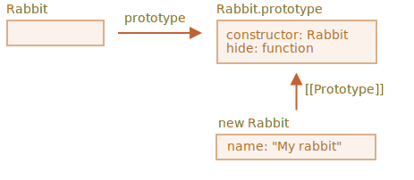

# Thừa kế một class

<<<<<<< HEAD
Giả sử chúng ta có hai class:
=======
Class inheritance is a way for one class to extend another class.
>>>>>>> 0599d07b3c13ee25f583fc091cead3c17a7e7779

So we can create new functionality on top of the existing.

## The "extends" keyword

Let's say we have class `Animal`:

```js
class Animal {
  constructor(name) {
    this.speed = 0;
    this.name = name;
  }
  run(speed) {
<<<<<<< HEAD
    this.speed += speed;
    alert(`${this.name} chạy với tốc độ ${this.speed}.`);
=======
    this.speed = speed;
    alert(`${this.name} runs with speed ${this.speed}.`);
>>>>>>> 0599d07b3c13ee25f583fc091cead3c17a7e7779
  }
  stop() {
    this.speed = 0;
<<<<<<< HEAD
    alert(`${this.name} đã dừng lại.`);
=======
    alert(`${this.name} stands still.`);
>>>>>>> fb38a13978f6e8397005243bc13bc1a20a988e6a
  }
}

let animal = new Animal("My animal");
```

<<<<<<< HEAD


...Và `Rabbit`:

```js
class Rabbit {
  constructor(name) {
    this.name = name;
  }
  hide() {
    alert(`${this.name} ẩn nấp!`);
  }
}

let rabbit = new Rabbit("My rabbit");
```


=======
Here's how we can represent `animal` object and `Animal` class graphically:
>>>>>>> 0599d07b3c13ee25f583fc091cead3c17a7e7779


<<<<<<< HEAD
Hiện tại chúng hoàn toàn đôc lập với nhau.

Nhưng chúng ta muốn `Rabbit` thừa kế từ `Animal`. Nói cách khác, các đối tượng rabbit thừa kế từ các đối tượng animal, có thể truy cập các phương thức của `Animal` cũng như có thể có riêng các phương thức của nó.

Để thừa kế từ một class, ta đặt `"extends"` sau đó là tên của class đó đằng trước `{..}`.

Ở đây `Rabbit` (class con) thừa kế từ class `Animal` (class cha):

```js run
class Animal {
  constructor(name) {
    this.speed = 0;
    this.name = name;
  }
  run(speed) {
    this.speed += speed;
    alert(`${this.name} chạy với tốc độ ${this.speed}.`);
  }
  stop() {
    this.speed = 0;
<<<<<<< HEAD
    alert(`${this.name} đã dừng.`);
=======
    alert(`${this.name} stands still.`);
>>>>>>> fb38a13978f6e8397005243bc13bc1a20a988e6a
  }
}

// Rabbit thừa kế từ Animal
=======
...And we would like to create another `class Rabbit`.

As rabbits are animals, `Rabbit` class should be based on `Animal`, have access to animal methods, so that rabbits can do what "generic" animals can do.

The syntax to extend another class is: `class Child extends Parent`.

Let's create `class Rabbit` that inherits from `Animal`:

```js
>>>>>>> 0599d07b3c13ee25f583fc091cead3c17a7e7779
*!*
class Rabbit extends Animal {
*/!*
  hide() {
    alert(`${this.name} ẩn nấp!`);
  }
}

let rabbit = new Rabbit("White Rabbit");

rabbit.run(5); // White Rabbit chạy với tốc độ 5.
rabbit.hide(); // White Rabbit ẩn nấp!
```

<<<<<<< HEAD
Mã của class `Rabbit` trở nên ngắn hơn, vì mặc định nó sử dụng constructor của `Animal`, và cũng thừa kế được phương thức `run` từ `Animal`.

Sâu bên trong, từ khóa `extends` thêm `[[Prototype]]` cho `Rabbit.prototype` để nó tham chiếu đến `Animal.prototype`:


Cho nên, nếu một phương thức không tìm thấy trong `Rabbit.prototype`, JavaScript lấy nó từ `Animal.prototype`.

<<<<<<< HEAD
Như đã học ở bài <info:native-prototypes>, JavaScript cũng sử dụng cách này cho các đối tượng có sẵn. Ví dụ `Date.prototype.[[Prototype]]` là `Object.prototype`, nên các đối tượng date cũng có các phương thức chung như mọi đối tượng có.
=======
As we can recall from the chapter <info:native-prototypes>, JavaScript uses prototypal inheritance for build-in objects. E.g. `Date.prototype.[[Prototype]]` is `Object.prototype`, so dates have generic object methods.
>>>>>>> fb38a13978f6e8397005243bc13bc1a20a988e6a
=======
Object of `Rabbit` class have access to both `Rabbit` methods, such as `rabbit.hide()`, and also to `Animal` methods, such as `rabbit.run()`.

Internally, `extends` keyword works using the good old prototype mechanics. It sets `Rabbit.prototype.[[Prototype]]` to `Animal.prototype`. So, if a method is not found in `Rabbit.prototype`, JavaScript takes it from `Animal.prototype`.


For instance, to find `rabbit.run` method, the engine checks (bottom-up on the picture):
1. The `rabbit` object (has no `run`).
2. Its prototype, that is `Rabbit.prototype` (has `hide`, but not `run`).
3. Its prototype, that is (due to `extends`) `Animal.prototype`, that finally has the `run` method.

As we can recall from the chapter <info:native-prototypes>, JavaScript itself uses prototypal inheritance for built-in objects. E.g. `Date.prototype.[[Prototype]]` is `Object.prototype`. That's why dates have access to generic object methods.
>>>>>>> 0599d07b3c13ee25f583fc091cead3c17a7e7779

````smart header="Sau `extends` có thể là một biểu thức trả về một class"
Cú pháp thừa kế class cho phép một biểu thức sau `extends` là biểu thức trả về một class.

Ví dụ, biểu thức là một lời gọi hàm trả về class cha:

```js run
function f(phrase) {
  return class {
    sayHi() { alert(phrase) }
  }
}

*!*
class User extends f("Xin chào") {}
*/!*

new User().sayHi(); // Xin chào
```
Ở đây `class User` thừa kế từ class trả về của `f("Hello")`.

Nó hữu ích trong các mô hình lập trình nâng cao khi chúng ta sử dụng các hàm tạo ra các class dựa theo nhiều điều kiện và có thể thừa kế từ chúng.
````

## Ghi đè phương thức

<<<<<<< HEAD
Giờ cùng tìm hiểu về ghi đè phương thức. Đến lúc này, `Rabbit` thừa kế phương thức `stop` từ `Animal`.

Nếu ta cũng thêm phương thức `stop` riêng trong `Rabbit`, nó sẽ được dùng chứ không phải `stop` của class cha. Ta nói phương thức của class con ghi đè phương thức của class cha cùng tên.
=======
Now let's move forward and override a method. By default, all methods that are not specified in `class Rabbit` are taken directly "as is" from `class Animal`.

But if we specify our own method in `Rabbit`, such as `stop()` then it will be used instead:
>>>>>>> 0599d07b3c13ee25f583fc091cead3c17a7e7779

```js
class Rabbit extends Animal {
  stop() {
<<<<<<< HEAD
    // ...được dùng cho rabbit.stop()
=======
    // ...now this will be used for rabbit.stop()
    // instead of stop() from class Animal
>>>>>>> 0599d07b3c13ee25f583fc091cead3c17a7e7779
  }
}
```

<<<<<<< HEAD
<<<<<<< HEAD

...Nhưng thường chúng ta không muốn thay thế toàn bộ phương thức của class cha, mà muốn dựa vào phương thức này rồi tinh chỉnh cũng như bổ sung thêm một số tính năng khác. Chúng ta làm việc này trong phương thức của class con nhưng gọi phương thức của class cha trước hoặc sau khi thực hiện.
=======
...But usually we don't want to totally replace a parent method, but rather to build on top of it, tweak or extend its functionality. We do something in our method, but call the parent method before/after it or in the process.
>>>>>>> fb38a13978f6e8397005243bc13bc1a20a988e6a
=======
Usually we don't want to totally replace a parent method, but rather to build on top of it to tweak or extend its functionality. We do something in our method, but call the parent method before/after it or in the process.
>>>>>>> 0599d07b3c13ee25f583fc091cead3c17a7e7779

Các class cung cấp từ khóa `"super"` để làm việc này.

- `super.method(...)` gọi phương thức `method` của class cha.
- `super(...)` gọi constructor của class cha (trong constructor của class con).

Ví dụ, làm cho rabbit tự động ẩn nấp sau khi đã dừng:

```js run
class Animal {

  constructor(name) {
    this.speed = 0;
    this.name = name;
  }

  run(speed) {
<<<<<<< HEAD
    this.speed += speed;
    alert(`${this.name} chạy với tốc độ ${this.speed}.`);
=======
    this.speed = speed;
    alert(`${this.name} runs with speed ${this.speed}.`);
>>>>>>> 0599d07b3c13ee25f583fc091cead3c17a7e7779
  }

  stop() {
    this.speed = 0;
<<<<<<< HEAD
    alert(`${this.name} đã dừng.`);
=======
    alert(`${this.name} stands still.`);
>>>>>>> fb38a13978f6e8397005243bc13bc1a20a988e6a
  }

}

class Rabbit extends Animal {
  hide() {
    alert(`${this.name} ẩn nấp!`);
  }

*!*
  stop() {
    super.stop(); // gọi phương thức stop của class cha
    this.hide(); // và sau đó gọi hide của class con
  }
*/!*
}

let rabbit = new Rabbit("Thỏ trắng");

<<<<<<< HEAD
rabbit.run(5); // Thỏ trắng chạy với tốc độ 5.
rabbit.stop(); // Thỏ trắng đã dừng. Thỏ trắng ẩn nấp!
=======
rabbit.run(5); // White Rabbit runs with speed 5.
rabbit.stop(); // White Rabbit stands still. White rabbit hides!
>>>>>>> fb38a13978f6e8397005243bc13bc1a20a988e6a
```

Giờ `Rabbit` có riêng `stop` và gọi `super.stop()` trong quá trình xử lý.

````smart header="Hàm mũi tên không có `super`"
Như đã nói trong bài <info:arrow-functions>, hàm mũi tên không có `super`.

Nếu truy cập, nó được lấy từ hàm ngoài. Ví dụ:
```js
class Rabbit extends Animal {
  stop() {
    setTimeout(() => super.stop(), 1000); // gọi phương stop của cha sau 1 giây
  }
}
```

`super` trong hàm mũi tên là `super` trong `stop()`. Nếu dùng hàm thông thường, sẽ có lỗi:

```js
// Sai super
setTimeout(function() { super.stop() }, 1000);
```
````


## Ghi đè constructor

Với constructor điều kiện khắt khe hơn.

<<<<<<< HEAD
Đến giờ, `Rabbit` chưa có `constructor` riêng.
=======
Until now, `Rabbit` did not have its own `constructor`.
>>>>>>> 0599d07b3c13ee25f583fc091cead3c17a7e7779

Theo đặc tả [(specification)](https://tc39.github.io/ecma262/#sec-runtime-semantics-classdefinitionevaluation), nếu một class thừa kế từ một class khác và không có `constructor` riêng, thì JavaScript tự động tạo `constructor` trống cho nó như sau:

```js
class Rabbit extends Animal {
  // tự động tạo constructor trống cho Rabbit như sau
*!*
  constructor(...args) {
    super(...args);
  }
*/!*
}
```

Như ta thấy, nó cơ bản sẽ gọi `constructor` cha và truyền mọi đối số cho `constructor` cha. Chuyện này chỉ sảy ra nếu ta không viết `constructor` cho class con.

Giờ ta thêm `constructor` riêng cho `Rabbit`. Nó cài đặt thêm thuộc tính `earLength` cùng với thuộc tính `name`:

```js run
class Animal {
  constructor(name) {
    this.speed = 0;
    this.name = name;
  }
  // ...
}

class Rabbit extends Animal {

*!*
  constructor(name, earLength) {
    this.speed = 0;
    this.name = name;
    this.earLength = earLength;
  }
*/!*

  // ...
}

*!*
// Không làm việc!
let rabbit = new Rabbit("Thỏ trắng", 10); // Lỗi: this chưa được định nghĩa.
*/!*
```

Chúng ta có một lỗi và không thể tạo đối tượng rabbit. Vậy nó sai chỗ nào?

Câu trả lời ngắn gọn như sau: `constructor` của class con bắt buộc phải gọi `constructor` của class cha: `super(...)`, và phải làm việc này mới có thể sử dụng `this`.

...Nhưng tại sao? Chuyện gì xảy ra ở đây? Yêu cầu này có vẻ kỳ lạ.

<<<<<<< HEAD
Tất nhiên, có một lời giải thích. Hãy đi sâu vào chi tiết để bạn có thể hiểu chuyện gì đang diễn ra.
=======
The short answer is:

- **Constructors in inheriting classes must call `super(...)`, and (!) do it before using `this`.**
>>>>>>> 0599d07b3c13ee25f583fc091cead3c17a7e7779

Trong JavaScript, có sự khác biệt giữa hàm `constructor` của một class con và các hàm `constructor` khác. Trong class con, hàm `constructor` được "đánh dấu" nhờ một thuộc tính đặc biệt `[[ConstructorKind]]:"derived"`.

<<<<<<< HEAD
Sự khác biêt là:

<<<<<<< HEAD
- Khi một hàm `constructor` bình thường chạy, nó tạo một đối tượng trống và gán cho `this` và tiếp tục thay đổi đối tượng này thông qua `this`.
- Nhưng khi hàm `constructor` của class con chạy, nó không tạo ra đối tượng nào cả. Thay vào đó nó trông chờ `constructor` của class cha làm việc này cho nó.

Cho nên nếu chúng ta tạo ra `constructor` riêng cho class con, chúng ta buộc phải gọi `super`, bởi nếu không gọi, đối tượng mà `this` tham chiếu đến sẽ không được tạo. Và chúng ta có lỗi như trên.

Để `Rabbit` làm việc, chúng ta cần gọi `super()` trước khi dùng `this`, như sau:
=======
- When a normal constructor runs, it creates an empty object and assigns it to `this`.
=======
Of course, there's an explanation. Let's get into details, so you'll really understand what's going on.

In JavaScript, there's a distinction between a constructor function of an inheriting class (so-called "derived constructor") and other functions. A derived constructor has a special internal property `[[ConstructorKind]]:"derived"`. That's a special internal label.

That label affects its behavior with `new`.

- When a regular function is executed with `new`, it creates an empty object and assigns it to `this`.
>>>>>>> 0599d07b3c13ee25f583fc091cead3c17a7e7779
- But when a derived constructor runs, it doesn't do this. It expects the parent constructor to do this job.

So a derived constructor must call `super` in order to execute its parent (base) constructor, otherwise the object for `this` won't be created. And we'll get an error.

<<<<<<< HEAD
For `Rabbit` constructor to work, it needs to call `super()` before using `this`, like here:
>>>>>>> fb38a13978f6e8397005243bc13bc1a20a988e6a
=======
For the `Rabbit` constructor to work, it needs to call `super()` before using `this`, like here:
>>>>>>> 0599d07b3c13ee25f583fc091cead3c17a7e7779

```js run
class Animal {

  constructor(name) {
    this.speed = 0;
    this.name = name;
  }

  // ...
}

class Rabbit extends Animal {

  constructor(name, earLength) {
*!*
    super(name);
*/!*
    this.earLength = earLength;
  }

  // ...
}

*!*
// chạy tốt
let rabbit = new Rabbit("Thỏ trắng", 10);
alert(rabbit.name); // Thỏ trắng
alert(rabbit.earLength); // 10
*/!*
```


<<<<<<< HEAD
## Tìm hiểu sâu về super, [[HomeObject]]
=======

### Overriding class fields: a tricky note

```warn header="Advanced note"
This note assumes you have a certain experience with classes, maybe in other programming languages.

It provides better insight into the language and also explains the behavior that might be a source of bugs (but not very often).

If you find it difficult to understand, just go on, continue reading, then return to it some time later.
```

We can override not only methods, but also class fields.

Although, there's a tricky behavior when we access an overridden field in parent constructor, quite different from most other programming languages.

Consider this example:

```js run
class Animal {
  name = 'animal'

  constructor() {
    alert(this.name); // (*)
  }
}

class Rabbit extends Animal {
  name = 'rabbit';
}

new Animal(); // animal
*!*
new Rabbit(); // animal
*/!*
```

Here, class `Rabbit` extends `Animal` and overrides `name` field with its own value.

There's no own constructor in `Rabbit`, so `Animal` constructor is called.

What's interesting is that in both cases: `new Animal()` and `new Rabbit()`, the `alert` in the line `(*)` shows `animal`.

**In other words, parent constructor always uses its own field value, not the overridden one.**

What's odd about it?

If it's not clear yet, please compare with methods.

Here's the same code, but instead of `this.name` field we call `this.showName()` method:

```js run
class Animal {
  showName() {  // instead of this.name = 'animal'
    alert('animal');
  }

  constructor() {
    this.showName(); // instead of alert(this.name);
  }
}

class Rabbit extends Animal {
  showName() {
    alert('rabbit');
  }
}

new Animal(); // animal
*!*
new Rabbit(); // rabbit
*/!*
```

Please note: now the output is different.

And that's what we naturally expect. When the parent constructor is called in the derived class, it uses the overridden method.

...But for class fields it's not so. As said, the parent constructor always uses the parent field.

Why is there the difference?

Well, the reason is in the field initialization order. The class field is initialized:
- Before constructor for the base class (that doesn't extend anything),
- Immediately after `super()` for the derived class.

In our case, `Rabbit` is the derived class. There's no `constructor()` in it. As said previously, that's the same as if there was an empty constructor with only `super(...args)`.

So, `new Rabbit()` calls `super()`, thus executing the parent constructor, and (per the rule for derived classes) only after that its class fields are initialized. At the time of the parent constructor execution, there are no `Rabbit` class fields yet, that's why `Animal` fields are used.

This subtle difference between fields and methods is specific to JavaScript

Luckily, this behavior only reveals itself if an overridden field is used in the parent constructor. Then it may be difficult to understand what's going on, so we're explaining it here.

If it becomes a problem, one can fix it by using methods or getters/setters instead of fields.


## Super: internals, [[HomeObject]]
>>>>>>> 0599d07b3c13ee25f583fc091cead3c17a7e7779

<<<<<<< HEAD
Hãy tìm hiểu sâu hơn về cách làm việc của `super`. Chúng ta sẽ thấy vài điều thú vị.
=======
```warn header="Advanced information"
If you're reading the tutorial for the first time - this section may be skipped.

It's about the internal mechanisms behind inheritance and `super`.
```

<<<<<<< HEAD
Let's get a little deeper under the hood of `super`. We'll see some interesting things by the way.
>>>>>>> fb38a13978f6e8397005243bc13bc1a20a988e6a
=======
Let's get a little deeper under the hood of `super`. We'll see some interesting things along the way.
>>>>>>> 0599d07b3c13ee25f583fc091cead3c17a7e7779

Trước tiên cần nói rằng, với tất cả những gì ta đã được học, ta không thể hiểu cách làm việc của `super`!

<<<<<<< HEAD
Vâng, bạn hãy tự hỏi làm cách nào để nó có thể làm việc về mặt kỹ thuật? Khi đối tượng chạy các phương thức, các phương thức này lấy đối tượng đó làm `this`. Sau đó nếu chúng ta gọi `super.method()`, nó cần lấy `method` từ nguyên mẫu của đối tượng hiện tại.
=======
Yeah, indeed, let's ask ourselves, how it should technically work? When an object method runs, it gets the current object as `this`. If we call `super.method()` then, the engine needs to get the `method` from the prototype of the current object. But how?
>>>>>>> fb38a13978f6e8397005243bc13bc1a20a988e6a

Chuyện này tưởng như đơn giản, nhưng không. Bạn có thể nghĩ đơn giản: JavaScript engine biết đối tượng hiện tại như `this`, nên nó lấy phương thức cha `method` như `this.__proto__.method`. Không may, giải pháp này không làm việc.

Cùng làm rõ vấn đề này bằng cách chỉ dùng đối tượng đơn thuần.

<<<<<<< HEAD
Trong ví dụ dưới, `rabbit.__proto__ = animal`, trong `rabbit.eat()` gọi `animal.eat()`, bằng `this.__proto__`:
=======
You may skip this part and go below to the `[[HomeObject]]` subsection if you don't want to know the details. That won't harm. Or read on if you're interested in understanding things in-depth.

In the example below, `rabbit.__proto__ = animal`. Now let's try: in `rabbit.eat()` we'll call `animal.eat()`, using `this.__proto__`:
>>>>>>> fb38a13978f6e8397005243bc13bc1a20a988e6a

```js run
let animal = {
  name: "Animal",
  eat() {
    alert(`${this.name} ăn.`);
  }
};

let rabbit = {
  __proto__: animal,
  name: "Rabbit",
  eat() {
*!*
    // đây có thể là cách super.eat() hoạt dộng
    this.__proto__.eat.call(this); // (*)
*/!*
  }
};

rabbit.eat(); // Rabbit ăn.
```

Tại dòng `(*)` chúng ta lấy `eat` từ nguyên mẫu (`animal`) và truyền đối tượng hiện tại làm `this`. Chú ý phải có `.call(this)` nếu không `this.__proto__.eat()` chạy `eat` với `this` là nguyên mẫu (`this.__proto__`), chứ không phải đối tượng hiện tại.

Và đoạn mã hoạt động như dự định: chúng ta có thông báo `alert` chính xác.

Giờ thêm một hoặc nhiều đối tượng vào chuỗi thừa kế và ghi đè phương thức theo cách tương tự. Chúng ta sẽ thấy vấn đề:

```js run
let animal = {
  name: "Animal",
  eat() {
    alert(`${this.name} ăn.`);
  }
};

let rabbit = {
  __proto__: animal,
  eat() {
    // ...gọi phương thức cha (animal.eat) với this là rabbit
    this.__proto__.eat.call(this); // (*)
  }
};

let longEar = {
  __proto__: rabbit,
  eat() {
    // ...làm giống hệt như rabbit.eat
    this.__proto__.eat.call(this); // (**)
  }
};

*!*
longEar.eat(); // Lỗi: Vượt qua số stack tối đa
*/!*
```

Đoạn mã không còn làm việc được nữa! Chúng ta thấy lỗi khi gọi `longEar.eat()`.

Có vẻ không rõ ràng, nhưng nếu lần theo `longEar.eat()`, chúng ta sẽ hiểu tại sao. Trong hai dòng `(*)` và `(**)` giá trị của `this` là đối tượng hiện tại (`longEar`). Điều này rất cơ bản: tất cả phương thức lấy đối tượng trước dấu chấm làm `this`, không phải nguyên mẫu hay bất cứ thứ gì.

Cho nên trong hai dòng `(*)` và `(**)` giá trị của `this.__proto__` đều là: `rabbit`. Nên `rabbit.eat` gọi đi gọi lại chính nó (đệ quy) mãi mãi.

Đây là hình ảnh chuyện gì đã xảy ra:


1. Trong `longEar.eat()`, dòng `(**)` gọi `rabbit.eat` cung cấp `this=longEar`.
    ```js
    // bên trong longEar.eat() ta có this = longEar
    this.__proto__.eat.call(this) // (**)
    // trở thành
    longEar.__proto__.eat.call(this)
    // cũng chính là
    rabbit.eat.call(this);
    ```
2. Sau đó trong dòng `(*)` của `rabbit.eat`, chúng ta muốn chuyển lời gọi cho phương thức của đối tượng cao hơn trong chuỗi nguyên mẫu, nhưng `this=longEar`, nên `this.__proto__.eat` lại là `rabbit.eat`!

    ```js
    // bên trong rabbit.eat() ta vẫn có this = longEar
    this.__proto__.eat.call(this) // (*)
    // trở thành
    longEar.__proto__.eat.call(this)
    // hoặc (một lần nữa)
    rabbit.eat.call(this);
    ```

3. ...Nên `rabbit.eat` gọi chính nó mãi mãi.

Vấn đề không thể được giải quyết nếu chỉ sử dụng `this`.

### `[[HomeObject]]`

Để cung cấp giải pháp, JavaScript bổ sung thêm một thuộc tính đặc biệt cho các hàm: `[[HomeObject]]`.

Khi một hàm đóng vai trò như phương thức của class hoặc phương thức của một đối tượng, thuộc tính `[[HomeObject]]` tham chiếu tới class/đối tượng này.

Sau đó `super` sử dụng `[[HomeObject]]` để tìm nguyên mẫu và lấy các phương thức cần thiết.

Cùng xem cách nó làm việc, qua một ví dụ sử chỉ sử dụng đối tượng:

```js run
let animal = {
  name: "Animal",
  eat() {   // animal.eat.[[HomeObject]] == animal
    alert(`${this.name} ăn.`);
  }
};

let rabbit = {
  __proto__: animal,
  name: "Rabbit",
  eat() {   // rabbit.eat.[[HomeObject]] == rabbit
    super.eat();
  }
};

let longEar = {
  __proto__: rabbit,
  name: "Long Ear",
  eat() {   // longEar.eat.[[HomeObject]] == longEar
    super.eat();
  }
};

*!*
// Làm việc đúng
longEar.eat();  // Long Ear ăn.
*/!*
```

Nó làm việc như chủ định dựa vào `[[HomeObject]]`. Một phương thức, như `longEar.eat`, biết `[[HomeObject]]` của nó và lấy phương thức cha từ nguyên mẫu của `[[HomeObject]]`. Không dùng `this`.

### Các phương thức không "tự do"

Như ta đã biết, các hàm thông thường là "tự do", không bị ràng buộc vào đối tượng nào trong JavaScript. Nên chúng ta có thể sao chép chúng cho nhiều đối tượng và gọi với một `this` khác.

<<<<<<< HEAD
Sự tồn tại của `[[HomeObject]]` vi phạm nguyên tắc này, bởi phương thức luôn nhớ đối tượng chứa nó. `[[HomeObject]]` không thể thay đổi, nên ràng buộc này tồn tại mãi mãi.
=======
The very existence of `[[HomeObject]]` violates that principle, because methods remember their objects. `[[HomeObject]]` can't be changed, so this bond is forever.
>>>>>>> 0599d07b3c13ee25f583fc091cead3c17a7e7779

May mắn `[[HomeObject]]` chỉ được dùng với `super`. Nên nếu phương thức không dùng `super`, chúng ta vẫn có thể xem nó là "tự do".

<<<<<<< HEAD
Đây là ví dụ một phương thức sử dụng `super` sẽ hoạt động sai khi sao chép cho đối tượng khác:
=======
Here's the demo of a wrong `super` result after copying:
>>>>>>> fb38a13978f6e8397005243bc13bc1a20a988e6a

```js run
let animal = {
  sayHi() {
<<<<<<< HEAD
    alert("Tôi là động vật");
=======
    alert(`I'm an animal`);
>>>>>>> 0599d07b3c13ee25f583fc091cead3c17a7e7779
  }
};

// rabbit inherits from animal
let rabbit = {
  __proto__: animal,
  sayHi() {
    super.sayHi();
  }
};

let plant = {
  sayHi() {
<<<<<<< HEAD
    alert("Tôi là thực vật");
=======
    alert("I'm a plant");
>>>>>>> 0599d07b3c13ee25f583fc091cead3c17a7e7779
  }
};

// tree inherits from plant
let tree = {
  __proto__: plant,
*!*
  sayHi: rabbit.sayHi // (*)
*/!*
};

*!*
tree.sayHi();  // Tôi là động vật (?!?)
*/!*
```

<<<<<<< HEAD
Gọi `tree.sayHi()` sẽ hiển thị "Tôi là động vật". Đây là kết quả sai.
=======
A call to `tree.sayHi()` shows "I'm an animal". Definitely wrong.
>>>>>>> 0599d07b3c13ee25f583fc091cead3c17a7e7779

<<<<<<< HEAD
Lý do đơn giản:
- Trong dòng `(*)`, phương thức `tree.sayHi` được sao chép từ `rabbit.sayHi` (thực ra chúng là một).
- Cho nên `[[HomeObject]]` là `rabbit`, vì nó được tạo từ đầu trong `rabbit`. Không có cách nào thay đổi `[[HomeObject]]`.
- Mã của `tree.sayHi()` có `super.sayHi()` bên trong. Nó tìm tới `rabbit` và lấy phương thức từ `animal`.
=======
The reason is simple:
- In the line `(*)`, the method `tree.sayHi` was copied from `rabbit`. Maybe we just wanted to avoid code duplication?
- Its `[[HomeObject]]` is `rabbit`, as it was created in `rabbit`. There's no way to change `[[HomeObject]]`.
- The code of `tree.sayHi()` has `super.sayHi()` inside. It goes up from `rabbit` and takes the method from `animal`.
>>>>>>> fb38a13978f6e8397005243bc13bc1a20a988e6a

Here's the diagram of what happens:


### Phương thức, không phải thuộc tính hàm

`[[HomeObject]]` được định nghĩa cho các phương thức trong cả đối tượng lẫn trong class. Nhưng với các đối tượng, phương thức này buộc phải khai báo theo kiểu phương thức `method()`, không khai báo theo kiểu thuộc tính `"method: function()"`.

Sự khác biệt này có thể không quan trọng với chúng ta, nhưng nó rất quan trọng với JavaScript.

Ở ví dụ sau. phương thức được khai báo theo kiểu thuộc tính. Thuộc tính `[[HomeObject]]` không được cài đặt và `super` không hoạt động:

```js run
let animal = {
<<<<<<< HEAD
  eat: function() { // phải phải dùng cú pháp: eat() {...}
=======
  eat: function() { // intentionally writing like this instead of eat() {...
>>>>>>> 0599d07b3c13ee25f583fc091cead3c17a7e7779
    // ...
  }
};

let rabbit = {
  __proto__: animal,
  eat: function() {
    super.eat();
  }
};

*!*
rabbit.eat();  // Lỗi khi gọi super (vì không có [[HomeObject]])
*/!*
```

## Tóm tắt

1. Để thừa kế một class: `class Child extends Parent`:
    - Có nghĩa rằng `Child.prototype.__proto__` sẽ là `Parent.prototype`.
2. Khi ghi đè constructor:
    - Chúng ta phải gọi constructor cha `super()` trong constructor của `Child` trước khi sử dụng `this`.
3. Khi ghi đè phương thức khác:
    - Chúng ta có thể sử dụng `super.method()` trong phương thức của `Child` để gọi phương thức của `Parent`.
4. Sâu bên trong:
    - Phương thức nhớ class/đối tượng chứa nó trong thuộc tính `[[HomeObject]]`. Nó giúp `super` tìm thấy các phương thức cha.
    - Không an toàn khi sao chép các phương thức có `super` từ đối tượng này tới đối tượng khác.

<<<<<<< HEAD
Cũng cần biết:
- Các hàm mũi tên không có `this` và `super`.
=======
Also:
- Arrow functions don't have their own `this` or `super`, so they transparently fit into the surrounding context.
>>>>>>> 0599d07b3c13ee25f583fc091cead3c17a7e7779
