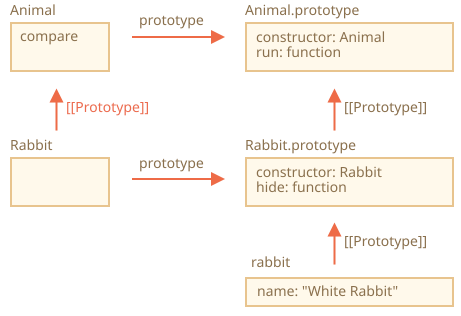

# Các thuộc tính và phương thức tĩnh

Chúng ta cũng có thể gán một phương thức cho chính hàm class, không phải cho `"prototype"` của nó. Các phương thức như vậy được gọi là *static*.

<<<<<<< HEAD
Trong một class, chúng được thêm vào trước bởi từ khóa `static`, như sau:
=======
We can also assign a method to the class as a whole. Such methods are called *static*.

In a class declaration, they are prepended by `static` keyword, like this:
>>>>>>> 1dce5b72b16288dad31b7b3febed4f38b7a5cd8a

```js run
class User {
*!*
  static staticMethod() {
*/!*
    alert(this === User);
  }
}

User.staticMethod(); // true
```

Điều đó thực sự hoạt động giống như là gán trực tiếp nó dưới dạng thuộc tính:

```js run
class User { }

User.staticMethod = function() {
  alert(this === User);
};

User.staticMethod(); // true
```

Giá trị của `this` trong lời gọi `User.staticMethod()` chính là `User` (quy tắc "đối tượng trước dấu chấm").

<<<<<<< HEAD
Các phương thức tĩnh thường được sử dụng để cài đặt các hàm thuộc về class, chứ không phải cho bất kỳ đối tượng cụ thể nào của nó.

Ví dụ, chúng ta có các đối tượng bài báo `Article` và cần một hàm để so sánh chúng. Một giải pháp tự nhiên là thêm phương thức `Article.compare`, như sau:
=======
Usually, static methods are used to implement functions that belong to the class as a whole, but not to any particular object of it.

For instance, we have `Article` objects and need a function to compare them.

A natural solution would be to add `Article.compare` static method:
>>>>>>> 1dce5b72b16288dad31b7b3febed4f38b7a5cd8a

```js run
class Article {
  constructor(title, date) {
    this.title = title;
    this.date = date;
  }

*!*
  static compare(articleA, articleB) {
    return articleA.date - articleB.date;
  }
*/!*
}

// cách dùng
let articles = [
  new Article("HTML", new Date(2019, 1, 1)),
  new Article("CSS", new Date(2019, 0, 1)),
  new Article("JavaScript", new Date(2019, 11, 1))
];

*!*
articles.sort(Article.compare);
*/!*

alert( articles[0].title ); // CSS
```

<<<<<<< HEAD
Ở đây `Article.compare` ở "phía trên" các đối tượng bài báo, như là một phương tiện để so sánh chúng. Nó không phải là phương thức của một đối tượng bài báo nào, mà là của cả class.

Một ví dụ khác là một phương thức gọi là "factory". Hãy tưởng tượng, chúng ta cần một số cách để tạo một bài báo:
=======
Here `Article.compare` method stands "above" articles, as a means to compare them. It's not a method of an article, but rather of the whole class.

Another example would be a so-called "factory" method.

Let's say, we need multiple ways to create an article:
>>>>>>> 1dce5b72b16288dad31b7b3febed4f38b7a5cd8a

1. Tạo bằng cách cung cấp các tham số (`title`, `date` v.v.).
2. Tạo một bài báo rỗng với ngày tháng hiện tại.
3. ... hoặc bằng cách khác nào đó.

Cách đầu tiên có thể được cài đặt bằng constructor. Đối với cách thứ hai chúng ta có thể tạo một phương thức tĩnh của class.

<<<<<<< HEAD
Giống như `Article.createTodays()` ở đây:
=======
Such as `Article.createTodays()` here:
>>>>>>> 1dce5b72b16288dad31b7b3febed4f38b7a5cd8a

```js run
class Article {
  constructor(title, date) {
    this.title = title;
    this.date = date;
  }

*!*
  static createTodays() {
    // nhớ rằng, this = Article
    return new this("Tin vắn hôm nay", new Date());
  }
*/!*
}

let article = Article.createTodays();

alert( article.title ); // Tin vắn hôm nay
```

Bây giờ mỗi khi chúng ta cần tạo một tin vắn hôm nay, chúng ta có thể gọi `Article.createTodays()`. Một lần nữa, đó không phải là một phương thức của một đối tượng bài báo, mà là của cả class.

Các phương thức tĩnh cũng được sử dụng trong các class liên quan đến cơ sở dữ liệu để tìm kiếm/lưu trữ/xóa các mục dữ liệu khỏi cơ sở dữ liệu, như thế này:

```js
<<<<<<< HEAD
// giả sử Article là một class đặc biệt để quản lý các bài báo
// phương thức tĩnh để xóa bài báo là:
Article.remove({id: 12345});
```

## Các thuộc tính tĩnh
=======
// assuming Article is a special class for managing articles
// static method to remove the article by id:
Article.remove({id: 12345});
```

````warn header="Static methods aren't available for individual objects"
Static methods are callable on classes, not on individual objects.

E.g. such code won't work:

```js
// ...
article.createTodays(); /// Error: article.createTodays is not a function
```
````

## Static properties
>>>>>>> 1dce5b72b16288dad31b7b3febed4f38b7a5cd8a

[recent browser=Chrome]

Các thuộc tính tĩnh cũng có thể tồn tại, chúng trông giống như các thuộc tính thông thường của class nhưng được thêm vào trước bởi từ khóa `static`:

```js run
class Article {
  static publisher = "Ilya Kantor";
}

alert( Article.publisher ); // Ilya Kantor
```

Điều đó cũng giống như là gán trực tiếp cho `Article`:

```js
Article.publisher = "Ilya Kantor";
```

## Sự kế thừa các phương thức và thuộc tính tĩnh [#statics-and-inheritance]

Các phương thức và thuộc tính tĩnh cũng được kế thừa.

Ví dụ, `Animal.compare` và `Animal.planet` trong đoạn mã dưới đây được kế thừa và có thể truy cập như là `Rabbit.compare` và `Rabbit.planet`:

```js run
class Animal {
  static planet = "Trái đất";

  constructor(name, speed) {
    this.speed = speed;
    this.name = name;
  }

  run(speed = 0) {
    this.speed += speed;
    alert(`${this.name} chạy với tốc độ ${this.speed}.`);
  }

*!*
  static compare(animalA, animalB) {
    return animalA.speed - animalB.speed;
  }
*/!*

}

// Kế thừa từ Animal
class Rabbit extends Animal {
  hide() {
    alert(`${this.name} ẩn nấp!`);
  }
}

let rabbits = [
  new Rabbit("Thỏ Trắng", 10),
  new Rabbit("Thỏ Đen", 5)
];

*!*
rabbits.sort(Rabbit.compare);
*/!*

rabbits[0].run(); // Thỏ Đen chạy với tốc độ 5.

alert(Rabbit.planet); // Trái đất
```

Bây giờ khi chúng ta gọi `Rabbit.compare`, phương thức được kế thừa `Animal.compare` sẽ được gọi.

Nó hoạt động như thế nào? Một lần nữa, lại sử dụng các nguyên mẫu. Có thể bạn đã đoán được, `extends` cung cấp cho `Rabbit` tham chiếu `[[Prototype]]` tới `Animal`.



Vì vậy, `Rabbit extends Animal` tạo ra hai tham chiếu `[[Prototype]]`:

1. Hàm `Rabbit` kế thừa nguyên mẫu từ hàm `Animal`.
2. `Rabbit.prototype` kế thừa nguyên mẫu từ `Animal.prototype`.

Kết quả là, kế thừa hoạt động cho cả phương thức thông thường và phương thức tĩnh.

Đây, hãy kiểm tra điều đó bằng đoạn mã:

```js run
class Animal {}
class Rabbit extends Animal {}

// for statics
alert(Rabbit.__proto__ === Animal); // true

// for regular methods
alert(Rabbit.prototype.__proto__ === Animal.prototype); // true
```

## Tóm tắt

Các phương thức tĩnh được sử dụng cho chức năng thuộc về class "nói chung". Nó không liên quan đến một đối tượng cụ thể.

Ví dụ, một phương thức dùng để so sánh `Article.compare(article1, article2)` hoặc một phương thức dùng để tạo ra đối tượng `Article.createTodays()`.

Chúng được gắn nhãn bằng từ khóa `static` trong khai báo lớp.

Các thuộc tính tĩnh được sử dụng khi chúng ta muốn lưu trữ dữ liệu ở mức class, và cũng không bị ràng buộc với một đối tượng nào.

Cú pháp là:

```js
class MyClass {
  static property = ...;

  static method() {
    ...
  }
}
```

Về mặt kỹ thuật, khai báo tĩnh cũng giống như việc gán cho chính class:

```js
MyClass.property = ...
MyClass.method = ...
```

Các thuộc tính và phương thức tĩnh được kế thừa.

Đối với `class B extends A` nguyên mẫu của class `B` trỏ đến class `A`: `B.[[Prototype]] = A`. Vì vậy, nếu một trường không được tìm thấy trong `B`, thì việc tìm kiếm sẽ tiếp tục trong `A`.
