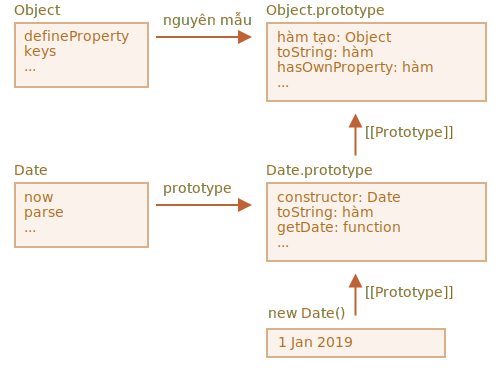

# Mở rộng các class dựng sẵn

Các class dựng sẵn như Array, Map và các class khác cũng có thể mở rộng được.

Chẳng hạn, ở đây `PowerArray` kế thừa từ `Array` gốc:

```js run
// thêm một phương thức nữa vào nó (có thể làm nhiều hơn)
class PowerArray extends Array {
  isEmpty() {
    return this.length === 0;
  }
}

let arr = new PowerArray(1, 2, 5, 10, 50);
alert(arr.isEmpty()); // false

let filteredArr = arr.filter(item => item >= 10);
alert(filteredArr); // 10, 50
alert(filteredArr.isEmpty()); // false
```

Hãy lưu ý một điều rất thú vị. Các phương thức tích hợp sẵn như `filter`, `map` và các phương thức khác -- trả về các đối tượng mới thuộc loại chính xác `PowerArray` được kế thừa. Việc triển khai nội bộ của chúng sử dụng thuộc tính `constructor` của đối tượng cho điều đó.

Trong ví dụ trên,
```js
arr.constructor === PowerArray
```

Khi `arr.filter()` được gọi, nó sẽ tạo array kết quả mới bên trong bằng cách sử dụng chính xác `arr.constructor`, chứ không phải `Array` cơ bản. Điều đó thực sự rất tuyệt, bởi vì chúng ta có thể tiếp tục sử dụng các phương thức `PowerArray` cho kết quả.

Hơn nữa, chúng ta có thể tùy chỉnh hành vi đó.

Chúng ta có thể thêm một getter tĩnh đặc biệt `Symbol.species` vào class. Nếu nó tồn tại, nó sẽ trả về hàm tạo mà JavaScript sẽ sử dụng nội bộ để tạo các thực thể mới trong `map`, `filter`, v.v.

Nếu muốn các phương thức tích hợp sẵn như `map` hoặc `filter` trả về các array thông thường, chúng ta có thể trả về `Array` trong `Symbol.species`, như sau:

```js run
class PowerArray extends Array {
  isEmpty() {
    return this.length === 0;
  }

*!*
  // các phương thức tích hợp sẽ sử dụng phương thức này làm hàm tạo
  static get [Symbol.species]() {
    return Array;
  }
*/!*
}

let arr = new PowerArray(1, 2, 5, 10, 50);
alert(arr.isEmpty()); // false

// bộ lọc tạo array mới bằng cách sử dụng arr.constructor[Symbol.species] làm hàm tạo
let filteredArr = arr.filter(item => item >= 10);

*!*
// filterArr không phải là PowerArray, mà là Array
*/!*
alert(filteredArr.isEmpty()); // Error: filteredArr.isEmpty is not a function
```

Như bạn có thể thấy, bây giờ `.filter` trả về `Array`. Vì vậy, hàm mở rộng không được thông qua nữa.

```smart header="Các bộ sưu tập khác hoạt động tương tự"
Các bộ sưu tập khác, chẳng hạn như `Map` và `Set`, hoạt động như nhau. Chúng cũng sử dụng `Symbol.species`.
```

## Không có kế thừa tĩnh trong tích hợp

Các đối tượng tích hợp sẵn có các phương thức tĩnh của riêng chúng, chẳng hạn như `Object.keys`, `Array.isArray`, v.v.

Như chúng ta đã biết, các class bản địa mở rộng lẫn nhau. Chẳng hạn, `Array` mở rộng `Object`.

Thông thường, khi một class mở rộng một class khác, cả phương thức tĩnh và không tĩnh đều được kế thừa. Điều đó đã được giải thích cặn kẽ trong bài viết [](info:static-properties-methods#statics-and-inheritance).

Nhưng các class dựng sẵn là một ngoại lệ. Chúng không kế thừa số liệu thống kê từ nhau.

Ví dụ: cả `Array` và `Date` đều kế thừa từ `Object`, vì vậy các phiên bản của chúng có các phương thức từ `Object.prototype`. Nhưng `Array.[[Prototype]]` không tham chiếu `Object`, do đó, chẳng hạn, không có phương thức tĩnh `Array.keys()` (hoặc `Date.keys()`).

Đây là cấu trúc hình ảnh cho `Date` và `Object`:



Như bạn có thể thấy, không có liên kết nào giữa `Date` và `Object`. Chúng độc lập, chỉ có `Date.prototype` kế thừa từ `Object.prototype`

Đó là sự khác biệt quan trọng của tính kế thừa giữa các đối tượng dựng sẵn so với những gì chúng ta nhận được với `extends`.
