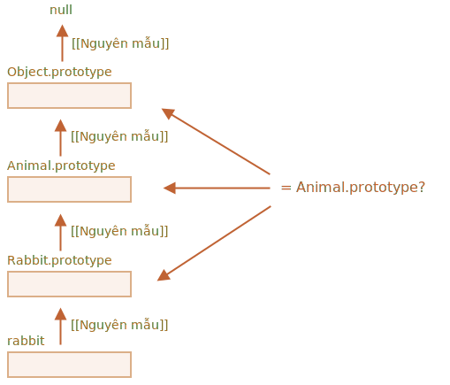

# Kiểm tra class: "instanceof"

Toán tử `instanceof` cho phép kiểm tra xem một đối tượng có thuộc một class nào đó hay không. Nó cũng tính đến sự kế thừa.

Việc kiểm tra như vậy có thể cần thiết trong nhiều trường hợp. Ví dụ: nó có thể được sử dụng để xây dựng hàm *đa hình*, hàm xử lý các đối số khác nhau tùy thuộc vào loại của chúng.

## Toán tử instanceof [#ref-instanceof]

Cú pháp là:
```js
obj instanceof Class
```

Nó trả về `true` nếu `obj` thuộc về `Class` hoặc một class kế thừa từ nó.

Ví dụ:

```js run
class Rabbit {}
let rabbit = new Rabbit();

// nó có phải là đối tượng của class Rabbit không?
*!*
alert( rabbit instanceof Rabbit ); // true
*/!*
```

Nó cũng hoạt động với các hàm tạo:

```js run
*!*
// thay vì class
function Rabbit() {}
*/!*

alert( new Rabbit() instanceof Rabbit ); // true
```

...Và với các class tích hợp như `Array`:

```js run
let arr = [1, 2, 3];
alert( arr instanceof Array ); // true
alert( arr instanceof Object ); // true
```

Hãy lưu ý rằng `arr` cũng thuộc class `Object`. Đó là bởi vì `Array` kế thừa nguyên mẫu từ `Object`.

Thông thường, `instanceof` kiểm tra chuỗi nguyên mẫu để kiểm tra. Chúng ta cũng có thể đặt logic tùy chỉnh trong phương thức tĩnh `Symbol.hasInstance`.

Thuật toán của `obj instanceof Class` hoạt động đại khái như sau:

1. Nếu có một phương thức tĩnh `Symbol.hasInstance`, thì chỉ cần gọi nó là: `Class[Symbol.hasInstance](obj)`. Nó sẽ trả về `true` hoặc `false`, và chúng ta đã hoàn tất. Đó là cách chúng ta có thể tùy chỉnh hành vi của `instanceof`.

    Ví dụ:

    ```js run
    // thiết lập instanceOf kiểm tra giả định rằng
    // bất cứ thứ gì có thuộc tính canEat đều là động vật
    class Animal {
      static [Symbol.hasInstance](obj) {
        if (obj.canEat) return true;
      }
    }

    let obj = { canEat: true };

    alert(obj instanceof Animal); // true: Animal[Symbol.hasInstance](obj) được gọi
    ```

2. Hầu hết các class không có `Symbol.hasInstance`. Trong trường hợp đó, logic tiêu chuẩn được sử dụng: `obj instanceOf Class` kiểm tra xem `Class.prototype` có bằng với một trong các nguyên mẫu trong chuỗi nguyên mẫu `obj` hay không.

    Nói cách khác, so sánh cái này với cái khác:
    ```js
    obj.__proto__ === Class.prototype?
    obj.__proto__.__proto__ === Class.prototype?
    obj.__proto__.__proto__.__proto__ === Class.prototype?
    ...
    // nếu bất kỳ câu trả lời nào là đúng, trả về true
    // ngược lại, nếu chúng ta đến cuối chuỗi, hãy trả về false
    ```

    Trong ví dụ trên `rabbit.__proto__ === Rabbit.prototype`, do đó sẽ đưa ra câu trả lời ngay lập tức.

    Trong trường hợp kế thừa, quá trình sẽ sang bước thứ hai:

    ```js run
    class Animal {}
    class Rabbit extends Animal {}

    let rabbit = new Rabbit();
    *!*
    alert(rabbit instanceof Animal); // true
    */!*

    // rabbit.__proto__ === Rabbit.prototype
    *!*
    // rabbit.__proto__.__proto__ === Animal.prototype (trùng khớp!)
    */!*
    ```

Đây là hình minh họa về những gì `rabbit instanceof Animal` so sánh với `Animal.prototype`:



Nhân tiện, cũng có một phương thức [objA.isPrototypeOf(objB)](mdn:js/object/isPrototypeOf), trả về `true` nếu `objA` nằm ở đâu đó trong chuỗi nguyên mẫu cho `objB`. Vì vậy, bài kiểm tra của `obj instanceof Class` có thể được diễn đạt lại thành `Class.prototype.isPrototypeOf(obj)`.

Thật buồn cười, nhưng bản thân hàm tạo `Class` không tham gia kiểm tra! Chỉ chuỗi nguyên mẫu và `Class.prototype` mới quan trọng.

Điều đó có thể dẫn đến những hậu quả thú vị khi thuộc tính `prototype` bị thay đổi sau khi đối tượng được tạo.

Như ở đây:

```js run
function Rabbit() {}
let rabbit = new Rabbit();

// đã thay đổi nguyên mẫu
Rabbit.prototype = {};

// ...không còn là thỏ nữa!
*!*
alert( rabbit instanceof Rabbit ); // false
*/!*
```

## Bonus: Object.prototype.toString cho loại

Chúng ta đã biết rằng các đối tượng đơn giản được chuyển đổi thành chuỗi dưới dạng `[object Object]`:

```js run
let obj = {};

alert(obj); // [object Object]
alert(obj.toString()); // giống nhau
```

Đó là cách triển khai `toString` của chúng. Nhưng có một tính năng ẩn làm cho `toString` thực sự mạnh hơn thế nhiều. Chúng ta có thể sử dụng nó như một `typeof` mở rộng và thay thế cho `instanceof`.

Thấy lạ không? Thực vậy. Hãy làm sáng tỏ

Theo [thông số kỹ thuật](https://tc39.github.io/ecma262/#sec-object.prototype.tostring), `toString` tích hợp sẵn có thể được trích xuất từ đối tượng và được thực thi trong ngữ cảnh của bất kỳ giá trị nào khác. Và kết quả của nó phụ thuộc vào giá trị đó.

- Đối với một số, nó sẽ là `[object Number]`
- Đối với một boolean, nó sẽ là `[object Boolean]`
- Đối với `null`: `[object Null]`
- Đối với `undefined`: `[object Undefined]`
- Đối với các array: `[object Array]`
- ...v.v (có thể tùy chỉnh).

Hãy chứng minh:

```js run
// sao chép phương thức toString vào một biến để thuận tiện
let objectToString = Object.prototype.toString;

// đây là loại gì?
let arr = [];

alert( objectToString.call(arr) ); // [object *!*Array*/!*]
```

Ở đây, chúng ta đã sử dụng [call](mdn:js/function/call) như được mô tả trong chương [](info:call-apply-decorators) để thực thi hàm `objectToString` trong ngữ cảnh `this=arr`.

Bên trong, thuật toán `toString` kiểm tra `this` và trả về kết quả tương ứng. Thêm ví dụ:

```js run
let s = Object.prototype.toString;

alert( s.call(123) ); // [object Number]
alert( s.call(null) ); // [object Null]
alert( s.call(alert) ); // [object Function]
```

### Symbol.toStringTag

Hành vi của Đối tượng `toString` có thể được tùy chỉnh bằng thuộc tính đối tượng đặc biệt `Symbol.toStringTag`.

Ví dụ:

```js run
let user = {
  [Symbol.toStringTag]: "User"
};

alert( {}.toString.call(user) ); // [object User]
```

Đối với hầu hết các đối tượng dành riêng cho môi trường, có một thuộc tính như vậy. Dưới đây là một số ví dụ cụ thể về trình duyệt:

```js run
// toStringTag cho class và đối tượng dành riêng cho môi trường:
alert( window[Symbol.toStringTag]); // Window
alert( XMLHttpRequest.prototype[Symbol.toStringTag] ); // XMLHttpRequest

alert( {}.toString.call(window) ); // [object Window]
alert( {}.toString.call(new XMLHttpRequest()) ); // [object XMLHttpRequest]
```

Như bạn có thể thấy, kết quả chính xác là `Symbol.toStringTag` (nếu tồn tại), được bao bọc trong `[object...]`.

Cuối cùng, chúng ta có "typeof on steroids" không chỉ hoạt động với các kiểu dữ liệu nguyên thủy mà còn cho các đối tượng tích hợp sẵn và thậm chí có thể được tùy chỉnh.

Chúng ta có thể sử dụng `{}.toString.call` thay vì `instanceof` cho các đối tượng tích hợp khi chúng ta muốn lấy loại dưới dạng chuỗi thay vì chỉ để kiểm tra.

## Tóm tắt

Hãy tóm tắt các phương pháp kiểm tra loại mà chúng ta biết:

|               | hoạt động với |  trả về      |
|---------------|-------------|---------------|
| `typeof`      | đối tượng nguyên thuỷ  |  chuỗi       |
| `{}.toString` | đối tượng nguyên thuỷ, đối tượng tích hợp, đối tượng với `Symbol.toStringTag`   |       chuỗi |
| `instanceof`  | đối tượng     |  true/false   |

Như chúng ta có thể thấy, `{}.toString` về mặt kỹ thuật là một `typeof` "cao cấp hơn".

Và toán tử `instanceof` thực sự tỏa sáng khi chúng ta làm việc với hệ thống phân cấp class và muốn kiểm tra class có tính đến tính kế thừa hay không.
