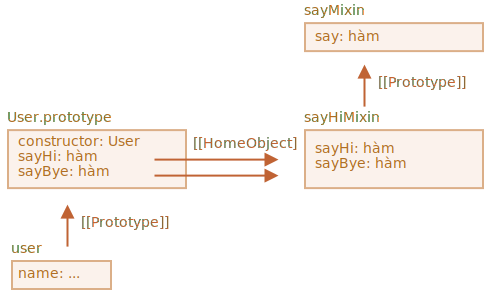

# Mixin

Trong JavaScript, chúng ta chỉ có thể kế thừa từ một đối tượng duy nhất. Chỉ có thể có một `[[Prototype]]` cho một đối tượng. Và một class chỉ có thể mở rộng một class khác.

Nhưng đôi khi điều đó cảm thấy hạn chế. Chẳng hạn, chúng ta có một class `StreetSweeper` và một class `Bicycle`, và muốn kết hợp chúng: một `StreetSweepingBicycle`.

Hoặc chúng ta có một class `User` và một class `EventEmitter` thực hiện tạo sự kiện và chúng ta muốn thêm hàm của `EventEmitter` vào `User` để người dùng của chúng ta có thể tạo ra các sự kiện.

Có một khái niệm có thể hữu ích ở đây, được gọi là "mixin".

Theo định nghĩa trong Wikipedia, một [mixin](https://en.wikipedia.org/wiki/Mixin) là một class chứa các phương thức có thể được sử dụng bởi các class khác mà không cần kế thừa từ nó.

Nói cách khác, *mixin* cung cấp các phương thức thực hiện một hành vi nhất định, nhưng chúng ta không sử dụng nó một mình, chúng ta sử dụng nó để thêm hành vi vào các class khác.

## Một ví dụ mixin

Cách đơn giản nhất để triển khai mixin trong JavaScript là tạo một đối tượng bằng các phương thức hữu ích, để chúng ta có thể dễ dàng hợp nhất chúng thành một nguyên mẫu của bất kỳ class nào.

Ví dụ ở đây, mixin `sayHiMixin` được sử dụng để thêm một số "lời nói" cho `User`:

```js run
*!*
// mixin
*/!*
let sayHiMixin = {
  sayHi() {
    alert(`Xin chào ${this.name}`);
  },
  sayBye() {
    alert(`Tạm biệt ${this.name}`);
  }
};

*!*
// cách sử dụng:
*/!*
class User {
  constructor(name) {
    this.name = name;
  }
}

// sao chép các phương thức
Object.assign(User.prototype, sayHiMixin);

// bây giờ User có thể nói xin chào
new User("anh bạn").sayHi(); // Xin chào anh bạn!
```

Không có kế thừa, nhưng một phương thức sao chép đơn giản. Vì vậy, `User` có thể kế thừa từ một class khác và cũng bao gồm mixin để "kết hợp" các phương thức bổ sung, như sau:

```js
class User extends Person {
  // ...
}

Object.assign(User.prototype, sayHiMixin);
```

Mixin có thể tận dụng sự kế thừa bên trong chính chúng.

Chẳng hạn, ở đây `sayHiMixin` kế thừa từ `sayMixin`:

```js run
let sayMixin = {
  say(phrase) {
    alert(phrase);
  }
};

let sayHiMixin = {
  __proto__: sayMixin, // (hoặc chúng ta có thể sử dụng Object.setPrototypeOf để đặt nguyên mẫu tại đây)

  sayHi() {
    *!*
    // gọi phương thức gốc
    */!*
    super.say(`Xin chào ${this.name}`); // (*)
  },
  sayBye() {
    super.say(`Tạm biệt ${this.name}`); // (*)
  }
};

class User {
  constructor(name) {
    this.name = name;
  }
}

// sao chép các phương thức
Object.assign(User.prototype, sayHiMixin);

// bây giờ User có thể nói xin chào
new User("anh bạn").sayHi(); // Xin chào anh bạn!
```

Hãy lưu ý rằng cuộc gọi đến phương thức gốc `super.say()` từ `sayHiMixin` (tại các dòng được gắn nhãn `(*)`) sẽ tìm phương thức trong nguyên mẫu của mixin đó, chứ không phải class.

Đây là sơ đồ (xem phần bên phải):



Đó là bởi vì các phương thức `sayHi` và `sayBye` ban đầu được tạo trong `sayHiMixin`. Vì vậy, mặc dù chúng đã được sao chép, nhưng tham chiếu thuộc tính bên trong `[[HomeObject]]` của chúng là `sayHiMixin`, như minh họa trong hình trên.

Vì `super` tìm kiếm các phương thức gốc trong `[[HomeObject]].[[Prototype]]`, điều đó có nghĩa là nó tìm kiếm `sayHiMixin.[[Prototype]]`.

## EventMixin

Bây giờ hãy tạo một mixin cho cuộc sống thực.

Một tính năng quan trọng của nhiều đối tượng trình duyệt (ví dụ) là chúng có thể tạo ra các sự kiện. Các sự kiện là một cách tuyệt vời để "phát thông tin" cho bất kỳ ai muốn. Vì vậy, hãy tạo một mixin cho phép chúng ta dễ dàng thêm các hàm liên quan đến sự kiện vào bất kỳ class/đối tượng nào.

- Mixin sẽ cung cấp phương thức `.trigger(name, [...data])` để "tạo sự kiện" khi có điều gì đó quan trọng xảy ra với nó. Đối số `name` là tên của sự kiện, tùy chọn theo sau là các đối số bổ sung có dữ liệu sự kiện.
- Ngoài ra, phương thức `.on(name, handler)` có thêm hàm `handler` làm trình nghe các sự kiện có tên đã cho. Nó sẽ được gọi khi một sự kiện có trình kích hoạt `name` đã cho và nhận các đối số từ lệnh gọi `.trigger`.
- ...Và phương thức `.off(name, handler)` loại bỏ trình nghe `handler`.

Sau khi thêm mixin, đối tượng `user` sẽ có thể tạo sự kiện `"login"` khi khách truy cập đăng nhập. Và một đối tượng khác, chẳng hạn như `calendar` có thể muốn nghe các sự kiện như vậy để tải lịch cho người đăng nhập.

Hoặc, `menu` có thể tạo sự kiện `"select"` khi một mục menu được chọn và các đối tượng khác có thể chỉ định trình xử lý để phản ứng với sự kiện đó. Và như thế.

Đây là mã:

```js run
let eventMixin = {
  /**
   * Theo dõi sự kiện, cách sử dụng:
   *  menu.on('select', function(item) { ... }
  */
  on(eventName, handler) {
    if (!this._eventHandlers) this._eventHandlers = {};
    if (!this._eventHandlers[eventName]) {
      this._eventHandlers[eventName] = [];
    }
    this._eventHandlers[eventName].push(handler);
  },

  /**
   * Hủy theo dõi, cách sử dụng:
   *  menu.off('select', handler)
   */
  off(eventName, handler) {
    let handlers = this._eventHandlers?.[eventName];
    if (!handlers) return;
    for (let i = 0; i < handlers.length; i++) {
      if (handlers[i] === handler) {
        handlers.splice(i--, 1);
      }
    }
  },

  /**
   * Tạo một sự kiện với tên và dữ liệu đã cho
   *  this.trigger('select', data1, data2);
   */
  trigger(eventName, ...args) {
    if (!this._eventHandlers?.[eventName]) {
      return; // không có trình xử lý nào cho tên sự kiện đó
    }

    // gọi trình xử lý
    this._eventHandlers[eventName].forEach(handler => handler.apply(this, args));
  }
};
```


- `.on(eventName, handler)` -- chỉ định hàm `handler` để chạy khi sự kiện có tên đó xảy ra. Về mặt kỹ thuật, có một thuộc tính `_eventHandlers` lưu trữ một array các trình xử lý cho từng tên sự kiện và thuộc tính này chỉ cần thêm sự kiện đó vào danh sách.
- `.off(eventName, handler)` -- xóa hàm khỏi danh sách xử lý.
- `.trigger(eventName, ...args)` -- tạo sự kiện: tất cả các trình xử lý từ `_eventHandlers[eventName]` được gọi, với một danh sách các đối số `...args`.

Cách sử dụng:

```js run
// Tạo một class
class Menu {
  choose(value) {
    this.trigger("lựa chọn", value);
  }
}
// Thêm mixin với các phương thức liên quan đến sự kiện
Object.assign(Menu.prototype, eventMixin);

let menu = new Menu();

// thêm một trình xử lý, để được gọi khi lựa chọn:
*!*
menu.on("lựa chọn", value => alert(`Giá trị đã chọn: ${value}`));
*/!*

// kích hoạt sự kiện => trình xử lý ở trên chạy và hiển thị:
// Giá trị đã chọn: 123
menu.choose("123");
```

Bây giờ, nếu chúng ta muốn bất kỳ mã nào phản ứng với lựa chọn menu, chúng ta có thể nghe mã đó bằng `menu.on(...)`.

Và mixin `eventMixin` giúp dễ dàng thêm hành vi như vậy vào bao nhiêu class tùy thích mà không can thiệp vào chuỗi kế thừa.

## Tóm tắt

*Mixin* -- là một thuật ngữ lập trình hướng đối tượng chung: một class chứa các phương thức cho các class khác.

Một số ngôn ngữ khác cho phép đa kế thừa. JavaScript không hỗ trợ đa kế thừa, nhưng mixin có thể được triển khai bằng cách sao chép các phương thức vào nguyên mẫu.

Chúng ta có thể sử dụng mixin như một cách để tăng cường class bằng cách thêm nhiều hành vi, như xử lý sự kiện như chúng ta đã thấy ở trên.

Mixin có thể trở thành một điểm xung đột nếu chúng vô tình ghi đè lên các phương thức class hiện có. Vì vậy, nói chung, người ta nên suy nghĩ kỹ về các phương pháp đặt tên của mixin, để giảm thiểu khả năng xảy ra điều đó.
