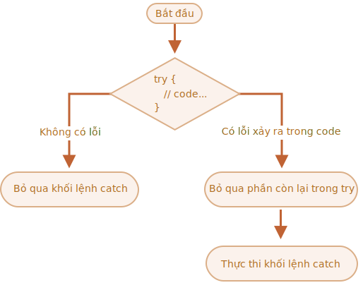

# Xử lý lỗi, "try...catch"

Cho dù chúng ta giỏi lập trình đến đâu, đôi khi tập lệnh của chúng ta có lỗi. Chúng có thể xảy ra do sai lầm của chúng ta, do một đầu vào không ngờ đến từ người dùng, do một lỗi phản hồi của máy chủ, và hàng ngàn lý do khác.

Thông thường, khi có lỗi xảy ra, tập lệnh sẽ "chết" (dừng ngay lập tức) và in ra màn hình console.

Tuy nhiên có một cấu trúc cú pháp `try...catch` cho phép chúng ta "bắt" lỗi để tập lệnh có thể làm điều gí đó hợp lý hơn thay vì chết.

## Cú pháp "try...catch"

Cấu trúc `try...catch` có hai phần chính là: `try` và `catch`:

```js
try {

  // code...

} catch (err) {

  // xử lý lỗi

}
```

Nó thực hiện các bước sau:

1. Đầu tiên, code trong `try {...}` được thực thi.
2. Nếu không có lỗi, thì `catch (err)` sẽ bị bỏ qua: quá trình thực thi sẽ bỏ qua `catch` sau khi kết thúc khối `try`.
3. Nếu có lỗi xảy ra, thì quá trình thực thi khối `try` sẽ dừng lại, và chuyển sang bắt đầu khối `catch (err)`. Biến `err` (chúng ta có thể sử dụng bất kỳ tên nào) sẽ chứa một đối tượng lỗi với chi tiết về những điều đã xảy ra.


Vì vậy, một lỗi trong khối `try {...}` không làm chết tập lệnh -- chúng ta có cơ hội xử lý nó ở trong `catch`.

Hãy xem một số ví dụ sau.

- Ví dụ không có lỗi: hiển thị `alert` `(1)` và `(2)`:

    ```js run
    try {

      alert('Bắt đầu chạy khối try');  // *!*(1) <--*/!*

      // ...không có lỗi

      alert('Kết thúc chạy khối try');   // *!*(2) <--*/!*

    } catch (err) {

      alert('Khối catch bị bỏ qua, vì không có lỗi'); // (3)

    }
    ```
- Ví dụ có lỗi: hiển thị `(1)` và `(3)`:

    ```js run
    try {

      alert('Bắt đầu chạy khối try');  // *!*(1) <--*/!*

    *!*
      lalala; // lỗi, biến không xác định!
    */!*

      alert('Kết thúc khối try (không được thực thi)');  // (2)

    } catch (err) {

      alert(`Có lỗi xảy ra!`); // *!*(3) <--*/!*

    }
    ```


````warn header="`try...catch` chỉ hoạt động với các lỗi trong thời gian chạy"
Để `try...catch` hoạt động, code phải thực thi được. Nói cách khác, nó phải là code JavaScript hợp lệ.

Nó sẽ không hoạt động nếu code có lỗi cú pháp, chẳng hạn như dấu ngoặc nhọn không khớp:

```js run
try {
  {{{{{{{{{{{{
} catch (err) {
  alert("JavaScript engine không thể hiểu lỗi này, nó không hợp lệ");
}
```

Đầu tiên, JavaScript engine đọc code, sau đó chạy code. Các lỗi xảy ra trong thời gian đọc được gọi là lỗi "parse-time" và không thể khôi phục được (từ bên trong code). Đó là bởi vì engine không thể hiểu code.

Vì vậy, `try...catch` chỉ có thể xử lý lỗi xảy ra trong code hợp lệ. Các lỗi này được gọi là "runtime errors" hoặc, đôi khi là "exceptions".
````


````warn header="`try...catch` hoạt động đồng bộ"
Nếu một ngoại lệ xảy ra trong code "đã lên lịch", như trong `setTimeout` thì `try...catch` sẽ không bắt được:

```js run
try {
  setTimeout(function() {
    noSuchVariable; // tập lệnh sẽ chết ở đây
  }, 1000);
} catch (err) {
  alert( "sẽ không hoạt động" );
}
```

Đó là bởi vì hàm trong code "đã lên lịch" được thực thi sau, khi engine đã rời khỏi cấu trúc `try...catch`.

Để bắt được ngoại lệ bên trong một hàm đã lên lịch, `try...catch` phải nằm bên trong hàm đó:
```js run
setTimeout(function() {
  try {    
    noSuchVariable; // try...catch xử lý lỗi!
  } catch {
    alert( "lỗi được bắt ở đây!" );
  }
}, 1000);
```
````

## Đối tượng error

Khi xảy ra lỗi, JavaScript sẽ tạo một đối tượng chứa chi tiết về lỗi đó. Sau đó chuyển đối tượng đó thành đối số để `catch`:

```js
try {
  // ...
} catch (err) { // <-- "đối tượng error", có thể sử dụng tên khác thay cho err
  // ...
}
```

Với tất cả các lỗi đã dựng sẵn, đối tượng error có hai thuộc tính chính:

`name`
: Tên lỗi. Ví dụ, đối với một biến không xác định là `"ReferenceError"`.

`message`
: Một văn bản mô tả chi tiết về lỗi.

Các thuộc tính không chuẩn khác có sẵn trong hầu hết các môi trường. Được sử dụng và hỗ trợ rộng rãi nhất là:

`stack`
: Ngăn xếp lần gọi hiện tại: một chuỗi có thông tin về chuỗi các lần gọi lồng nhau dẫn đến lỗi. Được sử dụng cho mục đích gỡ lỗi.

Ví dụ:

```js run untrusted
try {
*!*
  lalala; // lỗi, biến không xác định!
*/!*
} catch (err) {
  alert(err.name); // ReferenceError
  alert(err.message); // lalala is not defined
  alert(err.stack); // ReferenceError: lalala is not defined at (...call stack)

  // Có thể hiển thị toàn bộ lỗi
  // Thông báo lỗi được chuyển thành một chuỗi như "name: message"
  alert(err); // ReferenceError: lalala is not defined
}
```

## Tùy chọn ràng buộc "catch"

[recent browser=new]

Nếu chúng ta không cần thông tin về chi tiết lỗi, `catch` có thể bỏ qua nó:

```js
try {
  // ...
} catch { // <-- không có (err)
  // ...
}
```

## Sử dụng "try...catch"

Hãy khám phá một trường hợp sử dụng `try...catch` trong thực tế.

Như chúng ta đã biết, JavaScript hỗ trợ phương thức [JSON.parse(str)](mdn:js/JSON/parse) để phân tích chuỗi mã hóa dạng JSON.

Thông thường nó được sử dụng để phân tích dữ liệu nhận được từ mạng, từ server hoặc là từ nguồn khác.

Sau khi nhận được dữ liệu thì chúng ta sẽ gọi `JSON.parse` như thế này:

```js run
let json = '{"name":"John", "age": 30}'; // dữ liệu từ server

*!*
let user = JSON.parse(json); // chuyển đổi dạng văn bản thành đối tượng JS
*/!*

// bây giờ user là một đối tượng có các thuộc tính được phân tích từ chuỗi
alert( user.name ); // John
alert( user.age );  // 30
```

Bạn có thể tìm thêm thông tin về JSON trong chương <info:json>.

**Nếu `json` không đúng định dạng, `JSON.parse` sẽ phát sinh lỗi, do đó tập lệnh sẽ "chết".**

Chúng ta có hài lòng với điều đó không? Dĩ nhiên là không!

Khi bạn làm điều này, khi có vấn đề với dữ liệu, khách truy cập sẽ không bao giờ biết tại sao (trừ khi họ mở giao diện console lên). Và người ta sẽ không thích nếu một cái gì đó "tự nhiên chết" mà không thông báo một lỗi nào.

Thử sử dụng `try...catch` để xử lý lỗi:

```js run
let json = "{ bad json }";

try {

*!*
  let user = JSON.parse(json); // <-- khi xảy ra lỗi...
*/!*
  alert( user.name ); // không chạy

} catch (err) {
*!*
  // ...việc thực thi sẽ nhảy đến đây
  alert( "Rất tiếc, dữ liệu có lỗi, chúng tôi sẽ cố gắng lấy lai nó một lần nữa." );
  alert( err.name );
  alert( err.message );
*/!*
}
```

Ở đây chúng tôi chỉ sử dụng khối `catch` để hiển thị thông tin, nhưng chúng ta có thể làm nhiều hơn: gửi một yêu cầu mới, đề xuất giải pháp thay thế cho người dùng, gửi thông tin về lỗi tới thiết bị ghi log, ... . Tất cả đều tốt hơn là cứ để code bị chết.

## Ném ra lỗi của chính chúng ta

Điều gì sẽ xảy ra nếu `json` đúng về mặt cú pháp, nhưng không có thuộc tính bắt buộc `name`?

Giống như này:

```js run
let json = '{ "age": 30 }'; // dữ liệu không đầy đủ

try {

  let user = JSON.parse(json); // <-- không có lỗi
*!*
  alert( user.name ); // không có name!
*/!*

} catch (err) {
  alert( "không thực hiện" );
}
```

Ở đây `JSON.parse` chạy bình thường, nhưng thuộc tính `name` bị thiếu thực sự là một lỗi của chúng ta.

Để xử lý lỗi thống nhất, chúng ta sẽ sử dụng toán tử `throw`.

### Toán tử "throw"

Toán tử `throw` tạo ra một lỗi.

Cú pháp như sau:

```js
throw <error object>
```

Về mặt kỹ thuật, chúng ta có thể sử dụng bất cứ thứ gì để làm đối tượng lỗi. Nó thậm chí có thể là dữ liệu kiểu nguyên thủy, chẳng hạn như một số hay một chuỗi, nhưng tốt hơn nên sử dụng một đối tượng, tốt hơn nữa là một đối tượng với các thuộc tính `name` và `message` (để tương thích phần nào với các lỗi đã tích hợp sẵn).

JavaScript có nhiều hàm khởi tạo tích hợp sẵn cho các lỗi tiêu chuẩn: `Error`, `SyntaxError`, `ReferenceError`, `TypeError` và nhiều lỗi khác. Chúng ta cũng có thể sử dụng chúng để tạo các đối tượng lỗi.

Cú pháp của chúng là:

```js
let error = new Error(message);
// hoặc
let error = new SyntaxError(message);
let error = new ReferenceError(message);
// ...
```

Đối với các lỗi tích hợp sẵn (không dành có đối tượng nào khác, chỉ dành cho lỗi), thuộc tính `name` sẽ là tên của hàm khởi tạo. Và `message` được lấy từ đối số.

Ví dụ:

```js run
let error = new Error("Vài thứ đã xảy ra o_O");

alert(error.name); // Error
alert(error.message); // Vài thứ đã xảy ra o_O
```

Hãy xem loại lỗi mà `JSON.parse` tạo ra:

```js run
try {
  JSON.parse("{ bad json o_O }");
} catch (err) {
*!*
  alert(err.name); // SyntaxError
*/!*
  alert(err.message); // Unexpected token b in JSON at position 2
}
```

Như chúng ta có thể thấy, đó là một `SyntaxError`.

Trong ví dụ của chúng ta, việc thiếu thuộc tính `name` là một lỗi, vì người dùng phải có `name`.

Vì vậy hãy ném ra lỗi này:

```js run
let json = '{ "age": 30 }'; // dữ liệu không đầy đủ

try {

  let user = JSON.parse(json); // <-- không có lỗi

  if (!user.name) {
*!*
    throw new SyntaxError("Dữ liệu không đầy đủ: không có name"); // (*)
*/!*
  }

  alert( user.name );

} catch (err) {
  alert( "JSON Error: " + err.message ); // JSON Error: Dữ liệu không đầy đủ: không có name
}
```

Trên dòng `(*)`, toán tử `throw` ném ra một lỗi `SyntaxError` chứa `message` mà chúng ta đưa vào, giống như cách mà chính JavaScript đã tạo ra nó. Việc thực hiện `try` sẽ dừng ngay lập tức và nhảy sang khối `catch`.

Bây giờ `catch` trở thành nơi duy nhất cho việc xử lý lỗi: cho cả `JSON.parse` và những thứ khác.

## Ném lại (rethrowing)

Trong ví dụ trên chúng ta sử dụng `try...catch` để xử lý dữ liệu không chính xác. Nhưng liệu có thể xảy ra *một lỗi ngoài ý muốn khác* bên trong khối `try {...}` không? Chẳng hạn như lỗi lập trình (biến không xác định) hoặc các lỗi khác, không chỉ là `dữ liệu không chính xác`.

Ví dụ:

```js run
let json = '{ "age": 30 }'; // dữ liệu không đầy đủ

try {
  user = JSON.parse(json); // <-- quên đặt "let" trước user
  // ...
} catch (err) {
  alert("Lỗi JSON: " + err); // Lỗi JSON: ReferenceError: user is not defined
  // (thực ra không phải lỗi JSON)
}
```

Tất nhiên, mọi thứ đều có thể xảy ra! Lập trình viên cũng phạm sai lầm. Ngay cả trong một dự án mã nguồn mở được sử dụng bởi hàng triệu người trong nhiều thập kỷ -- một lỗi đột nhiên có thể được phát hiện và dẫn đến một vụ hack khủng khiếp.

Trong trường hợp của chúng ta, `try...catch`  được thiết kế để phát hiện lỗi "dữ liệu không chính xác". Nhưng trên thực tế, `catch` sẽ bắt *tất cả* lỗi từ `try`. Tại đây nó phát hiện một lỗi không mong muốn nhưng vẫn đưa ra thông báo `"Lỗi JSON"`. Điều này là không chính xác và cũng làm cho code khó debug hơn.

Để tránh những vấn đề như vậy, chúng ta có thể sử dụng kỹ thuật "ném lại". Quy tắc rất đơn giản:

**Catch chỉ nên xử lý các lỗi mà nó biết và "ném lại" tất cả lỗi khác.**

Kỹ thuật "ném lại" có thể được giải thích chi tiết hơn như sau: 

1. Catch bắt tất cả các lỗi.
2. Trong khối `catch (err) {...}` chúng ta phân tích đối tượng lỗi `err`.
3. Nếu chúng ta không biết cách xử lý nó, chúng ta sẽ `throw err`.

Thông thường, chúng ta có thể sử dụng toán tử `instanceof` để xác định loại lỗi: 

```js run
try {
  user = { /*...*/ };
} catch (err) {
*!*
  if (err instanceof ReferenceError) {
*/!*
    alert('ReferenceError'); // truy cập một biến không xác định sẽ tạo ra lỗi "ReferenceError"
  }
}
```

Chúng ta cũng có thể lấy tên lớp lỗi từ thuộc tính `err.name`. Tất cả các lỗi mặc định đều có thuộc tính này. Một cách khác là lấy từ `err.constructor.name`.

Trong đoạn code sau, chúng ta sử dụng rethrowing để chỉ `catch` những lỗi `SyntaxError`:

```js run
let json = '{ "age": 30 }'; // dữ liệu không đầy đủ
try {

  let user = JSON.parse(json);

  if (!user.name) {
    throw new SyntaxError("Dữ liệu không đầy đủ: không có  name");
  }

*!*
  blabla(); // lỗi không mong muốn
*/!*

  alert( user.name );

} catch (err) {

*!*
  if (err instanceof SyntaxError) {
    alert( "JSON Error: " + err.message );
  } else {
    throw err; // ném lại (*)
  }
*/!*

}
```

Lỗi xuất hiện trên dòng `(*)` từ bên trong khối `catch` "rơi ra" của `try..catch` có thể bị bắt bởi cấu trúc `try...catch` bên ngoài (nếu có), hoặc là nó sẽ làm chết tập lệnh.

Vì vậy khối `catch` thực sự chỉ xử lý các lỗi mà nó biết cách xử lý và "bỏ qua" tất cả các lỗi khác.

Ví dụ sau mô tả cách các lỗi được bắt bởi một cấp độ khác của `try...catch`:

```js run
function readData() {
  let json = '{ "age": 30 }';

  try {
    // ...
*!*
    blabla(); // lỗi!
*/!*
  } catch (err) {
    // ...
    if (!(err instanceof SyntaxError)) {
*!*
      throw err; // ném lại (không biết phải làm gì với nó)
*/!*
    }
  }
}

try {
  readData();
} catch (err) {
*!*
  alert( "Catch bên ngoài bắt được: " + err ); // bắt được lỗi!
*/!*
}
```

Ở đây hàm `readData` chỉ biết xử lý lỗi `SyntaxError`, trong khi đó `try...catch bên ngoài` biết cách xử lý mọi thứ.

## try...catch...finally

Đợi chút, những điều trên không phải là tất cả.

Cấu trúc `try...catch` có thể có thêm một mệnh đề nữa: `finally`.

Nếu nó tồn tại, nó sẽ chạy trong mọi trường hợp:

- sau khi `try`, nếu không có lỗi,
- sau khi `catch`, nếu có lỗi.

Cú pháp mở rộng như sau:

```js
*!*try*/!* {
   ... cố gắng thực hiện đoạn code này ...
} *!*catch*/!* (err) {
   ... xử lý lỗi ...
} *!*finally*/!* {
   ... luôn được thực thi ...
}
```

Thử chạy đoạn code này:

```js run
try {
  alert( 'thử' );
  if (confirm('Có tạo ra lỗi không?')) BAD_CODE();
} catch (err) {
  alert( 'bắt' );
} finally {
  alert( 'cuối cùng' );
}
```

Code này có thể thực thi theo hai cách:

1. Nếu bạn trả lời "Yes" cho câu hỏi "Có tạo ra lỗi không?", thì `try -> catch -> finally`.
2. Nếu bạn nói "No", thì `try -> finally`.

Mệnh đề `finally` thường được sử dụng khi chúng ta bắt đầu làm một cái gì đó và muốn hoàn thành nó cho dù có chuyện gì xảy ra.

Ví dụ, chúng ta muốn đo thời gian cần thiết để hàm `fib(n)` thực thi. Thông thường, chúng ta có thể bắt đầu đo trước khi chạy và dừng đo khi chạy xong. Nhưng nếu xảy ra lỗi trong hàm đó thì sao? Cụ thể, việc triển khai `fib(n)` trong code dưới đây sẽ trả về lỗi nếu gặp số âm hoặc không phải số nguyên.

Trong mọi trường hợp, mệnh đề `finally` là nơi tuyệt vời để kết thúc phép đo.

Ở đây `finally` đảm bảo rằng thời gian sẽ được đo chính xác trong cả hai trường hợp -- trong trường hợp thực thi thành công `fib` và trong trường hợp có lỗi trong đó:

```js run
let num = +prompt("Nhâp một số nguyên dương?", 35)

let diff, result;

function fib(n) {
  if (n < 0 || Math.trunc(n) != n) {
    throw new Error("Số không được âm, và phải là số nguyên.");
  }
  return n <= 1 ? n : fib(n - 1) + fib(n - 2);
}

let start = Date.now();

try {
  result = fib(num);
} catch (err) {
  result = 0;
*!*
} finally {
  diff = Date.now() - start;
}
*/!*

alert(result || "xảy ra lỗi");

alert( `việc thực thi mất ${diff}ms` );
```

Bạn có thể kiểm tra điều này bằng cách chạy code ở trên và nhập `35` vào `prompt` -- nó thực thi bình thường, `try` rồi đến `finally`. Nếu bạn nhập `-1` -- lỗi sẽ xảy ra ngay lập tức, và việc thực thi sẽ mất `0ms`. Phép đo thời gian được thực hiện chính xác trong cả hai trường hợp.

Nói cách khác, việc hoàn thành hàm với `return` hay `throw`, là không quan trọng. Mệnh đề `finally` được thực thi trong cả hai trường hợp.


```smart header="Các biến là cục bộ bên trong `try...catch...finally`"
Lưu ý rằng các biến `result` và `diff` trong đoạn code trên đều được khai báo *trước* `try...catch`.

Mặt khác, nếu chúng ta sử dụng `let` để khai báo ở  trong khối `try`, thì biến đó sẽ chỉ tồn tại trong khối đó thôi.
```

````smart header="`finally` và `return`"
Mệnh đề `finally` áp dụng cho *bất kỳ* lần thoát nào của `try...catch`. Nó bao gồm cả một `return` rõ ràng (explicit return).

Trong ví dụ dưới đây, có một `return` bên trong `try`. Trong trường hợp này, `finally` sẽ được thực thi trước khi ra code bên ngoài.

```js run
function func() {

  try {
*!*
    return 1;
*/!*

  } catch (err) {
    /* ... */
  } finally {
*!*
    alert( 'cuối cùng' );
*/!*
  }
}

alert( func() ); // thực hiện alert trong finally trước, xong mới đến alert ở đây
```
````

````smart header="`try...finally`"

Cấu trúc `try...finally`, không có `catch`, cũng hữu ích. Khi chúng ta không muốn xử lý lỗi ở đây (hãy để chúng trôi qua), nhưng cần đảm bảo rằng quá trình xử lý mà chúng ta bắt đầu cần phải được hoàn thành.

```js
function func() {
  // bắt đầu làm gì đó cần được hoàn thành (ví dụ như đo lường)
  try {
    // ...
  } finally {
    // hoàn thành nó ngay cả khi tất cả bị chết
  }
}
```
Trong đoạn code trên, một lỗi trong `try` sẽ luôn rơi ra ngoài, bởi vì không có `catch`. Nhưng `finally` vẫn thực thi trước khi rời khỏi hàm.
````

## Catch toàn cục

```warn header="Môi trường cụ thể"
Nội dung của phần này không phải là một phần trong cốt lõi của JavaScript.
```

Hãy thử tưởng tượng rằng chúng ta gặp một lỗi nghiêm trọng bên ngoài `try...catch`, và tập lệnh bị chết. Giống như một lỗi lập trình hay một thứ gì đó khủng khiếp.

Có cách nào để đối phó với tình huống này không? Chúng ta có thể ghi lại lỗi này, hiển thị cái gì đó cho người dùng (thông thường người dùng không nhìn thấy thông báo lỗi), v.v.

Không có gì trong thông số kỹ thuật, nhưng mỗi trường thường sẽ cung cấp nó, bởi vì nó thực sự hữu ích. Chẳng hạn, Node.js có [`process.on("uncaughtException")`](https://nodejs.org/api/process.html#process_event_uncaughtexception). Trong các trình duyệt chúng ta có thể gán một hàm cho thuộc tính  [window.onerror](mdn:api/GlobalEventHandlers/onerror), nó sẽ chạy khi xảy ra lỗi chưa được phát hiện.

Cú pháp:

```js
window.onerror = function(message, url, line, col, error) {
  // ...
};
```

`message`
: Thông báo lỗi.

`url`
: URL của tập lệnh nơi xảy ra lỗi.

`line`, `col`
: Số dòng và cột của code xảy ra lỗi.

`error`
: Đối tượng lỗi.

Ví dụ:

```html run untrusted refresh height=1
<script>
*!*
  window.onerror = function(message, url, line, col, error) {
    alert(`${message}\n tại ${line}:${col} của ${url}`);
  };
*/!*

  function readData() {
    badFunc(); // Ồ, có gì đó không đúng!
  }

  readData();
</script>
```

Vai trò của trình xử lý lỗi chung `window.onerror` nói chung không phải là tiếp tục thực thi tập lệnh -- điều không thể trong trường hợp xảy ra lỗi lập trình, mà là gửi thông báo lỗi cho các nhà phát triển.

Ngoài ra cũng có các dịch vụ web cung cấp nhật ký lỗi cho trường hợp này, như <https://errorception.com> hay <http://www.muscula.com>.

Chúng hoạt động như sau:

1. Chúng ta đăng ký dịch vụ và nhận được một đoạn code JS (hoặc URL tới tập lệnh) và chèn nó vào trang.
2. Tập lệnh JS này là một hàm `window.onerror` tùy chỉnh.
3. Khi có lỗi xảy ra, nó sẽ gửi một yêu cầu liên quan đến lỗi đến nhà cung cấp dịch vụ,
4. Chúng ta có thể đăng nhập vào giao diện web của máy chủ để xem các lỗi này.

## Tóm tắt

Cấu trúc `try...catch` cho phép chúng ta xử lý các lỗi xảy ra trog quá trình thực thi. Theo nghĩa đen, nó cho phép "try" chạy code và "catch" bắt các lỗi xảy ra trong đó.

Cú pháp như sau:

```js
try {
  // chạy code ở đây
} catch (err) {
  // nếu có lỗi xảy ra, thì nhảy đến đây
  // err là một đối tượng lỗi
} finally {
  // thực thi trong mọi trường hợp sau khi try/catch
}
```

Có thể không có `catch` hoặc không có `finally`, vì vậy các cấu trúc ngắn hơn như `try...catch` và `try...finally` đều được chấp nhận.

Các đối tượng lỗi có những thuộc tính sau:

- `message` -- thông báo lỗi mà người dùng có thể đọc được
- `name` -- một chuỗi có tên của lỗi (tên của hàm khởi tạo lỗi).
- `stack` (không chuẩn, nhưng được hỗ trợ tốt) -- ngăn xếp các lần gọi khi xảy ra lỗi.

Nếu không cần đối tượng lỗi, chúng ta có thể bỏ qua nó bằng cách sử dụng `catch {` thay vì `catch (err) {`.

Chúng ta cũng có thể dùng toán tử `throw` để tạo lỗi của chính chúng ta. Về mặt kỹ thuật, đối số của `throw` có thể là bất kỳ thứ gì, nhưng thường là đối tượng lỗi kế thừa từ lớp `Error` tích hợp sẵn. Trong chương tiếp theo, chúng tôi sẽ giới thiệu chi tiết lỗi mở rộng.

*Ném lại* (rethrowing) là một mô hình xử lý lỗi quan trọng: một khối `catch` thường mong đợi và biết cách xử lý một loại lỗi cụ thể, do đó, nó sẽ ném lại những lỗi mà nó không biết.

Ngay cả khi chúng ta không `try...catch`, hầu hết các môi trường đều cho phép chúng ta đặt một trình xử lý lỗi "toàn cục" để bắt những lỗi "rơi ra". Trong trình duyệt, đó là `window.onerror`.
