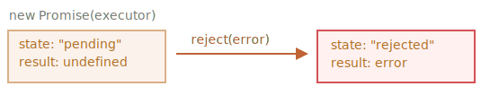

# Promise

Tưởng tượng rằng bạn là một ca sĩ hàng đầu, từ sáng đến tối bạn liên tục nhận được câu hỏi khi nào sẽ phát hành bài hát mới từ những người hâm mộ.

Để giải thoát cho mình, bạn hứa sẽ gửi bài hát ngay khi phát hành tới họ. Bạn đưa cho những người hâm mộ một danh sách đăng ký. Trong danh sách này, người hâm mộ có thể điền vào thông tin địa chỉ hòm thư điện tử để nhận được thông báo ngay khi bài hát được phát hành. Thông báo này sẽ bao gồm cả những trường hợp xấu nhất, ví dụ như một vụ cháy tại phòng thu, khiến cho bạn không thể phát hành bài hát, họ vẫn sẽ được thông báo.

Tất cả mọi người đều cảm thấy hạnh phúc: bản thân bạn, không còn người làm phiền, những người hâm mộ thì không bỏ lỡ bài hát mới.

Đây là một ví dụ thực tế cho những điều chúng ta thường gặp trong lập trình:

1. Một đoạn "producing code" (mã sản xuất) cần một khoảng thời gian để thực hiện công việc. Ví dụ, một số đoạn mã cần phải tải dữ liệu qua mạng. Đây là "ca sĩ".
2. Một đoạn mã "consuming code" (mã tiêu thụ) sử dụng kết quả của "producing code" khi nó đã sãn sàng. Có rất nhiều hàm có thể cần tới kết quả, các hàm này chính là "người hâm mộ".
3. Một _promise_ là một đối tượng đặc biệt (Object) trong JavaScript kết nối giữa "producing code" và "consuming code". Trong ngữ cảnh của ví dụ trên: đây chính là "danh sách đăng ký". "Producing code" cần một khoảng thời để tạo ra kết quả cần thiết, và "promise" làm cho kết quả đó sẵn sàng cho tất cả các mã tiêu thụ khi nó đã sẵn sàng.

Sự so sánh này không chính xác lắm, vì promise trong JavaScript phức tạp hơn một danh sách đăng ký đơn giản: chúng có những tính năng và hạn chế bổ sung. Nhưng đó là một bắt đầu tốt.

Cấu trúc constructor cho một đối tượng promise là:

```js
let promise = new Promise(function (resolve, reject) {
  // Thực hiện (mã sản xuất , "singer")
});
```

Hàm được truyền vào `new Promise` được gọi là _executor_ (hàm thực thi). Khi `new Promise` được tạo, executor chạy tự động. Nó chứa mã sản xuất mà cuối cùng sẽ tạo ra kết quả. Trong ngữ cảnh của ví dụ trên: executor chính là "ca sĩ".

Nó nhận tham số là 2 hàm `resolve` và `reject` được cung cấp bởi JavaScript. Mã của chúng ta chỉ nằm trong executor.

Khi mà executor nhận được kết quả, dù sớm hay muộn, điều này không quan trọng, nó sẽ gọi một trong hai hàm callback:

- `resolve(value)` — nếu công việc đã hoàn thành thành công, sẽ trả về kết quả `value`.
- `reject(error)` - nếu có lỗi xảy ra, sẽ trả về kết quả đối tượng lỗi `error`.

Tóm lại, executor chạy tự động và cố gắng thực hiện công việc. Khi nó hoàn thành công việc, nó gọi `resolve` nếu thành công hoặc `reject` nếu có lỗi.

Một đối tượng `promise` được trả về bởi constructor `new Promise` có những thuộc tính nội bộ sau:

- `state` — khởi tạo là `"pending"`, sau đó chuyển sang `"fulfilled"` khi `resolve` được gọi hoặc `"rejected"` khi `reject` được gọi.
- `result` (kết quả) - ban đầu là `undefined`, sau đó thay đổi thành `value` khi `resolve(value)` được gọi hoặc `error` khi `reject(error)` được gọi.

Vậy executor cuối cùng sẽ chuyển `promise` sang một trong hai trạng thái:


Sau đó chúng ta sẽ hiểu cách "người hâm mộ" có thể đăng ký những thay đổi này.

Sau đây là 1 ví dụ của một constructor của promise và một hàm executor đơn giản với "producing code" cần khoảng thời gian để thực thi (thông qua `setTimeout`):

```js run
let promise = new Promise(function(resolve, reject) {
  // Hàm được tự động thực thi khi promise được tạo

  // Sau 1 giây thông báo rằng công việc đã hoàn thành với kết quả "done"
  setTimeout(() => *!*resolve("done")*/!*, 1000);
});
```

Chúng ta có thể thấy hai điều khi chạy mã trên:

1. Executor được tự động gọi ngay lập tức (bởi `new Promise`).
2. Executor nhận hai tham số: `resolve` và `reject`. Hai hàm này được định nghĩa sẵn bởi JavaScript, nên chúng ta không cần phải tạo chúng. Chúng ta chỉ cần gọi một trong hai khi đã sẵn sàng.

   Sau một giây "xử lý" executor gọi `resolve("done")` để tạo ra kết quả. Điều này thay đổi trạng thái của đối tượng của `promise`:

   

Đây là một ví dụ về việc hoàn thành công việc thành công, một "fulfilled promise".

Và sau đây là một ví dụ về việc executor từ chối promise với một lỗi:

```js
let promise = new Promise(function(resolve, reject) {
  // Sau 1 giây thông báo rằng công việc đã hoàn thành với lỗi "Whoops!"
  setTimeout(() => *!*reject(new Error("Whoops!"))*/!*, 1000);
});
```

Cuộc gọi `reject(...)` chuyể đối tượng promise sang trạng thái `"rejected"`:



Tóm lại, executor nên thực hiện một công việc (thường là một công việc mất thời gian) và sau đó gọi `resolve` hoặc `reject` để thay đổi trạng thái của đối tượng promise tương ứng.

Một promise có thể ở một trong hai trạng thái: resolved hoặc rejected hay được gọi là "settled", như đối lại với trạng thái ban đầu "pending".

````smart header="Tại đây chỉ có thể là một kết quả hoặc một lỗi"
Executor chỉ nên gọi một trong hai hàm `resolve` hoặc `reject`. Bất kỳ thay đổi trạng thái nào đều là cuối cùng.

Tất cả các cuộc gọi `resolve` và `reject` sau đó sẽ bị bỏ qua:


```js
let promise = new Promise(function(resolve, reject) {
*!*
  resolve("done");
*/!*

  reject(new Error("…")); // ignored
  setTimeout(() => resolve("…")); // ignored
});
```
Ý tưởng là công việc được thực hiện bởi executor chỉ có thể có một kết quả hoặc một lỗi.

Đồng thời, `resolve`/`reject` chỉ chấp nhận một đối số (hoặc không) và sẽ bỏ qua thêm các đối số.
````

```smart header="Từ chối với đối tượng `Error`"
Trong trường hợp có lỗi sai, executor nên gọi `reject`. Điều này có thể được thực hiện với bất kỳ loại đối số nào (giống như `resolve`). Nhưng nó chỉ nên được khuyến khích sử dụng đối tượng `Error`(hoặc đối tượng kế thừa từ`Error`). Lý do cho điều này sẽ sớm trở nên rõ ràng.

`````

````smart header="Gọi ngay lập tức `resolve`/`reject`"
Trong thực tế, một executor thường thực hiện một công việc bất đồng bộ và gọi `resolve`/`reject` sau một khoảng thời gian, nhưng không nhất thiết phải làm như vậy. Chúng ta cũng có thể gọi `resolve` hoặc `reject` ngay lập tức, như sau:


```js
let promise = new Promise(function (resolve, reject) {
  // Không cần thời gian để làm công việc này
  resolve(123); // Ngay lập tức đưa ra kết quả: 123
});
`````

Điều này có thể xảy ra khi chúng ta bắt đầu thực hiện một công việc nhưng sau đó thấy rằng mọi thứ đã được hoàn thành và được lưu vào bộ nhớ cache.

Đây là điều tốt. Chúng ta ngay lập tức có một promise đã được giải quyết (resolved promise).

`````

```smart header="The `state` và `result` là  nội bộ"
Các thuộc tính `state` và `result` của đối tượng Promise là nội bộ. Chúng ta không thể truy cập trực tiếp vào chúng. Chúng ta có thể sử dụng các phương thức `.then`/`.catch`/`.finally` để làm điều đó. Chúng được mô tả bên dưới.

````

## Hàm xử lý tiếp theo (Consumers): then, catch, finally

Một đối tượng Promise hoạt động như một liên kết giữa executor (mã sản xuất hoặc ca sĩ) và các hàm tiêu thụ (người hâm mộ), những hàm này sẽ nhận kết quả hoặc lỗi. Các hàm xử lý tiếp theo có thể đăng ký (theo dõi) bằng cách sử dụng các phương thức `.then`, `.catch` và `.finally`.

### then
Điều quan trọng nhất, cơ bản nhất là `.then`.

Cú pháp là:

```js
promise.then(
  function(result) { *!*/* xử lý khi kết quả được trả về thành công */*/!* },
  function(error) { *!*/* xử lý một lỗi */*/!* }
);
````
Tham số đầu tiên của `.then` là một hàm chạy khi promise được giải quyết, và nhận kết quả.

Tham số thứ 2 của `.then` là một hàm chạy khi promise bị từ chối, và nhận lỗi.

Ví dụ, đây là một phản ứng với một promise được giải quyết thành công:

```js run
let promise = new Promise(function(resolve, reject) {
  setTimeout(() => resolve("done!"), 1000);
});

// giải quyết chạy trong hàm đầu tiên tại .then
promise.then(
*!*
  result => alert(result), // hiển thị kết quả "done!" sau 1 giây
*/!*
  error => alert(error) // không chạy
);
```

Hàm đầu tiên được thực thi.

Và trong trường hợp bị từ chối, hàm thứ hai:

```js run
let promise = new Promise(function(resolve, reject) {
  setTimeout(() => reject(new Error("Whoops!")), 1000);
});

// Từ chối chạy hàm thứ hai tại .then
promise.then(
  result => alert(result), // hiển thị không chạy
*!*
  error => alert(error) // hiển thị lỗi "Whoops!" sau 1 giây
*/!*
);
```
Nếu chúng ta chỉ quan tâm đến việc hoàn thành thành công, chúng ta chỉ cần cung cấp một hàm cho `.then`:

```js run
let promise = new Promise(resolve => {
  setTimeout(() => resolve("done!"), 1000);
});

*!*
promise.then(alert); //  hiển thị kết quả "done!" sau 1 giây
*/!*
```

### catch

Nếu chúng ta chỉ qaun tâm tới lỗi, chúng ta có thể sử dụng `null` như tham số đầu tiên: `.then(null, errorHandlingFunction)`. Hoặc chúng ta có thể sử dụng `.catch(errorHandlingFunction)`, đó chính là cách viết ngắn gọn:


```js run
let promise = new Promise((resolve, reject) => {
  setTimeout(() => reject(new Error("Whoops!")), 1000);
});

*!*
// .catch(f) tương tự như promise.then(null, f)
promise.catch(alert); // hiển thị lỗi "Whoops!" sau 1 giây
*/!*
```
Gọi `.catch(f)` là một bản sao hoàn toàn của `.then(null, f)`, đó chỉ là một cách viết ngắn gọn.

### finally

Giống như có một mệnh đề `finally` trong một `try {...} catch {...}` thông thường, cũng có `finally` trong promise.

Mệnh đề `.finally(f)` tương tự như `.then(f, f)` trong việc rằng `f` luôn chạy khi promise được giải quyết: có thể là giải quyết hoặc từ chối.

`finally` là một hàm xử lý tốt để thực hiện việc dọn dẹp, ví dụ như dừng các chỉ báo tải, vì chúng không cần nữa, không quan trọng kết quả là gì.

Giống như sau:

```js
new Promise((resolve, reject) => {
  /* làm một công việc mất thời gian, sau đó gọi resolve/reject */
})
*!*
  // chạy khi promise được giải quyết, không quan trọng thành công hay thất bại
  .finally(() => stop loading indicator)
  // và sau đó tải chỉ bảo luôn là dừng trước khi chúng ta xử lý kết quả/lỗi
*/!*
  .then(result => show result, err => show error)
```
Nói như vậy nhưng `finally(f)` không thực sự chính xác như là tên khác của `then(f,f)`. Có một số sự khác biệt tinh tế:

1. Một hàm `finally` không có đối số. Trong `finally` chúng ta không biết promise có thành công hay không. Điều này hoàn toàn đúng, vì công việc của chúng ta thường là thực hiện các thủ tục "tổng quát" cuối cùng.
2. Một hàm `finally` chuyển kết quả và lỗi cho hàm xử lý tiếp theo.

   Ví dụ, ở đây kết quả được chuyển qua `finally` tới `then`:

   ```js run
   new Promise((resolve, reject) => {
     setTimeout(() => resolve("result"), 2000);
   })
     .finally(() => alert("Promise ready"))
     .then((result) => alert(result)); // <-- .then kiểm soát kết quả 'result'
   ```

   Và ở đây có một lỗi trong promise, được chuyển qua `finally` tới `catch`:

   ```js run
   new Promise((resolve, reject) => {
     throw new Error("error");
   })
     .finally(() => alert("Promise ready"))
     .catch((err) => alert(err)); // <-- .catch xử lý đối tượng lỗi 'error'
   ```

Điều này thực sự tiện lợi, vì `finally` không được thiết kế để xử lý kết quả của promise. Vì vậy nó chuyển kết quả qua.

Chúng ta sẽ nói thêm về chuỗi promise và chuyển kết quả giữa các hàm xử lý trong chương tiếp theo.

````smart header="Chúng ta có thể đính kèm các hàm xử lý vào promise đã giải quyết"
Nếu một hàm promise bị pending, các hàm xử lý `.then/catch/finally` sẽ chờ đợi nó. Nếu một promise đã giải quyết, chúng sẽ chạy ngay lập tức:

```js run
// promise được giải quyết ngay lập tức khi được tạo
let promise = new Promise(resolve => resolve("done!"));

promise.then(alert); // Xong! (Hiển thị nói ngay lập tức)
```

Lưu ý rằng việc này sẽ giúp các hàm promises mạnh mẽ hơn so với trường hợp thực tế "danh sách đăng ký". Nếu ca sĩ đã phát hành bài hát của mình và sau đó một người đăng ký vào danh sách theo dõi, họ có thể không nhận được bài hát đó. Việc đăng ký trong thực tế phải được thực hiện trước sự kiện.

Promises thì linh hoạt hơn. Chúng ta có thể thêm các hàm xử lý bất cứ lúc nào: nếu kết quả đã có sẵn, chúng chỉ chạy.
`````

Next, let's see more practical examples of how promises can help us write asynchronous code.

## Ví dụ: loadScript [#loadscript]

Chúng ta đã có hàm `loadScript` để tải một script từ chương trước.
Sau đây là phiên bản dựa trên callback, chỉ để nhắc nhở chúng ta:

```js
function loadScript(src, callback) {
  let script = document.createElement("script");
  script.src = src;

  script.onload = () => callback(null, script);
  script.onerror = () => callback(new Error(`Script load error for ${src}`));

  document.head.append(script);
}
```

Cùng viết lại hàm này sử dụng Promise.

Hàm mới `loadScript` sẽ không yêu cầu một callback. Thay vào đó, nó sẽ tạo và trả về một đối tượng Promise mà giải quyết khi tải hoàn tất. Mã bên ngoài có thể thêm các xử lý (đăng ký hàm) vào nó bằng cách sử dụng `.then`:

```js run
function loadScript(src) {
  return new Promise(function (resolve, reject) {
    let script = document.createElement("script");
    script.src = src;

    script.onload = () => resolve(script);
    script.onerror = () => reject(new Error(`Script load error for ${src}`));

    document.head.append(script);
  });
}
```

Cách sử dụng:

```js run
let promise = loadScript(
  "https://cdnjs.cloudflare.com/ajax/libs/lodash.js/4.17.11/lodash.js"
);

promise.then(
  (script) => alert(`${script.src} is loaded!`),
  (error) => alert(`Error: ${error.message}`)
);

promise.then((script) => alert("Another handler..."));
```

Chúng ta có thể thấy ngày lập tức một vài lợi ích so với mẫu dựa trên callback:
| Promises | Callbacks |
| ----------------------------------------------------------------------------------------------------------------------------------------------------------------------------------------------------------------------- | ---------------------------------------------------------------------------------------------------------------------------------------------------------------------------------------- |
| Các hàm Promise cho phép chúng ta thực hiện các công việc theo thứ tự tự nhiên. Đầu tiên, chúng ta chạy `loadScript(script)`, và `.then` chúng ta viết những gì cần làm với kết quả. | Chúng ta phải có một hàm `callback` sẵn sàng khi gọi `loadScript(script, callback)`. Nói cách khác, chúng ta phải biết phải làm gì với kết quả _trước khi_ gọi `loadScript`.| We must have a `callback` function at our disposal when calling `loadScript(script, callback)`. In other words, we must know what to do with the result _before_ `loadScript` is called.
Chúng ta có thể gọi `.then` nhiều lần mà chúng ta muốn. Mỗi lần, chúng ta sẽ thêm một "người hâm mộ", một hàm theo dõi mới, vào danh sách "đăng ký". Thêm về điều này trong chương tiếp theo: [promise-chaining](info:promise-chaining). | Chỉ có thể có một callback.

Như vậy, các promise giúp chúng ta viết mã dễ đọc hơn và dễ bảo trì hơn. Chúng ta sẽ thấy thêm về điều này trong các chương tiếp theo.
